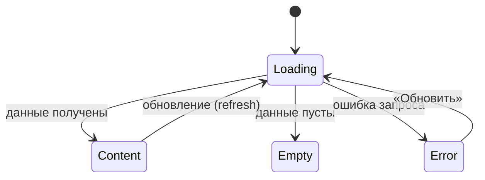

# Требования на дизайн · Foundations (сквозные правила)

> **Этап 3.** Сквозной документ дизайн-требований веб-приложения скалодрома «Вертикаль».
> Описывает принципы, структурные токены, паттерны навигации и состояний, доступность и
> микрокопию, **общие для всех экранов**. Экранные документы ссылаются сюда и не дублируют
> эти правила.

**Статус:** Черновик · **Версия:** 0.1 · **Дата:** 2026-07-04 · **Зона:** НЗ + АЗ

**Источники:**
[Бизнес-требования](..\2-requirements\business-requirements.md) ·
[ФТ](..\2-requirements\functional-requirements.md) ·
[НФТ](..\2-requirements\non-functional-requirements.md) ·
[Use cases](..\2-requirements\use-cases.md) ·
[User stories](..\2-requirements\user-stories.md) ·
[Описание домена](..\1-elicitation\domain-description.md)

> **Объём визуальных требований.** Документ задаёт **функционально-структурные** требования:
> иерархию, компоненты, поведение, ограничения. Конкретная палитра, шрифты и иллюстративный
> стиль — зона ответственности дизайнера; бренд в исходной аналитике не зафиксирован. Токены
> ниже описаны как **правила/уровни**, а не как hex/font-family.

---

## 1. Продукт и аудитория

**Клиентское веб-приложение скалодрома «Вертикаль»** — самостоятельная запись на групповые
тренировки по скалолазанию. Заменяет запись через Telegram и бумажную тетрадь.

**Единственная роль — «Клиент».** Инструктор и владелица в приложение не входят. Справочные
данные (тренировки/слоты, зоны/форматы, инструкторы) — read-only из API. Оплата (в т.ч.
проката) — **офлайн** (наличные / перевод); приложение показывает тариф проката и фиксирует
запись, онлайн-оплаты нет.

**Платформа.** Адаптивное веб-приложение (SPA) на **React + Tailwind CSS**, без установки из
магазина приложений, открывается по ссылке в браузере — на телефоне, планшете или десктопе.

**Контекст использования:** клиент чаще всего открывает приложение с телефона прямо в зале
скалодрома — между подходами, иногда с мелом на руках, в спешке между тренировками; либо дома
с десктопа при планировании недели. Это диктует крупные тач-зоны на мобильном брейкпоинте,
высокий контраст и минимум шагов (NFR-1), но макет должен оставаться удобным и на широком экране.

---

## 2. Дизайн-принципы

| # | Принцип | Источник | Что это значит для макета |
|---|---------|----------|---------------------------|
| P1 | **Mobile-first веб для зала** | NFR-1 | Крупные тач-зоны на мобильном брейкпоинте, высокий контраст, минимум мелкого текста; на десктопе — тот же контент в более широкой сетке. |
| P2 | **Короткий путь к записи** | NFR-2 | От списка до подтверждения — **≤ 3 экранов**. Не добавлять необязательных шагов/полей. |
| P3 | **Минимальный порог входа** | NFR-3 | Вход — телефон + SMS-код или Telegram, без пароля. Не запрашивать лишних данных. |
| P4 | **Воспринимаемая скорость** | NFR-6, NFR-21 | Скелетоны вместо пустого экрана; отклик списка и подтверждения ощущается < 2–3 с. |
| P5 | **Только свои данные** | NFR-11, NFR-12 | Клиент видит лишь свои записи и оценки; в UI нет доступа к чужим/админским данным. |
| P6 | **Честность и спокойствие** | UC-1/UC-2 | Ошибки и правила (места, прокат, 2 часа) объясняются понятно и без давления; штрафов нет. |
| P7 | **Оценка — ненавязчиво** | UC-4, FR-40 | Оценка инструктора предлагается, но не блокирует и не навязывается; отказ не повторяется агрессивно. |

---

## 3. Структурные токены (без бренда)

Дизайнер выбирает конкретные значения; ниже — обязательные **правила**.

### 3.1 Тач-зоны и размеры
- Минимальный размер интерактивного элемента на мобильном брейкпоинте — **≥ 44 px** по меньшей
  стороне (см. NFR-25); на десктопе допустимы более компактные элементы, но не менее 32px.
- Основной CTA на мобильном — во всю ширину контентной области.
- Между кликабельными элементами — отступ, исключающий промахи пальцем.

### 3.2 Контраст и читаемость (NFR-1, NFR-25)
- Контраст текста к фону — не ниже **WCAG 2.1 AA** (обычный текст ≥ 4.5:1, крупный ≥ 3:1).
- Состояния не передаются **только цветом** — дублируются иконкой/текстом/формой.
- Важные числа (свободно мест, доступность проката, время старта) — крупные и контрастные.

### 3.3 Типографическая иерархия (уровни, не шрифты)
- **Заголовок экрана** → **Заголовок секции/карточки** → **Основной текст** →
  **Вторичный/подпись (caption)**. Достаточно 4–5 уровней; держать единообразно.

### 3.4 Плотность и сетка
- Единая шкала отступов (Tailwind spacing scale) — задаёт дизайнер, применяет везде.
- Мобильный брейкпоинт — контент в одну колонку; десктопный брейкпоинт (≥1024px) — карточки
  тренировок могут выстраиваться в сетку из 2–3 колонок (список слотов).

### 3.5 Брейкпоинты (Tailwind)
| Класс | Ширина | Основной кейс |
|---|---|---|
| по умолчанию (mobile) | ~360–428px | Основной сценарий: телефон в зале. |
| `md:` | ~768px | Планшет. |
| `lg:` | ≥1024px | Десктоп: многоколоночная сетка списка, боковая навигация. |

### 3.6 Иконки и индикаторы
- Иконки сопровождаются текстом в ключевых местах (навигация, статусы), не несут смысл в одиночку.
- Индикатор активных фильтров, бейдж статуса брони — визуально считываемы с первого взгляда.

---

## 4. Каркас экрана и навигация

### 4.1 Базовый каркас (мобильный брейкпоинт)
```
┌─────────────────────────────┐
│ Хедер (заголовок / назад)    │  ← фиксированный
├─────────────────────────────┤
│                              │
│ Скролл-контент               │  ← основная зона
│                              │
├─────────────────────────────┤
│ Фикс. нижняя CTA (если есть) │  ← всегда видна
└─────────────────────────────┘
│ Нижняя навигация (в АЗ)      │  ← только на корневых экранах разделов
└─────────────────────────────┘
```
На десктопном брейкпоинте (`lg:`) нижняя навигация заменяется верхним/боковым меню,
контентная область — шире, максимальная ширина контейнера ограничена для читаемости.

### 4.2 Навигация (авторизованная зона)
Три верхнеуровневых раздела, всегда доступны на корневых экранах:
- **Тренировки** ([SCR-002](SCR-002-slot-list.md)) — стартовый раздел (список слотов).
- **Мои записи** ([SCR-005](SCR-005-my-bookings.md)).
- **Профиль** ([SCR-007](SCR-007-profile.md)).

На мобильном брейкпоинте — нижняя навигационная панель (аналог таб-бара), на десктопном —
верхняя навигация/сайдбар. Скрывается на вложенных экранах (карточка слота, оформление
записи, детали брони) и когда открыт модальный диалог.

### 4.3 Модальные диалоги / bottom sheet (BS-001 / BS-002 / BS-003 / BS-004)
Единые правила для всех модальных диалогов (BS-*):
- **Мобильный брейкпоинт** — модалка прижата к нижнему краю экрана (bottom sheet): высота по
  контенту, но не выше ~90% экрана; длинный контент скроллится внутри.
- **Десктопный брейкпоинт** — модалка центрируется на экране как обычный диалог, не привязана
  к нижнему краю.
- **Бэкдроп** (затемнение фона) + закрытие по клику вне модалки (кроме критичных подтверждений,
  где закрытие — только явной кнопкой).
- Закрытие — по кнопке, по клику на бэкдроп, клавишей **Esc** (важно для десктопа/клавиатуры);
  на мобильном — опционально свайп вниз как усиление, не единственный способ закрытия.
- Явная кнопка закрытия/отмены. Кнопки действий — в нижней части модалки.
- Открытие/закрытие — плавная анимация (снизу вверх на мобильном, fade/scale на десктопе).

### 4.4 Карта навигации
Каждый экранный документ описывает свои входящие/исходящие переходы в разделе «Навигация».

---

## 5. Сквозной паттерн состояний экрана

Применяется ко **всем экранам с запросами к API**. Экранные документы лишь уточняют
специфику (тексты пустых состояний, конкретные ошибки), не переописывая паттерн.



| Состояние | Что показываем | Правило |
|-----------|----------------|---------|
| **Loading** | Скелетон/шиммер в форме будущего контента | Не пустой белый экран (P4). |
| **Content** | Данные | Основной сценарий. |
| **Empty** | Заглушка + понятная подсказка + действие (если применимо) | Объясняет, почему пусто, и что сделать. |
| **Error** | Заглушка ошибки + кнопка **«Обновить»** | Нейтральный тон; не винит пользователя; даёт повтор. |

Специфичные состояния (например, **disabled CTA «Записаться»** при отсутствии свободных мест,
бейдж **«Поздняя отмена»**) описаны в соответствующих экранных документах.

---

## 6. Tone of voice и общая микрокопия

**Тон:** простой, прямой, дружелюбный, без жаргона и канцелярита. Обращение на «вы».
Сообщения — короткие, по делу, без вины и давления (штрафов в продукте нет).

**Сквозные тексты (единые формулировки, переиспользуются экранами):**

| Контекст | Текст |
|----------|-------|
| Оплата | «Оплата на месте: наличные или перевод на карту.» |
| Лейблы снаряжения | «Своё снаряжение» / «Прокатное снаряжение» |
| Правило отмены | «Отмена не позднее чем за 2 часа до старта — место освобождается. Позже — место остаётся за вами, но штрафов нет.» |
| Поздняя отмена (итог) | «Поздняя отмена: место не освобождено (правило 2 часов). Штраф не взимается.» |
| Кнопка повтора | «Обновить» |
| Сетевая ошибка при загрузке (общая) | «Не удалось загрузить. Проверьте соединение и попробуйте снова.» |
| Сетевая ошибка при действии | «Не удалось выполнить. Проверьте соединение и повторите.» |
| Ошибка сервера при действии (5xx) | «Что-то пошло не так. Попробуйте ещё раз позже.» |
| Ошибка действия без текста от сервера (дефолт 4xx без `message`) | «Не удалось выполнить. Попробуйте ещё раз.» |
| Нет прокатного инвентаря | «Прокатного снаряжения может не хватить на всех записавшихся.» |

> Числовые лимиты (вместимость группы, размер прокатного фонда) **не зашиваются в тексты** —
> подставляются из данных слота.
>
> **Раздельная модель доступности.** Места и прокатное снаряжение считаются **независимо**:
> место в группе не гарантирует наличие прокатного инвентаря, и наоборот. Формулу доступности
> «через прокат» для мест использовать **нельзя** (см. FR-19).
>
> **Единый источник правила отмены.** Полный текст правила «2 часов» задаётся **только здесь**.
> Экраны [SCR-006](SCR-006-booking-details.md) и [BS-003](BS-003-cancel-confirm.md) **ссылаются**
> на эти формулировки и не переписывают их. Граничный случай **«ровно 2 часа до старта»
> трактуется как ранняя отмена** (`≥ 2 ч` → место освобождается).

### 6.1 Каталог сообщений об успехе (единые формулировки)

Сообщение об успехе (toast/snackbar) показывается после **завершённого действия**, у которого
результат не очевиден из самого перехода. Тон — короткий, утвердительный, без восклицаний.

| Действие | Экран/Модалка | Текст | Примечание |
|----------|--------------|--------------------|------------|
| Сохранение профиля (`updateProfile`) | [SCR-007](SCR-007-profile.md) | «Профиль обновлён» | — |
| Отвязка/привязка Telegram | [SCR-007](SCR-007-profile.md) | «Telegram привязан» / «Telegram отвязан» | — |
| Выход из аккаунта (`logout`) | [SCR-007](SCR-007-profile.md) | — (не показывается) | Обратная связь — сам переход на [SCR-001](SCR-001-registration.md). |
| Отмена брони (`cancelBooking`, ранняя) | [BS-003](BS-003-cancel-confirm.md) → [SCR-006](SCR-006-booking-details.md) | «Бронь отменена» | Показывает экран-родитель после закрытия модалки. |
| Отмена брони (`cancelBooking`, поздняя) | [BS-003](BS-003-cancel-confirm.md) → [SCR-006](SCR-006-booking-details.md) | «Поздняя отмена: место не освобождено (правило 2 часов). Штраф не взимается.» | Это **успешный** исход, а не ошибка. |
| Создание брони (`createBooking`) | [SCR-004](SCR-004-booking.md) → [BS-002](BS-002-booking-success.md) | — (не показывается) | Обратная связь — переход на модалку успеха [BS-002](BS-002-booking-success.md). |
| Отправка оценки (`rateInstructor`) | [BS-004](BS-004-rate-instructor.md) → [SCR-006](SCR-006-booking-details.md) | «Спасибо за оценку» | Показывает экран-родитель после закрытия модалки. |
| Применение/сброс фильтров | [BS-001](BS-001-filters.md) → [SCR-002](SCR-002-slot-list.md) | — (не показывается) | Обратная связь — обновлённый список и индикатор активных фильтров. |

### 6.2 Кто показывает сообщение при закрытии модалки

- Сообщение **успеха/итога** действия, после которого модалка закрывается, показывает
  **экран-родитель** (он остаётся на экране и переживает закрытие модалки).
- Сообщение **ошибки** действия, при которой модалка **остаётся открытой** (можно повторить),
  показывает **сама модалка**.
- **Нельзя дублировать** обратную связь: если результат уже выражен переходом на отдельную
  модалку успеха (например, `createBooking` → [BS-002](BS-002-booking-success.md)), сообщение
  об успехе на экране-инициаторе **не показывается**.

---

## 7. Доступность (NFR-25 — WCAG 2.1 AA)

Целевой уровень — **WCAG 2.1 AA**. Обязательные требования:

- **Контраст:** не ниже WCAG AA — см. §3.2.
- **Тач-зоны:** интерактивные элементы на мобильном брейкпоинте — **≥ 44 px** по меньшей
  стороне, с отступами (§3.1).
- **Масштаб страницы:** поддержка увеличения масштаба браузером до 200% без потери
  функциональности и без горизонтального скролла.
- **Клавиатура:** вся ключевая функциональность доступна с клавиатуры (Tab/Shift+Tab,
  Enter/Space, видимый focus-ring); модалки закрываются по **Esc** (§4.3).
- **Screen reader:** все интерактивные элементы и изображения имеют текстовую
  подпись/доступное имя (ARIA); статусы и важные числа доступны для озвучивания.
- **Не только цвет:** состояния (свободно/нет мест, статус брони, ошибка) дублируются
  иконкой/текстом/формой, не передаются одним цветом (§3.2).
- **Малые экраны:** макет корректно работает на компактных устройствах (узкая ширина) —
  контент скроллится, фикс. CTA не перекрывает контент, ничего не обрезается.
- Фокус-состояния и обратная связь на клик/тап обязательны.

---

## 8. Сквозные функции

### 8.1 Напоминания и уведомления (FR-45, FR-46, FR-48, NFR-17)
- Заблаговременное напоминание о предстоящей тренировке (за 1 день и за 3 часа); уведомление
  об отмене тренировки скалодромом.
- **Каналы — браузерный Web Push (если разрешён) и Telegram.** Telegram — основной, гарантированно
  доступный канал (Web Push поддерживается не всеми браузерами/ОС, см. NFR-17); приложение
  регистрирует Web Push-подписку через Service Worker при явном разрешении пользователя.
- **Запрос разрешения на Web Push показывается после первой успешной записи** — на модалке
  подтверждения [BS-002](BS-002-booking-success.md), когда ценность очевидна, а не на старте.
  Экран входа [SCR-001](SCR-001-registration.md) разрешение **не запрашивает**.
- **Привязка Telegram** для дублирования уведомлений доступна в профиле
  [SCR-007](SCR-007-profile.md), если клиент не входил через Telegram изначально.
- Отдельного экрана управления частотой/типами уведомлений в MVP нет.

### 8.2 Безопасность данных в UI (NFR-11, NFR-12)
- На экранах отображаются только данные текущего клиента.
- Персональные данные (имя, телефон) не дублируются без необходимости; нет чужих контактов.

### 8.3 Поведение офлайн и сетевые ошибки (NFR-24)
- **Просмотр кэша офлайн разрешён:** ранее загруженные списки/детали показываются из кэша
  (Service Worker Cache API) с **видимой пометкой устаревания** («Данные могут быть
  неактуальны»), а не пустым экраном.
- **Мутации офлайн запрещены:** запись, отмена, оценка, изменение профиля при отсутствии сети
  не отправляются; действие блокируется с понятным сообщением «нет сети».
- **Единый паттерн Error / Retry:** все сетевые/серверные сбои и таймауты ведут к состоянию
  Error с кнопкой «Обновить» (для загрузки, §5) или к сообщению об ошибке с возможностью
  повтора (для действий); тексты — из §6.
- **Таймаут запроса — ~10 с:** по истечении показывается ошибка с повтором, экран не «висит».

---

## 9. Глоссарий

| Термин | Значение |
|--------|----------|
| **Тренировка / Слот** | Конкретное занятие: дата, время старта, зона/формат, инструктор, всего/свободно мест. |
| **Зона/формат** | Тип тренировки — болдеринг для новичков / трассы с верёвкой для опытных. |
| **Снаряжение** | Скальники и страховочная система: прокатные (из фонда скалодрома) или собственные. |
| **Бронь (запись)** | Запись клиента на слот: вариант снаряжения, статус. |
| **Ранняя отмена** | Отмена ≥ 2 ч до старта → место возвращается в слот. |
| **Поздняя отмена** | Отмена < 2 ч до старта → бронь фиксируется, место не освобождается, штрафов нет. |
| **Отменена скалодромом** | Тренировка отменена организатором (напр. профилактика); повторная запись на слот запрещена. |

---

## 10. Карта документов дизайн-требований

| ID | Документ |
|----|----------|
| — | **00-foundations.md** (этот файл) |
| SCR-001 | [Регистрация / Вход](SCR-001-registration.md) |
| SCR-002 | [Список тренировок](SCR-002-slot-list.md) |
| BS-001 | [Фильтры](BS-001-filters.md) |
| SCR-003 | [Карточка тренировки](SCR-003-slot-card.md) |
| SCR-004 | [Оформление записи](SCR-004-booking.md) |
| BS-002 | [Подтверждение записи](BS-002-booking-success.md) |
| SCR-005 | [Мои бронирования](SCR-005-my-bookings.md) |
| SCR-006 | [Детали брони + отмена](SCR-006-booking-details.md) |
| BS-003 | [Подтверждение отмены](BS-003-cancel-confirm.md) |
| BS-004 | [Оценка инструктора](BS-004-rate-instructor.md) |
| SCR-007 | [Профиль клиента](SCR-007-profile.md) |
