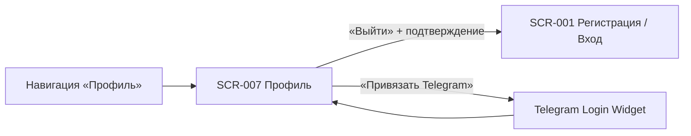

# Требования на дизайн · SCR-007 · Профиль клиента

**ID:** SCR-007 · **Тип:** Экран · **Зона:** АЗ · **Приоритет:** Medium · **Статус:** Черновик · **Версия:** 0.1 · **Дата:** 2026-07-04

> Документ описывает **функционально-структурные** требования к экрану «Профиль клиента».
> Сквозные правила (токены, навигация, состояния, доступность, микрокопия) — в
> [`00-foundations.md`](00-foundations.md); здесь они не дублируются, только уточняется специфика.

**Источники:**
[Foundations](00-foundations.md) ·
[Функциональные требования](../functional-requirements.md) ·
[Нефункциональные требования](../non-functional-requirements.md)

---

## 1. Назначение и контекст

Экран «Профиль» — верхнеуровневый раздел авторизованной зоны. Задачи экрана в MVP:

- **Показать и дать отредактировать контактные данные** клиента — имя и телефон (FR-33);
  смена телефона подтверждается кодом из SMS (как при входе).
- **Дать выход из аккаунта** — управляемое завершение сессии с возвратом к экрану входа (FR-34).
- **Привязать/отвязать Telegram** — для дублирования уведомлений (FR-2, NFR-26), если клиент
  вошёл не через Telegram изначально.
- **Справочные пункты** — правила скалодрома, контакты поддержки, версия приложения.

Это не «личный кабинет» в широком смысле: экран не содержит ленты записей (для этого есть
[SCR-005](SCR-005-my-bookings.md)) и **не управляет напоминаниями/Web Push** (разрешение
запрашивается в [BS-002](BS-002-booking-success.md), отдельного раздела настроек уведомлений в
MVP нет — см. [foundations §8.1](00-foundations.md#81-напоминания-и-уведомления-fr-45-fr-46-fr-48-nfr-17)).
Соответствует принципам **P3 «минимальный порог входа»** и **P5 «только свои данные»**
([foundations §2](00-foundations.md#2-дизайн-принципы)).

> **Отличие от типового шаблона.** В нашей поставке экран **не включает удаление аккаунта** —
> эта функция не зафиксирована ни в одном FR (FR-33/FR-34 описывают только просмотр/редактирование
> профиля и выход). Добавлять её сюда означало бы придумывать требование, которого нет в аналитике.
> Право на удаление персональных данных по 152-ФЗ помечено в [non-functional-requirements.md → NFR-20](../non-functional-requirements.md)
> как предмет **Phase 2** (полный комплаенс, включая экспорт/удаление данных субъекта) — при
> переносе в MVP кнопка добавляется сюда по аналогии с §6.3 ниже (зарезервировано местом в
> структуре, см. §5).

---

## 2. Пользователь и цель

| Параметр | Значение |
|----------|----------|
| **Роль** | Клиент (единственная роль приложения). |
| **Контекст** | Чаще всего — в зале скалодрома с телефона между тренировками, иногда с мелом на руках; либо дома с десктопа. Заход в «Профиль» обычно эпизодический: свериться с данными, привязать Telegram или выйти на чужом/общем устройстве. |
| **Задача (Job)** | «Хочу убедиться, что вошёл под своим именем/номером», «хочу получать напоминания в Telegram» и «хочу безопасно выйти, чтобы под моим аккаунтом не записались другие». |
| **Цель дизайна** | Считываемость данных с одного взгляда; защита от случайного выхода; отсутствие лишних элементов. |

---

## 3. Навигация

### Входящие
- **Нижняя навигация «Профиль»** ([foundations §4.2](00-foundations.md#42-навигация-авторизованная-зона)) —
  единственная точка входа на экран. Экран корневой, поэтому навигация на нём видна.

### Исходящие
- **«Выйти»** (после подтверждения) → завершение сессии → [SCR-001 · Регистрация / Вход](SCR-001-registration.md).
  После выхода клиент попадает в неавторизованную зону.
- **«Сохранить» в режиме редактирования** при смене телефона → шаг подтверждения нового номера
  кодом из SMS (как на [SCR-001](SCR-001-registration.md), шаг 2) → возврат в просмотр профиля с
  обновлёнными данными. Смена только имени подтверждения кодом не требует.
- **«Привязать Telegram»** → внешний Telegram Login Widget → возврат в профиль с обновлённым статусом привязки.



---

## 4. Контент-инвентарь

Отображаются **только собственные данные текущего клиента** (NFR-11, NFR-12).

| Элемент | Лейбл (UI) | Источник | Доступ |
|---------|------------|----------|--------|
| `name` | «Имя» | Клиент | read + **edit** |
| `phone` | «Телефон» | Клиент | read + **edit** (смена подтверждается кодом из SMS) |
| Кнопка «Редактировать» | «Редактировать» | — | вход в режим редактирования |
| Статус Telegram + кнопка привязки/отвязки | «Telegram: привязан / не привязан» | `client.telegram_id` | read + действие |
| Кнопка «Выйти» | «Выйти» | — | завершение сессии (с подтверждением) |
| Справочные пункты | «Правила скалодрома», «Поддержка», «Версия приложения» | конфиг / статика | read; правила/поддержка — переходы, версия — текст |

Чужие контакты, данные других клиентов и любые административные сведения (в т.ч. статус
«постоянный клиент», см. functional-requirements.md → «Вне скоупа») на экране **отсутствуют**
(см. [foundations §8.2](00-foundations.md#82-безопасность-данных-в-ui-nfr-11-nfr-12)).

---

## 5. Структура и иерархия

Каркас — по [foundations §4.1](00-foundations.md#41-базовый-каркас-мобильный-брейкпоинт).
Фиксированного нижнего CTA нет; «Выйти» — часть контента.

Порядок сверху вниз:

1. **Хедер** — заголовок «Профиль» + кнопка «Редактировать» (в режиме просмотра).
2. **Блок данных** — имя и телефон, крупно и контрастно (в режиме редактирования — поля ввода).
3. **Блок Telegram** — статус привязки + кнопка действия.
4. **Справочные пункты** — «Правила скалодрома» ›, «Поддержка» ›, «Версия приложения».
5. **Кнопка «Выйти»** — визуально отделена, в безопасной зоне (см. §9).
6. **Нижняя навигация** — постоянная (активен пункт «Профиль»).

**Режим просмотра:**
```
┌─────────────────────────────┐
│  Профиль        Редактировать│  ← хедер + вход в редактирование
├─────────────────────────────┤
│  Имя                         │
│  Тори Иванова                │  ← блок данных
│  Телефон                     │
│  +7 999 123-45-67            │
│  · · · · · · · · · · · · ·   │
│  Telegram: не привязан        │
│  [ Привязать Telegram ]       │
│  · · · · · · · · · · · · ·   │
│  Правила скалодрома       ›  │  ← справочные пункты
│  Поддержка                ›  │
│  Версия приложения   1.0.0   │
│                              │
│        [   Выйти   ]         │  ← безопасная зона
├─────────────────────────────┤
│ Тренировки Мои записи ●Профиль│ ← нижняя навигация
└─────────────────────────────┘
```

**Режим редактирования** (поля ввода + «Сохранить» / «Отмена»):
```
┌─────────────────────────────┐
│  ‹ Отмена   Редактирование    │
├─────────────────────────────┤
│  Имя                         │
│  [ Тори Иванова           ]  │  ← поле ввода
│  Телефон                     │
│  [ +7 999 123-45-67       ]  │  ← поле ввода (смена → код из SMS)
├─────────────────────────────┤
│  [        Сохранить       ]  │  ← фикс. CTA
└─────────────────────────────┘
```

---

## 6. Компоненты и поведение

### 6.1 Блок контактных данных и режим редактирования (имя, телефон)
- **Просмотр:** пары «лейбл → значение», значение крупнее лейбла.
- **Редактирование:** по «Редактировать» поля становятся вводимыми; валидация формата — как на
  [SCR-001](SCR-001-registration.md). Действия — «Сохранить» / «Отмена».
- **Смена телефона** подтверждается **кодом из SMS**, т.к. телефон — логин. Смена **только
  имени** подтверждения кодом не требует.
- На время сохранения — индикация; при сбое — нейтральная ошибка, данные не теряются.

### 6.2 Кнопка «Выйти»
- Завершает сессию (см. NFR-18 — сброс access из памяти, инвалидация refresh-cookie) и
  переводит на [SCR-001](SCR-001-registration.md).
- **Обязательное подтверждение** перед выходом — защита от случайного нажатия. Подтверждение —
  диалог/модалка по правилам [foundations §4.3](00-foundations.md#43-модальные-диалоги--bottom-sheet-bs-001--bs-002--bs-003--bs-004):
  два явных действия — «Выйти» и «Отмена»; закрытие модалки = отмена.

### 6.3 Блок Telegram
- Если клиент вошёл изначально через Telegram — статус «привязан» показывается сразу, кнопка
  отвязки доступна, но отвязка не должна лишать клиента возможности входа (нужен резервный вход
  по телефону — сохраняется всегда, т.к. регистрация ведётся по номеру телефона в любом случае).
- Если клиент вошёл по телефону — кнопка «Привязать Telegram» открывает Telegram Login Widget;
  после успешной привязки статус меняется на «привязан», уведомления начинают дублироваться.

### 6.4 Справочные пункты
- **Правила скалодрома** и **Поддержка** — строки-переходы (›) на статические/внешние ресурсы.
- **Версия приложения** — нередактируемый текст.
- Управление Web Push здесь **отсутствует** (см. §1, [foundations §8.1](00-foundations.md#81-напоминания-и-уведомления-fr-45-fr-46-fr-48-nfr-17)).

---

## 7. Состояния экрана

| Состояние | Содержимое / Поведение |
|-----------|------------------------|
| **Loading** | Скелетон на месте блока данных. Кнопка «Выйти» может быть видна, но неактивна до загрузки. |
| **Content (просмотр)** | Имя, телефон, статус Telegram, справочные пункты, кнопки «Редактировать», «Выйти». |
| **Редактирование** | Поля ввода имени/телефона + «Сохранить»/«Отмена»; при смене телефона — шаг подтверждения кодом из SMS. |
| **Сохранение (loading)** | Индикация процесса, повторные клики блокируются; при сбое — нейтральная ошибка, данные не теряются. |
| **Error (загрузка профиля)** | Заглушка ошибки + кнопка «Обновить». Кнопка «Выйти» остаётся доступной. |

---

## 8. Валидации и микрокопия

| Контекст | Текст |
|----------|-------|
| Заголовок подтверждения выхода | «Выйти из аккаунта?» |
| Пояснение | «Чтобы снова записаться на тренировку, нужно будет войти по номеру телефона или через Telegram.» |
| Кнопка действия | «Выйти» |
| Кнопка отмены | «Отмена» |
| Ошибка выхода | «Не удалось выйти. Проверьте соединение и попробуйте снова.» |
| Подтверждение смены телефона | «Подтвердите новый номер кодом из SMS.» |
| Успех сохранения профиля | «Профиль обновлён.» |
| Успех привязки Telegram | «Telegram привязан.» |
| Успех отвязки Telegram | «Telegram отвязан.» |

---

## 9. Доступность

Базовые правила — [foundations §7](00-foundations.md#7-доступность-nfr-25-wcag-21-aa). Специфика экрана:

- Имя и телефон — контрастны и комфортны для чтения; телефон — в формате, легко считываемом.
- **Кнопка «Выйти»** — тач-зона ≥ 44px на мобильном, в **явной безопасной зоне**: отделена
  отступом от блока данных и от нижней навигации, чтобы исключить случайный выход.
  Подтверждение (§6.2) — дополнительный барьер.
- Все элементы имеют текстовые подписи/доступные имена; форма редактирования полностью
  управляема с клавиатуры (Tab, Enter для сохранения, Esc для отмены).

---

## 10. Критерии приёмки дизайна

```gherkin
Функция: SCR-007 Профиль клиента

  Сценарий: AC-001 — отображение собственных данных
    Дано клиент авторизован
    Когда он открывает раздел «Профиль»
    Тогда он видит своё имя и свой телефон

  Сценарий: AC-002 — выход возвращает на экран входа
    Дано клиент находится на экране «Профиль»
    Когда он нажимает «Выйти» и подтверждает действие
    Тогда сессия завершается
    И он попадает на экран SCR-001

  Сценарий: AC-003 — защита от случайного выхода
    Когда клиент нажимает «Выйти»
    Тогда показывается подтверждение с действиями «Выйти» и «Отмена»
    И при выборе «Отмена» он остаётся в аккаунте

  Сценарий: AC-004 — нет доступа к чужим и административным данным
    Тогда на экране отсутствуют данные других клиентов и любые административные функции

  Сценарий: AC-005 — редактирование имени без кода
    Когда клиент меняет только имя и нажимает «Сохранить»
    Тогда изменения сохраняются без подтверждения кодом

  Сценарий: AC-006 — смена телефона подтверждается кодом
    Когда клиент меняет телефон и нажимает «Сохранить»
    Тогда показывается шаг подтверждения кодом из SMS
    И после верного кода телефон обновляется

  Сценарий: AC-007 — привязка Telegram
    Дано клиент вошёл по телефону и Telegram не привязан
    Когда он нажимает «Привязать Telegram» и подтверждает в Telegram
    Тогда статус меняется на «привязан»
```

---

## 11. Решения

| # | Решение |
|---|---------|
| 1 | **Редактирование данных — да.** Имя/телефон редактируются; смена телефона подтверждается кодом из SMS, смена имени — нет. |
| 2 | **Удаление аккаунта — нет в MVP.** Не зафиксировано в FR-33/FR-34; при появлении требования на Phase 2 (см. NFR-20) добавляется по аналогии с местом кнопки «Выйти». |
| 3 | **Привязка Telegram — да**, как дополнение к каналу уведомлений (FR-2, NFR-26), а не отдельная функция входа. |
| 4 | **Справочные пункты — да**, без привязки к конкретному FR (общая практика, аналогично шаблону-примеру). |
| 5 | **Управление Web Push — НЕ в профиле.** Разрешение запрашивается в [BS-002](BS-002-booking-success.md). |

---

## 12. Трассировка

| Артефакт | Связь |
|---|---|
| FR-33 | Просмотр и редактирование имени/телефона. |
| FR-34 | Выход из аккаунта. |
| FR-2, NFR-26 | Привязка Telegram для дублирования уведомлений. |
| NFR-11, NFR-12 | Доступ только к собственным данным. |
| NFR-18 | Завершение сессии (сброс access/refresh) при выходе. |
