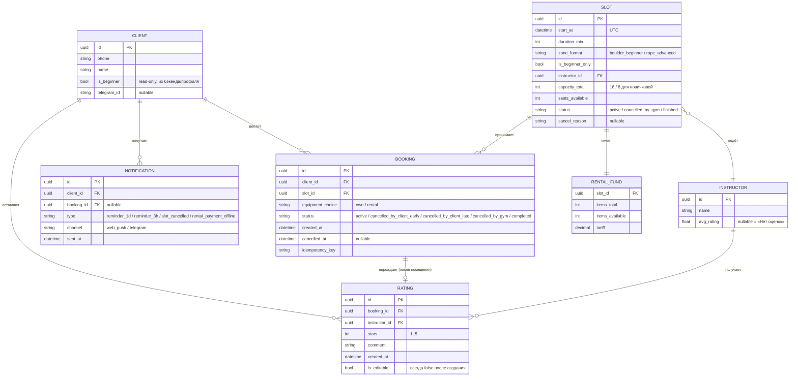
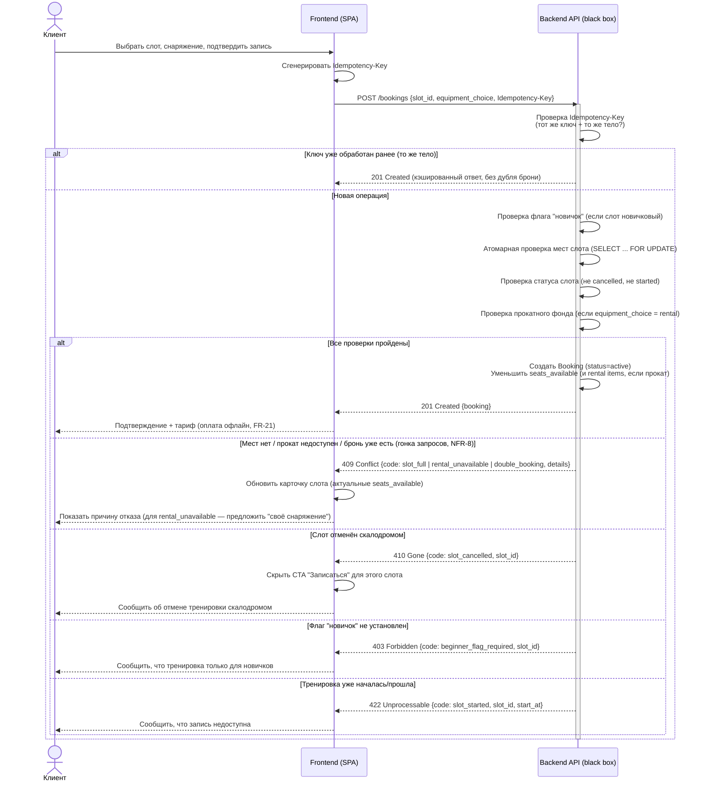

# Этап 4. Дизайн: ER-модель и sequence-диаграмма createBooking

> Скоуп — клиентское веб-приложение (React + Tailwind CSS) и его API. Источники: domain-description.md,
> functional-requirements.md, business-requirements.md, use-cases.md (UC-1), non-functional-requirements.md (NFR-8, NFR-9, NFR-24).

## 1. ER-модель

## 2. Модели сущностей: кто читает, кто пишет

Ключевой архитектурный факт (business-requirements.md → BR-9, domain-description.md → «Контекст и
границы скоупа»): **клиентское приложение не создаёт и не редактирует слоты/зоны/инструкторов** —
это read-only данные существующего бэкенда. Приложение мутирует только то, что относится к
собственным действиям клиента: бронь, оценка, часть профиля, подписка на уведомления.

| Сущность | Доступ клиентского приложения | Кто фактически меняет | Источник |
| :-- | :-- | :-- | :-- |
| **Client** (профиль) | **Частично read-write**: `name`, `phone` — редактируются клиентом (FR-33). `is_beginner`, `id`, статус «постоянный клиент» — **read-only**, приходят из бэкенда/админки, в клиенте не редактируются (BR-6, domain-description.md → «Клиент», BR: «постоянные клиенты вне скоупа») | Флаг «новичок» и лояльность — админка/бэкенд | FR-33, domain 3.1 |
| **Slot** (тренировка) | **Read-only** целиком: приложение только показывает список/карточку, фильтрует; не создаёт и не редактирует (BR-9) | Существующий бэкенд (расписание, зоны, инструкторы) | domain 3.2, FR-9…FR-11 |
| **Instructor** | **Read-only**, включая `avg_rating` — агрегат считает бэкенд, клиент только отображает (FR-41) | Бэкенд (пересчёт агрегата на основе Rating) | domain 3.3, FR-41 |
| **RentalFund** (прокатный фонд слота) | **Read-only на клиенте** — приложение видит `items_available`/`tariff`, но не изменяет напрямую; фонд уменьшается как побочный эффект `createBooking` **на сервере**, а не отдельной операцией клиента (FR-19, FR-20) | Бэкенд, при обработке брони | domain 3.5, FR-18…FR-20 |
| **Booking** (бронь) | **Read-write** — единственная сущность, которую клиент создаёт (`createBooking`) и переводит в отменённое состояние (`cancelBooking`); статус «отменена скалодромом» / «поздняя отмена» выставляет **сервер**, клиент этого не делает | Клиент создаёт/отменяет; сервер — атомарные проверки, отметка поздней отмены, статус «отменена скалодромом» | FR-15…FR-30, UC-1 |
| **Rating** (оценка) | **Write-once**: клиент создаёт ровно один раз на посещённую бронь, редактирование запрещено даже на уровне API (FR-40) | Только клиент, один раз | domain 3.6, FR-40 |
| **Notification** | **Read-only** для клиента (список/факт получения); генерируется и рассылается сервером по триггерам (напоминание, отмена скалодромом) | Бэкенд по расписанию/событиям | domain 3.7, FR-45…FR-48 |
| **WebPushSubscription** (неявная сущность) | **Read-write**: клиент создаёт подписку при выдаче разрешения браузера (FR-48), передаёт токен на бэкенд | Клиент создаёт/отзывает подписку | FR-48 |

Важно: даже там, где клиент формально «пишет» (Booking, Rating), решающая проверка и присвоение
финального статуса — на стороне сервера (domain-description.md → «Ограничения верхнего уровня»:
атомарность — ответственность бэкенда). Клиент только инициирует операцию и корректно
обрабатывает код ответа.

## 3. Sequence-диаграмма: `createBooking` (UC-1)

Ветки 201 / 409 / 410 — как в матрице ошибок UC-1. Дополнительно показаны 403 (`beginner_flag_required`)
и 422 (`slot_started`), т.к. они логически часть той же атомарной проверки на сервере, но раскрыты
компактно, чтобы не размывать три основные ветки.

### Пояснение к веткам

- **201** — единственный успешный исход: бронь создана, счётчики уменьшены атомарно на сервере
  (FR-23, NFR-8), клиенту показан тариф и офлайн-условие оплаты (FR-21). Повтор с тем же
  `Idempotency-Key` тоже возвращает 201 с тем же телом — не создаёт вторую бронь (NFR-9, UC-1 → E5).
- **409** — конфликт состояния, три причины по матрице ошибок UC-1: `slot_full` (места кончились,
  в т.ч. из-за гонки запросов, UC-1 → E4), `rental_unavailable` (прокат кончился — своё снаряжение
  всё ещё доступно, UC-1 → E2), `double_booking` (бронь на этот слот уже есть). Retry без
  изменения запроса не поможет — клиент должен изменить выбор или обновить данные.
- **410** — слот безвозвратно недоступен: отменён скалодромом (FR-29, FR-30). Повторная запись на
  этот слот запрещена, альтернативу система не предлагает — клиент ищет новое время сам.
- 403/422 показаны для полноты картины ошибок той же операции, но не входят в три
  запрошенных основных ветки: `beginner_flag_required` (доступ к новичковому слоту, FR-16) и
  `slot_started` (тренировка уже началась — UC-1 → E6).
