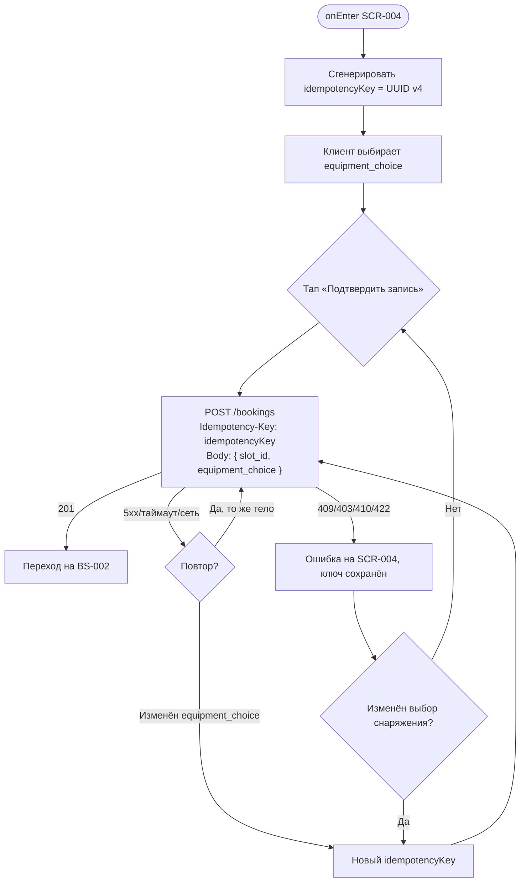

# Идемпотентность мутаций

**ID:** LOGIC-001  
**Тип:** Логика  
**Домен:** 09. Логики  
**Приоритет:** Critical  
**Статус:** Черновик  
**Функциональные блоки:** FB-BOOK-001 (Создание брони)

---

## История изменений

| Релиз | ТЗ | Описание изменений |
|-------|-----|-------------------|
| 0.1.0 | [README.md](../README.md) | Первоначальная документация для «Вертикали» |

---

## Входные данные

| Название | Тип | Возможные значения | Описание |
|----------|-----|-------------------|----------|
| `idempotencyKey` | Состояние (генерируется на экране) | UUID v4 | Уникальный ключ операции создания брони. Генерируется **один раз** при входе на SCR-004 и переиспользуется при всех повторных попытках той же операции (retry, таймаут, двойной тап). |
| `requestBody` | Состояние (форма SCR-004) | `{ slot_id, equipment_choice }` | Тело запроса `createBooking`. Ключ действителен только в паре с **идентичным** телом. |

---

## Обзор

Логика обеспечивает **идемпотентность** мутации «создать бронь»: повторный запрос `POST /bookings` с тем же заголовком `Idempotency-Key` и тем же телом возвращает **идентичный ответ** (201 с той же бронью) и **не создаёт дубль**. Это критично при сетевых сбоях, таймаутах (~10 с, NFR-24) и защите от двойного тапа (NFR-8).

Ключ генерируется на клиенте при входе на [SCR-004](../SCR-004-booking.md) и живёт до успешного создания брони или ухода с экрана. При изменении параметров записи (другой `equipment_choice`) — генерируется **новый** ключ.

### User Story

> Как клиент, я хочу быть уверен, что при повторной отправке записи не создастся дубль брони,
> чтобы не занимать лишнее место и не получать двойную оплату на месте.

### Бизнес-ценность

- Исключает двойные брони при «мокром пальце» и нестабильной сети в зале (BR-1, NFR-8).
- Безопасный retry после таймаута без риска овербукинга (NFR-24).
- Согласованность с серверным контрактом: атомарная проверка мест/проката + идемпотентность.

---

## Точки применения

| Экран/Компонент | Элемент/Триггер | Условие |
|-----------------|-----------------|---------|
| [SCR-004 Оформление записи](../SCR-004-booking.md) | При входе на экран | Генерация `idempotencyKey` (UUID v4) |
| [SCR-004 Оформление записи](../SCR-004-booking.md) | Кнопка «Подтвердить запись» | Передача `Idempotency-Key` в заголовке `createBooking` |
| [SCR-004 Оформление записи](../SCR-004-booking.md) | Retry после таймаута/сети | Тот же ключ и то же тело — без дубля |

---

## Флоу



---

## Описание логики

### Шаг 1: Генерация ключа

При входе на SCR-004 клиент генерирует `idempotencyKey` (UUID v4) и сохраняет в состоянии экрана. Ключ **не** перегенерируется между retry той же операции.

### Шаг 2: Отправка запроса

Каждый вызов `POST /bookings` включает заголовок:

```
Idempotency-Key: <idempotencyKey>
```

Тело — `{ slot_id, equipment_choice }` из формы.

### Шаг 3: Повтор при неопределённом результате

Если ответ не получен (таймаут ~10 с, обрыв сети, NFR-24) — клиент **повторяет** запрос с **тем же** `Idempotency-Key` и **тем же** телом. Сервер вернёт 201 с уже созданной бронью или создаст её один раз.

### Шаг 4: Смена параметров операции

Если клиент меняет `equipment_choice` **до** успешного 201 — генерируется **новый** `idempotencyKey`, потому что это уже другая операция с другим телом.

### Шаг 5: Успех и очистка

При успешном 201 ключ больше не нужен — переход на BS-002. При уходе с экрана без успеха ключ отбрасывается; при повторном входе генерируется новый.

---

## API запросы

### POST /bookings

**Триггер:** Тап «Подтвердить запись» на SCR-004; повтор при retry.

**Спецификация:** [../../api/openapi.yaml](../../api/openapi.yaml) → `POST /bookings`

**Headers:**

| Поле | Описание |
|------|----------|
| `Authorization` | Bearer access-токен |
| `Idempotency-Key` | UUID v4 из состояния SCR-004 |

**Параметры/Body:**

| Параметр | Тип | Описание | Значение/Источник |
|----------|-----|----------|-------------------|
| `slot_id` | string (uuid) | Слот для записи | Параметр навигации `slotId` |
| `equipment_choice` | string (`own` \| `rental`) | Вариант снаряжения | Радио-группа формы SCR-004 |

**Обработка ответа:**

| Результат | Действие |
|-----------|----------|
| Загрузка | CTA в Loading, форма заблокирована |
| Успех (201) | Переход на BS-002; ключ больше не используется |
| Повтор с тем же ключом (201) | Идентичный ответ — трактуется как успех, переход на BS-002 |
| Ошибка 4xx/5xx | Обработка по SCR-004; ключ сохранён для retry (кроме смены тела) |
| Таймаут/сеть | Retry с тем же ключом и телом |

---

## Связанные требования

### Функциональные (FR-*)

| ID | Название | Приоритет |
|----|----------|-----------|
| FR-15 | Запись на слот при наличии мест | Must |
| FR-23 | Запрет овербукинга; атомарная проверка на сервере | Must |

### Нефункциональные (NFR-*)

| ID | Название | Приоритет |
|----|----------|-----------|
| NFR-8 | Исключение двойных броней и овербукинга | Must |
| NFR-24 | Retry с тем же `Idempotency-Key` при неопределённом результате | Should |

---

## Критерии приёмки

| ID | Критерий |
|----|----------|
| AC-001 | **Дано** клиент на SCR-004 и нажал «Подтвердить запись», **Когда** запрос ушёл с заголовком `Idempotency-Key`, **Тогда** повторный запрос с тем же ключом и телом не создаёт вторую бронь. |
| AC-002 | **Дано** первый запрос завершился таймаутом без ответа, **Когда** клиент повторяет отправку с тем же ключом, **Тогда** сервер возвращает 201 с одной бронью (без дубля). |
| AC-003 | **Дано** клиент изменил выбор с «Своё» на «Прокат» до успеха, **Когда** отправляет запрос, **Тогда** используется новый `Idempotency-Key`. |
| AC-004 | **Дано** клиент дважды быстро тапнул «Подтвердить запись», **Когда** первый запрос в Loading, **Тогда** повторный тап заблокирован (NFR-8). |

---

## Обработка ошибок

| Тип ошибки | Контекст | Действие |
|------------|----------|----------|
| Таймаут/сеть | `createBooking` | Retry с тем же `Idempotency-Key`; снек «Не удалось выполнить. Проверьте соединение и повторите.» |
| 409 `double_booking` | Клиент уже записан | Ключ не помогает — бронь уже есть; показать сообщение и ссылку на SCR-005 |
| Смена тела запроса | Изменён `equipment_choice` | Новый ключ; старый ключ не переиспользуется с новым телом |

---
