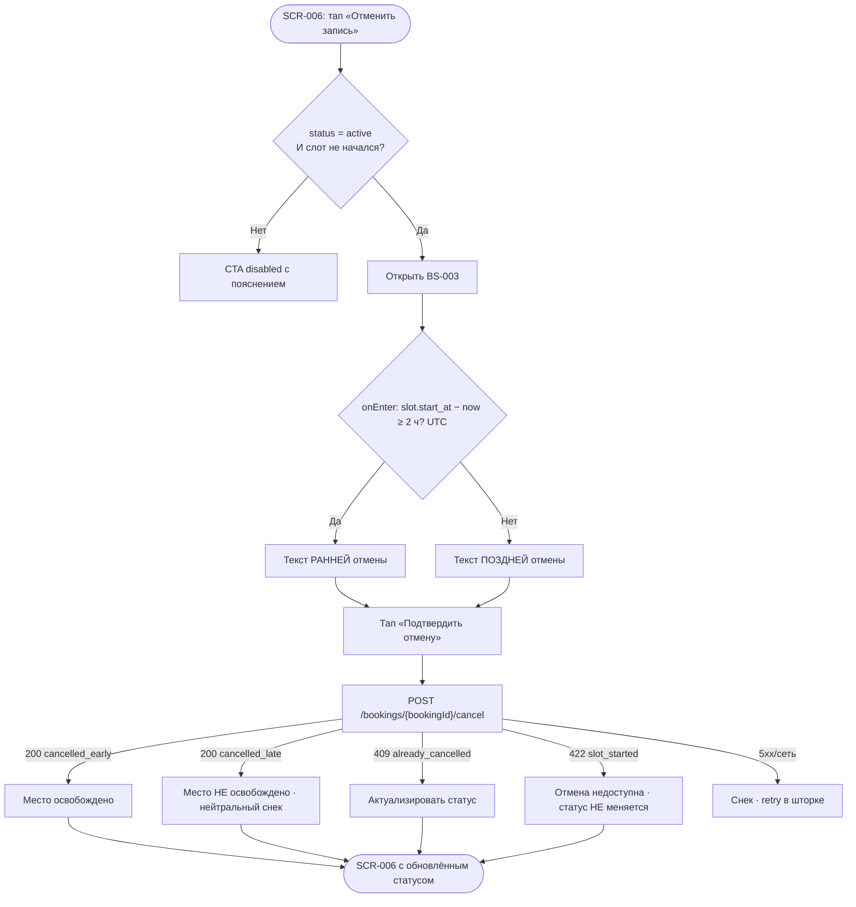

# Правило ранней/поздней отмены (2 часа)

**ID:** LOGIC-002  
**Тип:** Логика  
**Домен:** 09. Логики  
**Приоритет:** Critical  
**Статус:** Черновик  
**Функциональные блоки:** FB-MYB-003 (Отмена брони)

---

## История изменений

| Релиз | ТЗ | Описание изменений |
|-------|-----|-------------------|
| 0.1.0 | [README.md](../README.md) | Первоначальная документация для «Вертикали» |

---

## Входные данные

| Название | Тип | Возможные значения | Описание |
|----------|-----|-------------------|----------|
| `slot.start_at` | Данные брони (`getBooking` → `Booking.slot.start_at`) | date-time (ISO 8601, UTC) | Время старта тренировки. Сервер отсчитывает порог 2 часов; клиент использует то же значение для предварительного текста в BS-003. |
| `now` | Состояние | date-time | Текущий момент; фиксируется **в момент onEnter BS-003**. Сравнение в UTC. |
| `booking.status` | Данные брони | `active`, `cancelled_early`, `cancelled_late`, `cancelled_by_gym`, `completed` | Отмена доступна только при `active`. |
| `booking.cancelled_at` | Данные брони | date-time \| `null` | Момент отмены; заполняется сервером. |

---

## Обзор

Логика управляет отменой брони клиентом и применением **правила 2 часов**. Отмена — `POST /bookings/{bookingId}/cancel`; сервер возвращает обновлённый `Booking` с новым статусом.

**Правило 2 часов** (источник истины — сервер, отсчёт от `slot.start_at` в UTC):

- **Ранняя отмена** — до старта **≥ 2 часов** (граница **ровно 2 часа = ранняя**). Статус → `cancelled_early`; **место освобождается** в слоте.
- **Поздняя отмена** — до старта **< 2 часов**. Статус → `cancelled_late`; место **не освобождается**; **штрафов нет**.

Текст правила для UI — единый из [00-foundations §6](../../3-design-brief/00-foundations.md): «Отмена не позднее чем за 2 часа до старта — место освобождается. Позже — место остаётся за вами, но штрафов нет.»

Клиент **до подтверждения** предварительно выбирает текст-последствие в [BS-003](../BS-003-cancel-confirm.md) по разнице `slot.start_at − now`. **Окончательное решение — сервер**; UI отображает фактический `status` из ответа.

CTA «Отменить запись» на [SCR-006](../SCR-006-booking-details.md) активна только при `status = active` **и** `slot.start_at` в будущем.

### User Story

> Как клиент, я хочу отменить запись до старта тренировки, понимая последствия (освободится место или нет),
> чтобы освободить место для других, если планы изменились, и не опасаться скрытых штрафов при поздней отмене.

### Бизнес-ценность

- Ранняя отмена возвращает место в слот — повышение заполняемости (FR-27).
- Честность: при поздней отмене явно сообщается об отсутствии штрафов (P6).
- Единое серверное правило исключает рассинхрон счётчиков (NFR-8).

---

## Точки применения

| Экран/Компонент | Элемент/Триггер | Условие |
|-----------------|-----------------|---------|
| [SCR-006 Детали брони](../SCR-006-booking-details.md) | CTA «Отменить запись» + блок «Правило отмены» | CTA enabled только при `active` и слот не начался |
| [BS-003 Подтверждение отмены](../BS-003-cancel-confirm.md) | Текст-последствие + «Подтвердить отмену» | Предварительный расчёт при onEnter; подтверждение → `cancelBooking` |

---

## Флоу

---

## Описание логики

### Шаг 1: Доступность отмены на SCR-006

CTA «Отменить запись» активна только при `booking.status = active` **и** `slot.start_at` в будущем. Иначе — disabled с пояснением:

- слот начался → «Тренировка уже началась — отменить запись нельзя.»;
- уже отменена → «Запись уже отменена.»

Рядом с активным CTA — текст правила из foundations §6 (без переписывания).

### Шаг 2: Предварительный расчёт в BS-003

При onEnter BS-003: `Δ = slot.start_at − now` (UTC):

- `Δ ≥ 2 ч` → текст **ранней** отмены (место освобождается);
- `Δ < 2 ч` → текст **поздней** отмены (место не освобождается, штрафов нет).

Граница **ровно 2 часа = ранняя** (`≥`).

### Шаг 3: Подтверждение и запрос

По «Подтвердить отмену» — Loading на кнопке, повторные тапы заблокированы → `POST /bookings/{bookingId}/cancel`.

### Шаг 4: Результат на сервере

- **≥ 2 ч → `cancelled_early`:** место возвращается в слот.
- **< 2 ч → `cancelled_late`:** место не освобождается; штрафов нет.

**`cancelled_late` — успешный исход (200), не ошибка.** Итог-снек: «Поздняя отмена: место не освобождено (правило 2 часов). Штраф не взимается.» (foundations §6, показывает SCR-006 после закрытия BS-003).

### Шаг 5: Отображение на SCR-006

Бейдж по `status` из ответа: «Отменена» (`cancelled_early`) или «Поздняя отмена» (`cancelled_late`); показан `cancelled_at`. CTA «Отменить» → disabled.

---

## API запросы

### POST /bookings/{bookingId}/cancel

**Спецификация:** [../../api/openapi.yaml](../../api/openapi.yaml) → `POST /bookings/{bookingId}/cancel`

**Триггер:** «Подтвердить отмену» в BS-003.

**Headers:**

| Поле | Описание |
|------|----------|
| `Authorization` | Bearer access-токен |

**Параметры/Body:**

| Параметр | Тип | Описание | Значение/Источник |
|----------|-----|----------|-------------------|
| `bookingId` | string (uuid), path | ID брони | `booking.id` (SCR-006) |

> Тело отсутствует. Тип отмены определяет сервер.

**Обработка ответа:**

| Результат | Действие |
|-----------|----------|
| Загрузка | Лоадер на кнопке; элементы шторки заблокированы |
| Успех (200), `cancelled_early` | Закрыть BS-003; бейдж «Отменена»; снек «Бронь отменена» |
| Успех (200), `cancelled_late` | Закрыть BS-003; бейдж «Поздняя отмена»; нейтральный итог-снек из foundations §6 |
| Ошибка 422 (`slot_started`) | **Статус НЕ меняется**; снек «Тренировка уже началась — отмена недоступна.»; `getBooking`; CTA disabled |
| Ошибка 409 (`already_cancelled`) | Актуализировать статус; снек «Запись уже отменена.» |
| Ошибка 403/404 | Снек: 4xx с `message` → из `message`, иначе «Не удалось выполнить. Попробуйте ещё раз.» |
| Ошибка 5xx/сеть | Снек «Не удалось выполнить. Проверьте соединение и повторите.»; остаться в BS-003, retry |

---

## Связанные требования

### Функциональные (FR-*)

| ID | Название | Приоритет |
|----|----------|-----------|
| FR-26 | Отмена записи до начала тренировки | Must |
| FR-27 | Ранняя отмена (≥2 ч) освобождает место | Must |
| FR-28 | Поздняя отмена (<2 ч) без освобождения места и без штрафов | Must |

### Use cases

| ID | Название | Приоритет |
|----|----------|-----------|
| UC-2 | Отмена записи | Must |

---

## Критерии приёмки

| ID | Критерий |
|----|----------|
| AC-001 | **Дано** активная бронь и до старта ≥2 ч, **Когда** клиент подтверждает отмену, **Тогда** сервер возвращает `cancelled_early`, место освобождается. |
| AC-002 | **Дано** до старта <2 ч, **Когда** клиент подтверждает отмену, **Тогда** сервер возвращает 200 `cancelled_late` (успех, не ошибка), место не освобождается, штрафов нет. |
| AC-003 | **Дано** ровно 2 ч до старта (onEnter BS-003, UTC), **Когда** клиент подтверждает, **Тогда** трактуется как ранняя отмена (`cancelled_early`). |
| AC-004 | **Дано** слот уже начался, **Когда** клиент на SCR-006, **Тогда** CTA disabled; при 422 `slot_started` статус не меняется. |
| AC-005 | **Дано** бронь уже отменена, **Когда** повторный вызов отмены, **Тогда** 409, актуализация статуса, CTA disabled. |
| AC-006 | **Дано** клиент подтверждает отмену, **Когда** запрос выполняется, **Тогда** кнопка в Loading, повторные тапы заблокированы. |

---

## Обработка ошибок

| Тип ошибки | Контекст | Действие |
|------------|----------|----------|
| 422 `slot_started` | Слот стартовал | Статус не меняется; нейтральный снек; `getBooking`; CTA disabled |
| 409 `already_cancelled` | Уже отменена | Актуализировать статус из ответа/`getBooking` |
| 403/404 | Нет прав / не найдена | Снек по foundations §6 |
| 5xx/сеть | Сбой при отмене | Снек; остаться в BS-003; retry |
| Двойной тап | Спешка | Loading блокирует повтор (NFR-8) |

---
