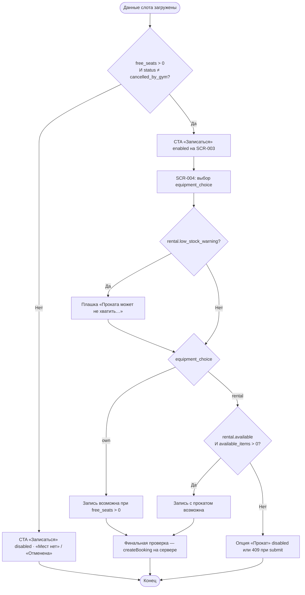

# Раздельная доступность мест и прокатного снаряжения

**ID:** LOGIC-003  
**Тип:** Логика  
**Домен:** 09. Логики  
**Приоритет:** Critical  
**Статус:** Черновик  
**Функциональные блоки:** FB-SLOTS-003, FB-BOOK-001

---

## История изменений

| Релиз | ТЗ | Описание изменений |
|-------|-----|-------------------|
| 0.1.0 | [README.md](../README.md) | Первоначальная документация для «Вертикали» |

---

## Входные данные

> Логика — **чистый клиентский расчёт и отображение** по данным слота из API. Отдельных запросов не делает.

| Название | Тип | Возможные значения | Описание |
|----------|-----|-------------------|----------|
| `slot.free_seats` | Данные слота | `0…capacity_total` | Свободные места в группе. Из `Slot.free_seats`. |
| `slot.status` | Данные слота | `scheduled`, `full`, `cancelled_by_gym` | Производный статус для UI (FR-9). |
| `slot.rental.available` | Данные слота | `true` / `false` | Доступность проката **отдельно** от мест (FR-19). |
| `slot.rental.available_items` | Данные слота | integer ≥ 0 | Остаток прокатных единиц. |
| `slot.rental.low_stock_warning` | Данные слота | `true` / `false` | Показать информационную плашку (FR-20). |
| `slot.rental.tariff` | Данные слота | number (RUB) | Тариф проката за единицу; оплата офлайн (FR-21). |
| `equipment_choice` | Состояние (SCR-004) | `own` / `rental` | Выбор клиента на уровне брони (FR-18). |

### Валидация входных диапазонов

- `free_seats` отрицательное или `null` → трактуется как `0` (защитный fallback).
- `rental.available_items` ≤ 0 или `rental.available = false` → прокат недоступен для новой брони с `equipment_choice = rental`.

---

## Обзор

Логика описывает **два независимых лимита** записи на тренировку:

1. **Места в группе** — `free_seats > 0` необходимо для любой записи.
2. **Прокатное снаряжение** — выбор `rental` требует `rental.available = true` и достаточного остатка; выбор `own` **не потребляет** прокатный фонд.

Наличие свободного места **не гарантирует** наличие проката, и наоборot (FR-19). Клиент отражает это в UI **до** подтверждения; **финальную проверку делает сервер** при `createBooking` (409 `slot_full` / `rental_unavailable`).

Информационная плашка «Прокатного снаряжения может не хватить на всех записавшихся» (`low_stock_warning = true`) показывается на SCR-003/SCR-004 **независимо** от выбора снаряжения и **не блокирует** запись (FR-20).

### User Story

> Как клиент, я хочу понимать, что место в группе и прокатное снаряжение учитываются отдельно,
> чтобы выбрать «Своё» или «Прокат» без сюрпризов при подтверждении.

### Бизнес-ценность

- Прозрачность до записи — меньше отказов и недовольства в зале (BR-13).
- Предотвращение ложных ожиданий «есть место = есть прокат» (FR-19).
- Единый расчёт для SCR-003 и SCR-004 без дублирования правил.

---

## Точки применения

| Экран/Компонент | Элемент/Триггер | Условие |
|-----------------|-----------------|---------|
| [SCR-003 Карточка тренировки](../SCR-003-slot-card.md) | «Свободно N из M», CTA «Записаться», плашка проката | По данным `getSlot` |
| [SCR-004 Оформление записи](../SCR-004-booking.md) | Радио «Своё»/«Прокат», плашка, тариф, доступность «Прокат» | Пересчёт при смене выбора |

---

## Флоу

---

## Описание логики

### Шаг 1: Доступность записи по местам (SCR-003)

CTA «Записаться» **активна**, если одновременно:

- `free_seats > 0`;
- `status ≠ cancelled_by_gym`;
- слот не начался (проверка по `start_at` — на SCR-003/навигации).

При `free_seats = 0` или `status = full` — CTA disabled, бейдж «Мест нет». При `cancelled_by_gym` — «Отменена скалодромом», запись недоступна.

### Шаг 2: Отображение проката (SCR-003 / SCR-004)

- Показать `rental.tariff` и доступность проката отдельно от счётчика мест.
- Если `rental.low_stock_warning = true` — информационная плашка (текст из foundations §6), **не блокирует** CTA.

### Шаг 3: Выбор снаряжения (SCR-004)

Радио «Своё» / «Прокат», дефолт — `own` (FR-18).

- **`own`:** запись потребляет только место в группе.
- **`rental`:** запись потребляет место **и** прокатную единицу. Если `rental.available = false` или `available_items = 0` — опция «Прокат» **disabled** с пояснением «Прокатного снаряжения не осталось»; клиент может выбрать «Своё».

При выборе «Прокат» показывается `rental.tariff` и напоминание об офлайн-оплате.

### Шаг 4: Сервер — финальный арбитр

При `createBooking`:

- 409 `slot_full` — места закончились (гонка); обновить `free_seats`, предложить вернуться к списку.
- 409 `rental_unavailable` — прокат закончился; предложить «Своё».
- 409 `double_booking` — клиент уже записан.

### Шаг 5: Пересчёт при обновлении данных

При pull-to-refresh / повторном `getSlot` — пересчитать доступность CTA и состояние радио «Прокат». Если `free_seats` стало 0 — CTA off. Если прокат исчерпан при выбранном `rental` — переключить на `own` или показать ошибку.

---

## API запросов

> Отдельных запросов логика не делает. Источник — ответ `GET /slots/{slotId}` ([openapi.yaml](../../api/openapi.yaml)).

| Источник | Поле | Назначение |
|----------|------|------------|
| `Slot` | `free_seats`, `status` | CTA «Записаться», бейджи |
| `Slot.rental` | `available`, `available_items`, `low_stock_warning`, `tariff` | Плашка, радио «Прокат», тариф |

Финальная проверка — `POST /bookings` (см. [LOGIC-001](LOGIC-001-idempotency.md), SCR-004).

---

## Связанные требования

### Функциональные (FR-*)

| ID | Название | Приоритет |
|----|----------|-----------|
| FR-15 | Запись при наличии свободных мест | Must |
| FR-18 | Выбор «своё»/«прокат» на уровне брони | Must |
| FR-19 | Раздельный учёт мест и проката | Must |
| FR-20 | Плашка о нехватке проката, не блокирует запись | Must |
| FR-21 | Тариф проката и офлайн-оплата | Must |
| FR-23 | Запрет овербукинга; сервер — атомарная проверка | Must |

---

## Критерии приёмки

| ID | Критерий |
|----|----------|
| AC-001 | **Дано** `free_seats = 0`, **Когда** открыта SCR-003, **Тогда** CTA «Записаться» disabled, бейдж «Мест нет». |
| AC-002 | **Дано** `free_seats > 0` и `rental.available = false`, **Когда** клиент на SCR-004, **Тогда** запись с «Своё» возможна, «Прокат» disabled. |
| AC-003 | **Дано** `low_stock_warning = true`, **Когда** SCR-003 или SCR-004, **Тогда** плашка видна независимо от выбора снаряжения, CTA активен при наличии мест. |
| AC-004 | **Дано** клиент выбрал «Прокат» и на submit прокат закончился, **Когда** сервер вернул 409 `rental_unavailable`, **Тогда** сообщение «Прокатного снаряжения не осталось», предложение выбрать «Своё». |
| AC-005 | **Дано** слот с `status = cancelled_by_gym`, **Когда** SCR-003, **Тогда** CTA disabled, повторная запись недоступна. |
| AC-006 | **Дано** параллельная запись заняла последнее место, **Когда** `createBooking` вернул 409 `slot_full`, **Тогда** UI обновляет `free_seats` и блокирует подтверждение. |

---

## Обработка ошибок

| Тип ошибки | Контекст | Действие |
|------------|----------|----------|
| 409 `slot_full` | Нехватка мест при submit | Сообщение «Мест не осталось»; актуализировать слот |
| 409 `rental_unavailable` | Нехватка проката | Предложить «Своё»; обновить `rental.*` |
| 409 `double_booking` | Уже записан | Ссылка на SCR-005 |
| Гонка (NFR-8) | Между `getSlot` и `createBooking` | Обновить данные слота, пересчитать UI |

---
