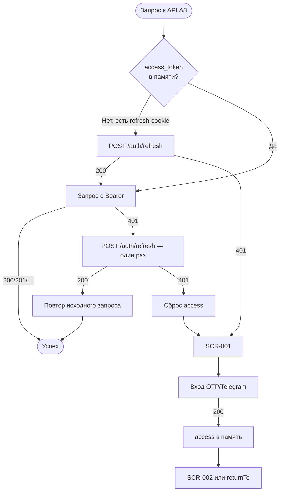

# Сессия: access/refresh, 401-flow

**ID:** LOGIC-004  
**Тип:** Логика  
**Домен:** 09. Логики  
**Приоритет:** Critical  
**Статус:** Черновик  
**Функциональные блоки:** FB-AUTH-002 (Сессия и выход), FB-PROFILE-003

---

## История изменений

| Релиз | ТЗ | Описание изменений |
|-------|-----|-------------------|
| 0.1.0 | [README.md](../README.md) | Первоначальная документация для «Вертикали» |

---

## Входные данные

| Название | Тип | Возможные значения | Описание |
|----------|-----|-------------------|----------|
| `access_token` | Состояние (память приложения) | JWT-строка / отсутствует | Короткоживущий Bearer (~15 мин, NFR-18). Подставляется в `Authorization: Bearer <access_token>`. **Не** хранится в localStorage/sessionStorage. Теряется при полной перезагрузке вкладки. |
| `refresh_token` | httpOnly-cookie (браузер) | cookie / отсутствует | Долгоживущий refresh (~30 дней). Передаётся браузером автоматически на `POST /auth/refresh`. Недоступен из JavaScript. |
| `expires_in` | Состояние | integer (секунды, напр. `900`) | Срок жизни access из ответа `otpVerify` / `telegramAuth` / `refresh`. |
| `returnTo` | Состояние (query) | путь экрана АЗ | Куда вернуть после входа при редиректе из-за истёкшей сессии. |

---

## Обзор

Логика управляет **JWT-сессией** клиентского веб-приложения «Вертикаль»:

- **`access_token`** — в памяти приложения (React state); подставляется во все запросы АЗ.
- **`refresh_token`** — в `httpOnly` + `Secure` + `SameSite=Strict` cookie; обновляет access без участия пользователя.

**Авто-обновление:** при `401` на авторизованном запросе клиент **один раз** вызывает `POST /auth/refresh` (cookie уходит автоматически) и **повторяет** исходный запрос. При успехе пользователь не замечает обновления.

**401-flow (refresh не помог):** refresh истёк/отозван → сброс access из памяти → редирект на [SCR-001](../SCR-001-registration.md) (шаг ввода телефона). Опционально сохраняется `returnTo` для возврата после входа.

**Logout:** `POST /auth/logout` инвалидирует refresh-cookie на сервере; клиент сбрасывает access → SCR-001.

**Полная перезагрузка вкладки:** access потерян, но refresh-cookie есть → при первом запросе к API — тихий `refresh` → продолжение без показа SCR-001.

### User Story

> Как клиент, я хочу оставаться авторизованным между визитами в приложение,
> чтобы быстро записаться на тренировку, не вводя код каждый раз.

### Бизнес-ценность

- Минимальный порог повторного входа (NFR-3, P3).
- Безопасность: refresh недоступен из JS — снижение риска XSS-кражи сессии (NFR-18).
- Прозрачное обновление access без прерывания сценария записи.

---

## Точки применения

| Экран/Компонент | Элемент/Триггер | Условие |
|-----------------|-----------------|---------|
| HTTP-клиент (глобальный interceptor) | Любой запрос АЗ | Подстановка `Authorization`; обработка 401 |
| [SCR-001 Регистрация / Вход](../SCR-001-registration.md) | Успешный `otpVerify` / `telegramAuth` | Сохранение access в памяти |
| [SCR-001 Регистрация / Вход](../SCR-001-registration.md) | Старт приложения с валидным refresh-cookie | Тихий refresh → SCR-002 |
| [SCR-007 Профиль](../SCR-007-profile.md) | «Выйти» | `logout` → сброс сессии |
| Все экраны АЗ | Ответ 401 после неуспешного refresh | Редирект на SCR-001 |

---

## Флоу

---

## Описание логики

### Шаг 0: Старт приложения

При загрузке SPA: если access в памяти отсутствует (перезагрузка вкладки), но refresh-cookie валиден — **до показа АЗ** выполнить `POST /auth/refresh`, сохранить access, открыть SCR-002 (или `returnTo`). Если refresh отклонён — SCR-001.

### Шаг 1: Подстановка access

HTTP-клиент добавляет `Authorization: Bearer <access_token>` ко всем запросам, требующим авторизации.

### Шаг 2: Обработка 401

1. Получен `401` на авторизованном запросе.
2. **Один раз** вызвать `POST /auth/refresh` (refresh-cookie автоматически).
3. При 200 — сохранить новый access (+ `expires_in`), **повторить** исходный запрос.
4. При 401 на refresh — сбросить access, редирект на SCR-001 с опциональным `returnTo`.

Параллельные 401 не должны вызывать шторм refresh — используется **single-flight** (один refresh на очередь запросов).

### Шаг 3: Успешный вход (SCR-001)

После `otpVerify` (200) или `telegramAuth` (200): сохранить `access_token` и `expires_in` в памяти; refresh устанавливается сервером в httpOnly-cookie. Переход на SCR-002 или `returnTo`.

### Шаг 4: Logout (SCR-007)

`POST /auth/logout` → 204: сервер инвалидирует refresh-cookie; клиент сбрасывает access → SCR-001. При ошибке сети — локально сбросить access и перейти на SCR-001.

---

## API запросы

### POST /auth/refresh

**Спецификация:** [../../api/openapi.yaml](../../api/openapi.yaml)

**Триггер:** 401 на авторизованном запросе; старт приложения без access в памяти.

**Headers:** refresh передаётся через cookie (не в JS). CSRF-заголовок на мутирующих запросах (NFR-18).

**Обработка ответа:**

| Результат | Действие |
|-----------|----------|
| Успех (200) | Сохранить `access_token`, `expires_in`; повторить исходный запрос |
| Ошибка 401 | Сброс access; редирект SCR-001 |
| Ошибка 5xx/сеть | Снек по foundations §6; сессия не сбрасывается немедленно; retry позже |

### POST /auth/logout

**Триггер:** «Выйти» на SCR-007.

**Обработка ответа:**

| Результат | Действие |
|-----------|----------|
| Успех (204) | Сброс access; SCR-001 |
| Ошибка 401 | Токен уже невалиден — также SCR-001 |
| Ошибка 5xx/сеть | Локальный сброс access; SCR-001 |

---

## Локальное хранение

| Ключ | Тип хранения | Описание |
|------|--------------|----------|
| `access_token` | Память приложения (React state) | Короткоживущий JWT. Не в localStorage. |
| `refresh_token` | httpOnly-cookie (браузер) | Управляется сервером; недоступен из JS. |
| `expires_in` | Память приложения | Для проактивного refresh (опционально). |

---

## Связанные требования

### Функциональные (FR-*)

| ID | Название | Приоритет |
|----|----------|-----------|
| FR-1 | Вход по SMS OTP | Must |
| FR-2 | Вход через Telegram | Must |
| FR-34 | Logout | Must |

### Нефункциональные (NFR-*)

| ID | Название | Приоритет |
|----|----------|-----------|
| NFR-3 | Минимальный порог входа | Must |
| NFR-18 | Access в памяти, refresh в httpOnly-cookie; 401-flow | Must |

---

## Критерии приёмки

| ID | Критерий |
|----|----------|
| AC-001 | **Дано** валидный refresh-cookie и нет access в памяти (перезагрузка), **Когда** приложение стартует, **Тогда** выполняется тихий refresh и открывается SCR-002 без SCR-001. |
| AC-002 | **Дано** access истёк, refresh валиден, **Когда** API вернул 401, **Тогда** клиент один раз обновляет access и повторяет запрос без редиректа на вход. |
| AC-003 | **Дано** refresh истёк, **Когда** API вернул 401 и refresh тоже 401, **Тогда** редирект на SCR-001, access сброшен. |
| AC-004 | **Дано** клиент на SCR-007 нажал «Выйти», **Когда** `logout` 204, **Тогда** access сброшен, refresh-cookie инвалидирован, открыт SCR-001. |
| AC-005 | **Дано** редирект на SCR-001 с `returnTo`, **Когда** вход успешен, **Тогда** клиент возвращается на исходный экран, а не на SCR-002 по умолчанию. |

---

## Обработка ошибок

| Тип ошибки | Контекст | Действие |
|------------|----------|----------|
| 401 + refresh OK | Любой запрос АЗ | Тихий refresh + retry |
| 401 + refresh fail | Любой запрос АЗ | SCR-001 с `returnTo` |
| 5xx на refresh | Старт / 401-flow | Снек; не сбрасывать сессию сразу |
| Параллельные 401 | Несколько запросов | Single-flight refresh |

---
