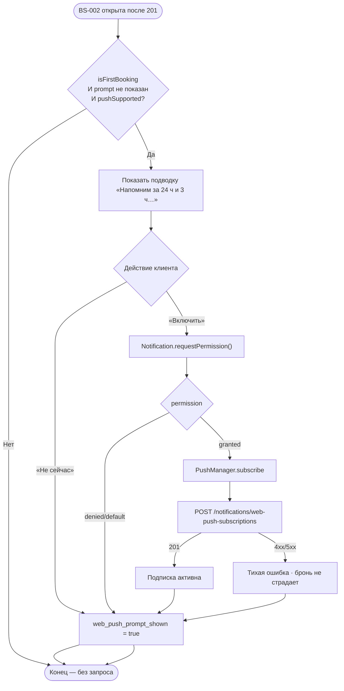

# Web Push подписка

**ID:** LOGIC-005  
**Тип:** Логика  
**Домен:** 09. Логики  
**Приоритет:** Medium  
**Статус:** Черновик  
**Функциональные блоки:** FB-BOOK-002 (Подтверждение записи)

---

## История изменений

| Релиз | ТЗ | Описание изменений |
|-------|-----|-------------------|
| 0.1.0 | [README.md](../README.md) | Первоначальная документация для «Вертикали» |

---

## Входные данные

| Название | Тип | Возможные значения | Описание |
|----------|-----|-------------------|----------|
| `isFirstBooking` | Состояние | `true` / `false` | Признак первой успешной записи клиента. Определяет показ запроса Web Push на BS-002 (FR-48). Источник — клиентский счётчик/флаг профиля или ответ API. |
| `web_push_prompt_shown` | Локальный кэш (localStorage) | `true` / `false` (default `false`) | Флаг «запрос разрешения уже показывался на этом устройстве/браузере». |
| `notificationPermission` | Browser API | `default` / `granted` / `denied` | Результат `Notification.permission` / `Notification.requestPermission()`. |
| `pushSupported` | Состояние | `true` / `false` | `('serviceWorker' in navigator) && ('PushManager' in window) && ('Notification' in window)`. На iOS Safari — только при Add to Home Screen (NFR-17). |
| `subscription` | PushManager | PushSubscription / `null` | Объект подписки после `pushManager.subscribe()`. |

---

## Обзор

Логика определяет **единственный момент** запроса браузерного разрешения на Web Push и регистрацию подписки на бэкенде. Запрос показывается **только после первой успешной записи** на [BS-002](../BS-002-booking-success.md), когда ценность напоминаний очевидна — **не** на старте приложения и **не** в профиле (FR-48).

**Каналы уведомлений (NFR-17):** Web Push + дублирование в Telegram (если аккаунт привязан). Telegram — основной гарантированный канал; при недоступности Web Push напоминания идут через Telegram.

**Принцип:** один раз, без давления (P6). Отказ **не блокирует** работу приложения. Повторный системный запрос не показывается — при отказе включение только через настройки браузера (опциональная подсказка-ссылка).

При `granted`: `PushManager.subscribe()` → `POST /notifications/web-push-subscriptions` с `{ endpoint, keys }`.

### User Story

> Как клиент, я хочу после первой записи разрешить напоминания о тренировке в браузере,
> чтобы не забыть о занятии — но без навязчивых запросов, если я отказался.

### Бизнес-ценность

- Снижение неявок: напоминания за 24 ч и 3 ч (FR-45, NFR-17).
- Запрос в момент высокой мотивации — выше conversion на разрешение (FR-48).
- Telegram-дублирование сохраняет доставку при отказе от push.

---

## Точки применения

| Экран/Компонент | Элемент/Триггер | Условие |
|-----------------|-----------------|---------|
| [BS-002 Подтверждение записи](../BS-002-booking-success.md) | Блок «Включить напоминания» после сводки | `isFirstBooking = true` **и** `web_push_prompt_shown = false` **и** `pushSupported = true` **и** `notificationPermission = default` |

---

## Флоу

---

## Описание логики

### Шаг 1: Условия показа

На BS-002 после отображения сводки брони проверить **все** условия:

1. `isFirstBooking = true`;
2. `web_push_prompt_shown = false`;
3. `pushSupported = true` (Service Worker зарегистрирован);
4. `Notification.permission === 'default'` (ещё не спрашивали).

Если любое не выполнено — блок запроса **не показывается**.

### Шаг 2: Подводка (не системный диалог)

Показать in-app блок с объяснением: напоминания за **24 ч и 3 ч** до тренировки (часы из API, не хардкод). Кнопки: «Включить напоминания» / «Не сейчас».

### Шаг 3: Системный запрос

По «Включить» → `Notification.requestPermission()`. **Только по явному тапу** — не при onEnter.

### Шаг 4: Регистрация подписки

При `granted`:

1. `registration.pushManager.subscribe({ userVisibleOnly: true, applicationServerKey })`.
2. `POST /notifications/web-push-subscriptions` с телом `{ endpoint, keys: { p256dh, auth } }`.

Ошибка регистрации **не блокирует** BS-002 и не показывает агрессивный error — бронь уже создана.

### Шаг 5: Отказ и повтор

- «Не сейчас» или `denied` → `web_push_prompt_shown = true`; повтор на BS-002 **не показывается**.
- При последующих бронях запрос **не повторяется**.
- MVP: отдельного экрана управления уведомлениями нет; при `denied` — опциональная подсказка «Включить в настройках браузера».

### Шаг 6: Отзыв разрешения

При `permission` → `denied` после ранее выданного `granted` — `DELETE /notifications/web-push-subscriptions` с `{ endpoint }` (при наличии сохранённой подписки).

---

## API запросы

### POST /notifications/web-push-subscriptions

**Спецификация:** [../../api/openapi.yaml](../../api/openapi.yaml)

**Триггер:** `Notification.permission === 'granted'` после первой брони.

**Headers:** `Authorization: Bearer <access_token>`

**Параметры/Body:**

| Параметр | Тип | Описание | Источник |
|----------|-----|----------|----------|
| `endpoint` | string (uri) | URL push-сервиса | `PushSubscription.endpoint` |
| `keys.p256dh` | string | Ключ клиента | `PushSubscription.getKey('p256dh')` |
| `keys.auth` | string | Auth secret | `PushSubscription.getKey('auth')` |

**Обработка ответа:**

| Результат | Действие |
|-----------|----------|
| Успех (201) | Подписка сохранена на сервере |
| Ошибка 4xx/5xx | Тихий fail; BS-002 закрывается штатно |
| Ошибка сети | Retry не обязателен; Telegram остаётся каналом |

### DELETE /notifications/web-push-subscriptions

**Триггер:** Отзыв разрешения / logout (опционально).

**Body:** `{ endpoint }` из сохранённой подписки.

---

## Локальное хранение

| Ключ | Тип хранения | Описание |
|------|--------------|----------|
| `web_push_prompt_shown` | localStorage | Флаг показа подводки/запроса |
| `push_subscription_endpoint` | localStorage (опционально) | Для DELETE при отзыве |

---

## Связанные требования

### Функциональные (FR-*)

| ID | Название | Приоритет |
|----|----------|-----------|
| FR-45 | Напоминания за 24 ч и 3 ч (Web Push + Telegram) | Should |
| FR-48 | Запрос Web Push после первой брони | Should |
| FR-46 | Push при отмене скалодромом | Must |

### Нефункциональные (NFR-*)

| ID | Название | Приоритет |
|----|----------|-----------|
| NFR-17 | Web Push + Telegram; ограничения iOS Safari | Must |
| NFR-26 | Telegram как резервный канал | Should |

---

## Критерии приёмки

| ID | Критерий |
|----|----------|
| AC-001 | **Дано** первая успешная бронь и push поддерживается, **Когда** BS-002 открыта, **Тогда** показывается подводка с кнопкой «Включить напоминания». |
| AC-002 | **Дано** клиент нажал «Включить» и разрешил в браузере, **Когда** подписка создана, **Тогда** вызван `POST /notifications/web-push-subscriptions` с endpoint и keys. |
| AC-003 | **Дано** клиент отказал (`denied`) или нажал «Не сейчас», **Когда** BS-002 закрыта, **Тогда** при второй брони запрос **не повторяется**. |
| AC-004 | **Дано** Web Push не поддерживается (нет SW/PushManager), **Когда** BS-002, **Тогда** блок запроса не показывается, бронь работает штатно. |
| AC-005 | **Дано** push не настроен, **Когда** наступает время напоминания, **Тогда** доставка идёт через Telegram при привязанном аккаунте (NFR-17). |

---

## Обработка ошибок

| Тип ошибки | Контекст | Действие |
|------------|----------|----------|
| `pushSupported = false` | Старый браузер / iOS без PWA | Не показывать блок; полагаться на Telegram |
| Ошибка `subscribe()` | SW не готов | Тихий fail; `web_push_prompt_shown = true` |
| 401 на register | Сессия истекла | Не блокировать BS-002; refresh по LOGIC-004 |
| 5xx на register | Сервер недоступен | Тихий fail; напоминания через Telegram |

---
