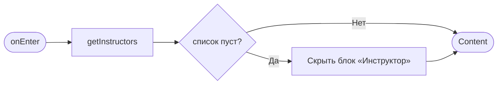
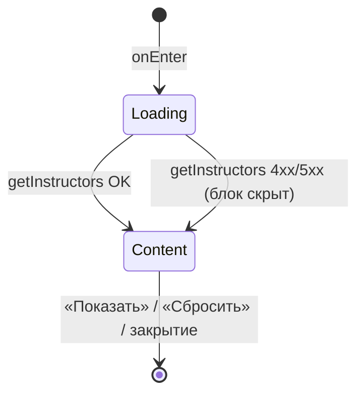

# Фильтры

**ID:** BS-001
**Тип:** Bottom Sheet
**Домен:** 02. Просмотр тренировок
**Приоритет:** High
**Статус:** Черновик
**Функциональные блоки:** FB-SLOTS-002
**Зона авторизации:** АЗ
**Дизайн-макет:** Figma не заведён — текстовый wireframe: [../3-design-brief/BS-001-filters.md](../3-design-brief/BS-001-filters.md), версия 0.1

---

## Содержание

- [История изменений](#история-изменений)
- [Обзор](#обзор)
- [Навигация](#навигация)
- [Входные данные](#входные-данные)
- [Применяемые логики](#применяемые-логики)
- [Свойства Bottom Sheet](#свойства-bottom-sheet)
- [Инициализация](#инициализация)
- [Используемые запросы](#используемые-запросы)
- [Макет экрана](#макет-экрана)
- [Элементы экрана](#элементы-экрана)
- [Состояния экрана](#состояния-экрана)
- [Действия пользователя](#действия-пользователя)
- [Связанные требования](#связанные-требования)
- [Критерии приёмки](#критерии-приёмки)

---

## История изменений

| Релиз | ТЗ | Описание изменений |
|-------|-----|-------------------|
| 0.1.0 | [BS-001-filters.md](../3-design-brief/BS-001-filters.md) | Первичная версия ТЗ на основе дизайн-брифа BS-001 v0.1 |

---

## Обзор

Позволяет клиенту сузить список тренировок на [SCR-002](SCR-002-slot-list.md) по дате/периоду,
зоне/формату и инструктору. Изменения применяются по кнопке «Показать», а не мгновенно.

### User Story

> Как клиент, я хочу фильтровать список тренировок,
> чтобы быстро находить подходящий вариант.

### Бизнес-ценность

- Ускоряет поиск подходящего слота при большом расписании — короче путь к записи (P2, NFR-2).
- Снижает число «пустых» просмотров карточек, не подходящих клиенту по формату/инструктору.

---

## Навигация

### Входящая (откуда открывается)

| Источник | Триггер | Условие | Передаваемые параметры |
|----------|---------|---------|------------------------|
| [SCR-002 Список тренировок](SCR-002-slot-list.md) | Тап «Фильтры» | Всегда | `activeFilters` (текущие значения для предзаполнения) |

### Исходящая (куда ведёт)

| Назначение | Триггер | Передаваемые параметры |
|------------|---------|------------------------|
| [SCR-002 Список тренировок](SCR-002-slot-list.md) | Тап «Показать N тренировок» | Новые `activeFilters` |
| [SCR-002 Список тренировок](SCR-002-slot-list.md) | Тап «Сбросить» | `activeFilters = {}` (дефолт: 7 дней, без фильтров) |
| [SCR-002 Список тренировок](SCR-002-slot-list.md) | Закрытие (бэкдроп/Esc/крестик) без применения | Фильтры не изменяются |

---

## Входные данные

| Название | Тип | Возможные значения | Описание |
|----------|-----|-------------------|----------|
| `activeFilters` | Состояние (переданное с SCR-002) | `{dateFrom, dateTo, zoneFormat[], instructorId[]}` | Предзаполнение полей при открытии |
| `instructorsList` | Кэш / запрос | список инструкторов | Справочник для чекбоксов «Инструктор» |

---

## Применяемые логики

| Логика | Элемент/Триггер | Описание |
|--------|-----------------|----------|
| [LOGIC-007 Комбинирование фильтров](09-logics/LOGIC-007-filter-combination.md) | Кнопка «Показать N тренировок» | ИЛИ внутри группы (зона/формат, инструктор), И между группами |

---

## Свойства Bottom Sheet

| Свойство | Значение |
|----------|----------|
| Высота | Динамическая (по контенту), не выше ~90% экрана на мобильном |
| Закрытие свайпом | Да (усиление на мобильном, не единственный способ) |
| Закрытие по тапу вне области | Да |
| Затемнение фона | Да |
| Кнопка закрытия | Да (крестик, верхний правый угол) |

---

## Инициализация

### Диаграмма загрузки



### Запросы при открытии

| № | Запрос | Критичный | Зависит от | Условие |
|---|--------|-----------|------------|---------|
| 1 | [getInstructors](#getinstructors) | Нет | — | Всегда (справочник для блока «Инструктор») |

> Модалка не делает собственного запроса на слоты — счётчик «Показать N тренировок» и сам список
> обновляются на SCR-002 после применения.

---

## Используемые запросы

### getInstructors

**Тип:** REST
**Метод:** GET
**Спецификация:** [../api/openapi.yaml](../api/openapi.yaml) → `GET /slots` (справочник инструкторов извлекается из уникальных значений `instructor` в ответе; отдельного эндпоинта `/instructors` в контракте нет — см. примечание ниже)

**Триггер:** Инициализация

**Параметры:** —

**Обработка ответа:**

| Результат | Условие | UI-реакция |
|-----------|---------|------------|
| Загрузка | — | Скелетон списка чекбоксов «Инструктор» |
| Успех | Список инструкторов не пуст | Отобразить чекбоксы |
| Успех | Список пуст | Блок «Инструктор» скрыт (AC-003) |
| HTTP 4xx/5xx | — | Блок «Инструктор» скрыт (не блокирует остальные фильтры) |

> **Примечание для API-контракта.** В `openapi.yaml` нет отдельного `GET /instructors`. Для этого
> блока рекомендуется завести лёгкий справочный эндпоинт (например `GET /instructors`) либо явно
> зафиксировать, что список берётся из уникальных `instructor` по результатам последнего
> `GET /slots` без фильтра по инструктору. Зафиксировать решение с бэкенд-командой до реализации.

---

## Макет экрана

### Структура

```
┌─────────────────────────────────────┐
│  ▭▭▭            Фильтры          ✕  │
│  Период                              │
│  [ от: 07.07 ]      [ до: 14.07 ]    │
│  Формат                              │
│  ☐ Для новичков   ☐ Опытные          │
│  Инструктор                          │
│  ☐ Анна   ☐ Игорь   ☐ ...            │
│  ┌───────────┐   ┌───────────────┐   │
│  │ Сбросить  │   │ Показать N     │   │
│  └───────────┘   └───────────────┘   │
└─────────────────────────────────────┘
```

### Компоненты

| Компонент | Описание | Обязательность |
|-----------|----------|----------------|
| Период дат (от/до) | Date range, включительные границы | Да |
| Чекбоксы «Формат» | «Для новичков» / «Опытные» | Да |
| Чекбоксы «Инструктор» | Из справочника, скрывается при пустом списке | Опционально |
| Кнопка «Сбросить» | Текстовая, очищает все фильтры | Да |
| Кнопка «Показать N тренировок» | Primary CTA, live-счётчик | Да |

---

## Элементы экрана

### 1. Фильтры

| Элемент | Описание | Источник данных | Валидация | Действие |
|---------|----------|-----------------|-----------|----------|
| Поле «от» | Дата начала периода | `activeFilters.dateFrom`, дефолт — сегодня | `dateFrom ≤ dateTo`. Ошибка: «Дата "от" не может быть позже даты "до"» | — |
| Поле «до» | Дата конца периода | `activeFilters.dateTo`, дефолт — сегодня + 7 дней | То же | — |
| Чекбокс «Для новичков» | Формат | `activeFilters.zoneFormat` | — | — |
| Чекбокс «Опытные» | Формат | `activeFilters.zoneFormat` | — | — |
| Чекбоксы инструкторов | По одному на каждого из справочника | `activeFilters.instructorId`, [getInstructors](#getinstructors) | — | — |
| Кнопка «Сбросить» | Текстовая кнопка | — | — | Сброс всех полей → закрытие с дефолтными `activeFilters` |
| Кнопка «Показать N тренировок» | Primary CTA, `N` — live-счётчик | Пересчёт по текущим условиям (если считается легко) | — | Применить `activeFilters` → закрытие → [SCR-002](SCR-002-slot-list.md) |

**Условия доступности:**
- Блок «Инструктор» скрыт, если справочник инструкторов пуст.
- Кнопка «Показать N тренировок» активна всегда (даже при `N = 0`, чтобы показать пользователю пустой результат явно).

---

## Состояния экрана

### Таблица состояний

| Состояние | Условие | Отображение |
|-----------|---------|-------------|
| Loading | Ожидание `getInstructors` | Скелетон блока «Инструктор», остальные поля доступны сразу |
| Content | Модалка открыта | Форма фильтров |
| Error (частичная) | `getInstructors` вернул 4xx/5xx | Блок «Инструктор» скрыт, остальное работает |

Empty state не применим (модалка формы, не список).

### Диаграмма переходов



---

## Действия пользователя

| Действие | Элемент | Триггер | Результат |
|----------|---------|---------|-----------|
| Выбрать период | Поля «от»/«до» | Ввод/выбор в date picker | Обновление live-счётчика (если считается на клиенте) |
| Выбрать формат/инструктора | Чекбоксы | Tap | Обновление live-счётчика |
| Применить фильтры | Кнопка «Показать N тренировок» | Tap | Закрытие модалки, обновление [SCR-002](SCR-002-slot-list.md) с новыми фильтрами |
| Сбросить фильтры | Кнопка «Сбросить» | Tap | Закрытие модалки, [SCR-002](SCR-002-slot-list.md) возвращается к дефолту (7 дней, без фильтров) |
| Закрыть без изменений | Крестик / бэкдроп / Esc / свайп вниз | Tap/Swipe/Key | Закрытие без изменения `activeFilters` |

---

## Связанные требования

### Функциональные (FR-*)

| ID | Название | Приоритет |
|----|----------|-----------|
| FR-11 | Фильтрация по дате/периоду, зоне/формату, инструктору; ИЛИ внутри группы, И между группами | Should |

### Use cases / User stories

| ID | Связь |
|----|-------|
| UC-3 | Просмотр и фильтрация списка тренировок (A2 — семантика комбинирования) |
| US-3 | «Хочу фильтровать список тренировок» |

---

## Критерии приёмки

### Позитивные сценарии

| ID | Критерий | Приоритет |
|----|----------|-----------|
| AC-001 | **Дано** клиент выбрал формат «Для новичков» и инструктора «Анна», **Когда** нажимает «Показать», **Тогда** SCR-002 показывает тренировки формата «Для новичков» ИЛИ с инструктором «Анна» (см. LOGIC-007) | P0 |
| AC-002 | **Дано** применены какие-либо фильтры, **Когда** клиент нажимает «Сбросить», **Тогда** список возвращается к дефолтному состоянию (7 дней, без фильтров) | P0 |

### Негативные сценарии

| ID | Критерий | Приоритет |
|----|----------|-----------|
| AC-N01 | **Дано** список инструкторов пуст, **Когда** модалка открыта, **Тогда** блок «Инструктор» не отображается | P1 |
| AC-N02 | **Дано** дата «от» позже даты «до», **Когда** клиент пытается применить фильтры, **Тогда** показывается ошибка валидации и кнопка «Показать» неактивна | P1 |

### Граничные условия (Edge Cases)

| ID | Критерий | Приоритет |
|----|----------|-----------|
| AC-E01 | **Дано** выбранные фильтры дают 0 результатов, **Когда** клиент нажимает «Показать 0 тренировок», **Тогда** модалка закрывается и SCR-002 показывает соответствующий empty state | P2 |

---
