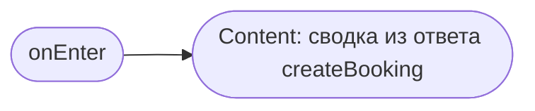
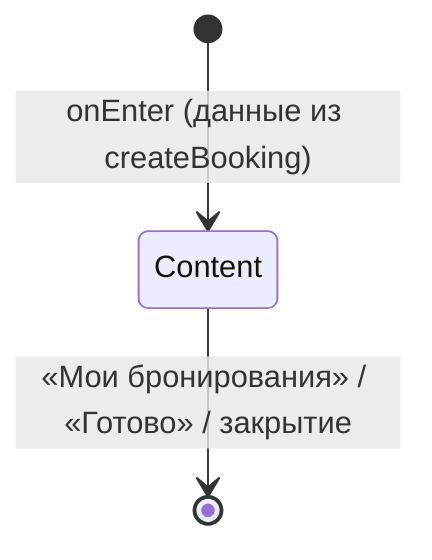

# Подтверждение записи

**ID:** BS-002
**Тип:** Bottom Sheet
**Домен:** 03. Запись на тренировку
**Приоритет:** High
**Статус:** Черновик
**Функциональные блоки:** FB-BOOK-002
**Зона авторизации:** АЗ
**Дизайн-макет:** Figma не заведён — текстовый wireframe: [../3-design-brief/BS-002-booking-success.md](../3-design-brief/BS-002-booking-success.md), версия 0.1

---

## Содержание

- [История изменений](#история-изменений)
- [Обзор](#обзор)
- [Навигация](#навигация)
- [Входные данные](#входные-данные)
- [Применяемые логики](#применяемые-логики)
- [Свойства Bottom Sheet](#свойства-bottom-sheet)
- [Инициализация](#инициализация)
- [Используемые запросы](#используемые-запросы)
- [Макет экрана](#макет-экрана)
- [Элементы экрана](#элементы-экрана)
- [Состояния экрана](#состояния-экрана)
- [Действия пользователя](#действия-пользователя)
- [Связанные требования](#связанные-требования)
- [Критерии приёмки](#критерии-приёмки)

---

## История изменений

| Релиз | ТЗ | Описание изменений |
|-------|-----|-------------------|
| 0.1.0 | [BS-002-booking-success.md](../3-design-brief/BS-002-booking-success.md) | Первичная версия ТЗ на основе дизайн-брифа BS-002 v0.1 |

---

## Обзор

Завершает сценарий записи: подтверждает успешное создание брони, показывает сводку, напоминает
об офлайн-оплате. Открывается только после успешного ответа API (403/409/410/422/5xx обрабатываются
на [SCR-004](SCR-004-booking.md) и сюда не доходят).

### User Story

> Как клиент, я хочу увидеть подтверждение и сводку моей записи,
> чтобы быть уверенным, что бронь создана и знать, что делать дальше.

### Бизнес-ценность

- Закрывает цикл записи явным положительным сигналом — снижает тревожность «а точно записался?».
- Естественная точка для запроса разрешения на Web Push — ценность уже очевидна клиенту (FR-48).

---

## Навигация

### Входящая (откуда открывается)

| Источник | Триггер | Условие | Передаваемые параметры |
|----------|---------|---------|------------------------|
| [SCR-004 Оформление записи](SCR-004-booking.md) | Успешный `createBooking` (201) | Всегда | `bookingId` |

### Исходящая (куда ведёт)

| Назначение | Триггер | Передаваемые параметры |
|------------|---------|------------------------|
| [SCR-005 Мои бронирования](SCR-005-my-bookings.md) | Тап «Мои бронирования» | — |
| [SCR-002 Список тренировок](SCR-002-slot-list.md) | Тап «Готово» / закрытие (крестик, бэкдроп, Esc) | — |

---

## Входные данные

| Название | Тип | Возможные значения | Описание |
|----------|-----|-------------------|----------|
| `bookingId` | Параметр навигации | UUID | Идентификатор только что созданной брони |
| `isFirstBooking` | Состояние (клиентский счётчик/флаг из профиля) | `true`/`false` | Определяет, показывать ли запрос разрешения на Web Push (FR-48) |

---

## Применяемые логики

| Логика | Элемент/Триггер | Описание |
|--------|-----------------|----------|
| [LOGIC-005 Web Push подписка](09-logics/LOGIC-005-web-push-subscription.md) | После показа сводки, только при `isFirstBooking = true` | Запрос `Notification.requestPermission()` |

---

## Свойства Bottom Sheet

| Свойство | Значение |
|----------|----------|
| Высота | Динамическая (по контенту) |
| Закрытие свайпом | Да |
| Закрытие по тапу вне области | Да |
| Затемнение фона | Да |
| Кнопка закрытия | Да («Готово» как явная кнопка, а не только крестик) |

---

## Инициализация

Модалка не делает собственных загрузочных запросов — все данные (`booking`) уже получены из
ответа `createBooking` на SCR-004 и передаются как входные данные.

### Диаграмма загрузки



---

## Используемые запросы

Собственных GET-запросов на инициализацию нет. Единственный запрос модалки — регистрация Web Push
подписки, вызывается условно (см. [LOGIC-005](09-logics/LOGIC-005-web-push-subscription.md)).

### registerWebPushSubscription

**Тип:** REST
**Метод:** POST
**Спецификация:** [../api/openapi.yaml](../api/openapi.yaml) → `POST /notifications/web-push-subscriptions`

**Триггер:** Пользователь разрешил уведомления в браузерном диалоге (`Notification.requestPermission()` → `granted`), только при первой успешной записи клиента

**Параметры/Body:**

| Параметр | Тип | Обязательность | Источник | Описание |
|----------|-----|----------------|----------|----------|
| `endpoint` | string (uri) | Да | `PushManager.subscribe()` | Endpoint push-сервиса браузера |
| `keys.p256dh`, `keys.auth` | string | Да | `PushManager.subscribe()` | Ключи подписки |

**Обработка ответа:**

| Результат | Условие | UI-реакция |
|-----------|---------|------------|
| Успех (201) | — | Без визуальной реакции (тихая регистрация) |
| HTTP 4xx/5xx | — | Без визуальной реакции — не блокирует остальные функции (NFR-26); Telegram-дублирование продолжает работать |
| Отказ пользователя (`denied`/`default`) | — | Запрос не повторяется на этой сессии; не показывается снова при последующих записях (см. AC-003) |

---

## Макет экрана

### Структура

```
┌─────────────────────────────────────┐
│              ( ✓ )                    │
│           Вы записаны                 │
│  ┌─────────────────────────────────┐ │
│  │ 🗓 Пн, 7 июля · 18:00             │ │
│  │ Болдеринг · Инструктор Анна       │ │
│  │ Снаряжение: прокат (300 ₽)        │ │
│  └─────────────────────────────────┘ │
│  ⓘ Оплата на месте: наличные          │
│     или перевод на карту.              │
│  ┌─────────────────────────────────┐ │
│  │       Мои бронирования          │ │
│  └─────────────────────────────────┘ │
│  ┌─────────────────────────────────┐ │
│  │            Готово               │ │
│  └─────────────────────────────────┘ │
└─────────────────────────────────────┘
```

### Компоненты

| Компонент | Описание | Обязательность |
|-----------|----------|----------------|
| Иконка успеха + заголовок «Вы записаны» | — | Да |
| Карточка сводки | Дата/время, зона/формат, инструктор, снаряжение+тариф | Да |
| Напоминание об офлайн-оплате | Статический текст | Да |
| Кнопка «Мои бронирования» | Primary | Да |
| Кнопка «Готово» | Secondary | Да |

---

## Элементы экрана

### 1. Сводка

| Элемент | Описание | Источник данных | Валидация | Действие |
|---------|----------|-----------------|-----------|----------|
| Иконка успеха + «Вы записаны» | — | — | — | — |
| Дата/время, зона/формат, инструктор | — | `booking.slot.*` | — | — |
| Снаряжение + тариф (если прокат) | — | `booking.equipment_choice`, `booking.rental_tariff_snapshot` | — | — |
| Текст «Оплата на месте» | Статический (foundations §6) | — | — | — |
| Кнопка «Мои бронирования» | Primary | — | — | Закрытие → [SCR-005](SCR-005-my-bookings.md) |
| Кнопка «Готово» | Secondary | — | — | Закрытие → [SCR-002](SCR-002-slot-list.md) |

**Логика:**
- После рендера сводки, если `isFirstBooking = true`: показать браузерный диалог разрешения на Web Push ([LOGIC-005](09-logics/LOGIC-005-web-push-subscription.md)). Отказ не блокирует ничего.

---

## Состояния экрана

### Таблица состояний

| Состояние | Условие | Отображение |
|-----------|---------|-------------|
| Content | Единственное состояние — данные уже переданы с SCR-004 | Сводка успешной брони |

Loading/Empty/Error не применимы — модалка открывается только после подтверждённого успеха
(403/409/410/422/5xx обрабатываются на SCR-004 до открытия).

### Диаграмма переходов



---

## Действия пользователя

| Действие | Элемент | Триггер | Результат |
|----------|---------|---------|-----------|
| Перейти в бронирования | Кнопка «Мои бронирования» | Tap | Закрытие модалки, переход на [SCR-005](SCR-005-my-bookings.md), новая бронь видна в списке |
| Закрыть | Кнопка «Готово» / крестик / бэкдроп / Esc | Tap/Key | Закрытие модалки, переход на [SCR-002](SCR-002-slot-list.md) |
| Разрешить/отклонить уведомления | Браузерный диалог permission | Tap (после сводки, только 1-я запись) | Регистрация подписки при разрешении; при отказе — не блокирует, не повторяется |

---

## Связанные требования

### Функциональные (FR-*)

| ID | Название | Приоритет |
|----|----------|-----------|
| FR-15 | Создание брони, отображение в «Мои бронирования» | Must |
| FR-21 | Отображение тарифа и офлайн-оплаты | Must |
| FR-48 | Запрос разрешения на Web Push после первой записи, не блокирует работу при отказе | Should |

### Нефункциональные (NFR-*)

| ID | Название | Приоритет |
|----|----------|-----------|
| NFR-17 | Каналы уведомлений: Web Push + Telegram, Telegram — основной | Средний |

### Use cases / User stories

| ID | Связь |
|----|-------|
| UC-1 | Запись на тренировку (шаг 7 — постусловие) |
| US-5 | «Хочу записаться на выбранную тренировку» |

---

## Критерии приёмки

### Позитивные сценарии

| ID | Критерий | Приоритет |
|----|----------|-----------|
| AC-001 | **Дано** бронь успешно создана, **Когда** модалка открыта, **Тогда** видна сводка: дата/время, зона/формат, инструктор, снаряжение, оплата офлайн | P0 |
| AC-002 | **Дано** модалка открыта, **Когда** клиент нажимает «Мои бронирования», **Тогда** открывается SCR-005 и новая бронь видна в списке | P0 |
| AC-003 | **Дано** это первая успешная запись клиента, **Когда** сводка показана, **Тогда** после сводки предлагается включить уведомления, и при следующих записях запрос не повторяется | P1 |

### Негативные сценарии

Не применимо — модалка открывается только при успешном исходе `createBooking`; сценарии ошибок
обрабатываются на [SCR-004](SCR-004-booking.md) и не доходят до BS-002.

### Граничные условия (Edge Cases)

| ID | Критерий | Приоритет |
|----|----------|-----------|
| AC-E01 | **Дано** клиент отклонил разрешение на Web Push, **Когда** он создаёт следующую бронь, **Тогда** запрос разрешения повторно не показывается | P1 |
| AC-E02 | **Дано** регистрация подписки (`registerWebPushSubscription`) вернула ошибку, **Тогда** это не отражается в UI и не блокирует закрытие модалки | P2 |

---
