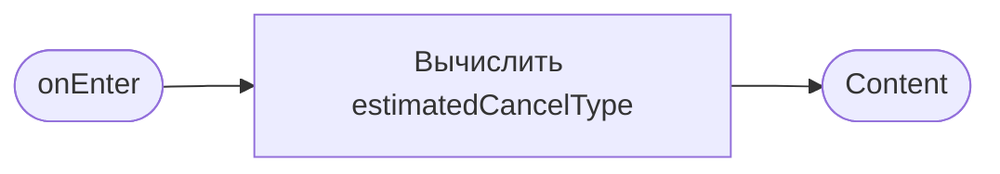
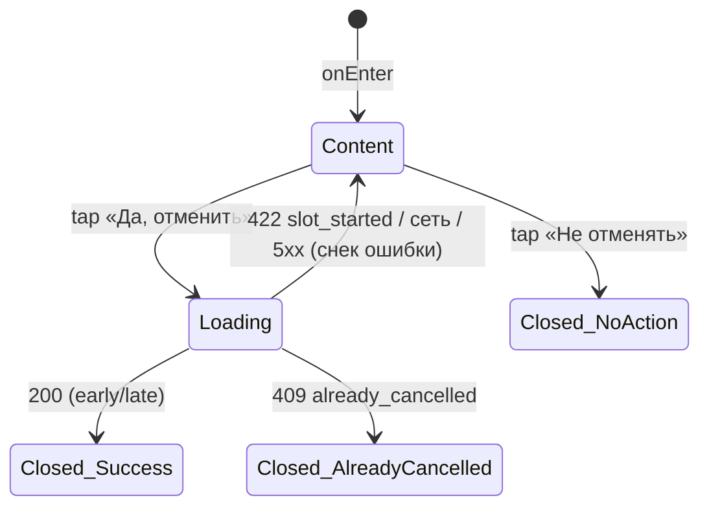

# Подтверждение отмены

**ID:** BS-003
**Тип:** Bottom Sheet
**Домен:** 04. Мои бронирования
**Приоритет:** High
**Статус:** Черновик
**Функциональные блоки:** FB-MYB-003
**Зона авторизации:** АЗ
**Дизайн-макет:** Figma не заведён — текстовый wireframe: [../3-design-brief/BS-003-cancel-confirm.md](../3-design-brief/BS-003-cancel-confirm.md), версия 0.1

---

## Содержание

- [История изменений](#история-изменений)
- [Обзор](#обзор)
- [Навигация](#навигация)
- [Входные данные](#входные-данные)
- [Применяемые логики](#применяемые-логики)
- [Свойства Bottom Sheet](#свойства-bottom-sheet)
- [Инициализация](#инициализация)
- [Используемые запросы](#используемые-запросы)
- [Макет экрана](#макет-экрана)
- [Элементы экрана](#элементы-экрана)
- [Состояния экрана](#состояния-экрана)
- [Действия пользователя](#действия-пользователя)
- [Связанные требования](#связанные-требования)
- [Критерии приёмки](#критерии-приёмки)

---

## История изменений

| Релиз | ТЗ | Описание изменений |
|-------|-----|-------------------|
| 0.1.0 | [BS-003-cancel-confirm.md](../3-design-brief/BS-003-cancel-confirm.md) | Первичная версия ТЗ на основе дизайн-брифа BS-003 v0.1 |

---

## Обзор

Финальное подтверждение перед отменой брони — критичное действие, закрытие только явной кнопкой
(не по клику на бэкдроп), чтобы избежать случайной отмены.

### User Story

> Как клиент, я хочу получить финальное подтверждение перед отменой записи,
> чтобы не отменить бронь случайно и понимать последствия (ранняя/поздняя отмена).

### Бизнес-ценность

- Снижает число случайных отмен (защита кликом по бэкдропу отключена намеренно).
- Прозрачно информирует о последствии до совершения действия — снижает недовольство клиентов правилом 2 часов (BR-5, P6 «честность и спокойствие»).

---

## Навигация

### Входящая (откуда открывается)

| Источник | Триггер | Условие | Передаваемые параметры |
|----------|---------|---------|------------------------|
| [SCR-006 Детали брони](SCR-006-booking-details.md) | Тап «Отменить запись» | Всегда (кнопка видна только для активных, не начавшихся тренировок) | `bookingId` |

### Исходящая (куда ведёт)

| Назначение | Триггер | Передаваемые параметры |
|------------|---------|------------------------|
| [SCR-006 Детали брони](SCR-006-booking-details.md) | Подтверждение («Да, отменить») или отказ («Не отменять») | Обновлённый `booking.status` (при подтверждении) |

---

## Входные данные

| Название | Тип | Возможные значения | Описание |
|----------|-----|-------------------|----------|
| `bookingId` | Параметр навигации | UUID | Идентификатор брони для отмены |
| `estimatedCancelType` | Вычисляемое (клиентский прогноз) | `early` \| `late` | Оценка на основе `slot.start_at − now`; финальный статус определяет сервер (LOGIC-002) |

---

## Применяемые логики

| Логика | Элемент/Триггер | Описание |
|--------|-----------------|----------|
| [LOGIC-002 Правило ранней/поздней отмены](09-logics/LOGIC-002-cancellation-rule.md) | Индикатор «ранняя/поздняя» + подтверждение | Сервер — источник истины; клиентский прогноз только для текста, финальный статус берётся из ответа `cancelBooking` |

---

## Свойства Bottom Sheet

| Свойство | Значение |
|----------|----------|
| Высота | Динамическая (по контенту) |
| Закрытие свайпом | Нет (критичное подтверждение) |
| Закрытие по тапу вне области | **Нет** — только явной кнопкой (foundations §4.3, исключение из общего правила) |
| Затемнение фона | Да |
| Кнопка закрытия | Нет отдельного крестика — закрытие только через «Да, отменить» / «Не отменять» |

---

## Инициализация

Модалка не делает собственных загрузочных запросов — `slot.start_at` уже известен из контекста
SCR-006, `estimatedCancelType` вычисляется на клиенте для текста индикатора.

### Диаграмма загрузки



---

## Используемые запросы

### cancelBooking

**Тип:** REST
**Метод:** POST
**Спецификация:** [../api/openapi.yaml](../api/openapi.yaml) → `POST /bookings/{bookingId}/cancel`

**Триггер:** Тап «Да, отменить»

**Параметры:**

| Параметр | Тип | Обязательность | Источник | Описание |
|----------|-----|----------------|----------|----------|
| `bookingId` | string (uuid, path) | Да | Параметр навигации | Отмена выполняется целиком, без тела запроса |

**Обработка ответа:**

| Результат | Условие | UI-реакция |
|-----------|---------|------------|
| Загрузка | — | Спиннер на кнопке «Да, отменить», кнопки блокированы |
| Успех (200) | `status = cancelled_early` | Закрытие модалки → SCR-006 показывает снек «Бронь отменена» |
| Успех (200) | `status = cancelled_late` | Закрытие модалки → SCR-006 показывает «Поздняя отмена: место не освобождено (правило 2 часов). Штраф не взимается.» |
| HTTP 422 | `slot_started` | Снек «Тренировка уже началась, отмена недоступна», модалка остаётся открытой |
| HTTP 409 | `already_cancelled` | Снек «Бронь уже отменена», модалка закрывается, SCR-006 обновляет статус |
| Сеть/5xx | — | Снек ошибки, модалка остаётся открытой — можно повторить |

---

## Макет экрана

### Структура

```
┌─────────────────────────────────────┐
│         Отменить запись?             │
│  Тренировка через 4 часа.             │
│  Отмена сейчас — ранняя,              │
│  место освободится.                    │
│  ┌───────────────────────────────┐   │
│  │        Да, отменить            │   │
│  └───────────────────────────────┘   │
│  ┌───────────────────────────────┐   │
│  │         Не отменять            │   │
│  └───────────────────────────────┘   │
└─────────────────────────────────────┘
```
Если до старта < 2 часов — текст меняется: «Отмена сейчас — поздняя, место не освободится
(штрафов нет)».

### Компоненты

| Компонент | Описание | Обязательность |
|-----------|----------|----------------|
| Заголовок «Отменить запись?» | — | Да |
| Индикатор ранняя/поздняя (текст) | По `estimatedCancelType` | Да |
| Кнопка «Да, отменить» | Primary | Да |
| Кнопка «Не отменять» | Secondary | Да |

---

## Элементы экрана

### 1. Подтверждение

| Элемент | Описание | Источник данных | Валидация | Действие |
|---------|----------|-----------------|-----------|----------|
| Текст индикатора (ранняя/поздняя) | Прозрачность последствия перед действием | `estimatedCancelType` (клиентский прогноз) | — | — |
| Кнопка «Да, отменить» | Primary CTA | — | — | → [cancelBooking](#cancelbooking) |
| Кнопка «Не отменять» | Отказ, закрыть без действия | — | — | Закрытие → SCR-006 (без изменений) |

**Логика:**
- Финальный статус (`cancelled_early`/`cancelled_late`) определяет **сервер**; если клиентский `estimatedCancelType` разошёлся с ответом сервера — SCR-006 показывает то, что вернул сервер (LOGIC-002).

---

## Состояния экрана

### Таблица состояний

| Состояние | Условие | Отображение |
|-----------|---------|-------------|
| Content | Модалка открыта | Текст подтверждения (ранняя/поздняя по прогнозу) |
| Loading | Ожидание `cancelBooking` | Спиннер на «Да, отменить», обе кнопки блокированы |
| Error | 422/409/5xx/сеть | Снек ошибки; модалка остаётся открытой (кроме `already_cancelled`, где она закрывается) |

### Диаграмма переходов



---

## Действия пользователя

| Действие | Элемент | Триггер | Результат |
|----------|---------|---------|-----------|
| Подтвердить отмену | Кнопка «Да, отменить» | Tap | Отправка `cancelBooking`, закрытие модалки, обновление статуса на SCR-006 |
| Отказаться от отмены | Кнопка «Не отменять» | Tap | Закрытие модалки без изменения статуса брони |

---

## Связанные требования

### Функциональные (FR-*)

| ID | Название | Приоритет |
|----|----------|-----------|
| FR-27 | Ранняя отмена (≥2 ч) | Must |
| FR-28 | Поздняя отмена (<2 ч), без блокировок | Must |

### Use cases / User stories

| ID | Связь |
|----|-------|
| UC-2 | Отмена записи (основной поток, A1, A2) |
| US-12 | «Хочу отменить свою запись до начала тренировки» |

---

## Критерии приёмки

### Позитивные сценарии

| ID | Критерий | Приоритет |
|----|----------|-----------|
| AC-001 | **Дано** до старта тренировки ≥ 2 часов, **Когда** клиент подтверждает отмену, **Тогда** бронь отменяется, место освобождается, SCR-006 показывает «Бронь отменена» | P0 |
| AC-002 | **Дано** до старта тренировки < 2 часов, **Когда** клиент подтверждает отмену, **Тогда** бронь помечается «поздняя отмена», место не освобождается, SCR-006 показывает соответствующее сообщение без указания на штраф | P0 |
| AC-003 | **Дано** модалка открыта, **Когда** клиент нажимает «Не отменять», **Тогда** модалка закрывается без изменения статуса брони | P0 |

### Негативные сценарии

| ID | Критерий | Приоритет |
|----|----------|-----------|
| AC-N01 | **Дано** тренировка уже началась к моменту подтверждения, **Когда** отправлен `cancelBooking`, **Тогда** показывается «Тренировка уже началась, отмена недоступна», модалка остаётся открытой | P1 |
| AC-N02 | **Дано** бронь уже была отменена ранее (гонка вкладок), **Когда** отправлен `cancelBooking`, **Тогда** показывается снек «Бронь уже отменена», статус актуализируется на SCR-006 | P2 |

### Граничные условия (Edge Cases)

| ID | Критерий | Приоритет |
|----|----------|-----------|
| AC-E01 | **Дано** клиентский прогноз показал «ранняя», а сервер вернул «поздняя» (или наоборот), **Тогда** SCR-006 отображает и применяет статус сервера | P1 |
| AC-E02 | **Дано** сетевой сбой при отправке `cancelBooking`, **Тогда** модалка остаётся открытой с возможностью повторить действие | P2 |

---
