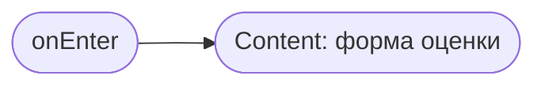
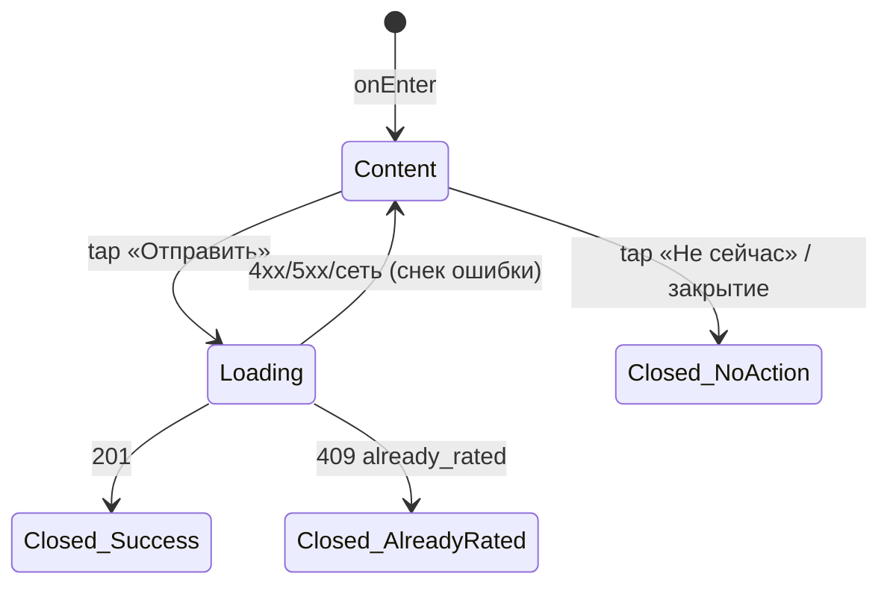

# Оценка инструктора

**ID:** BS-004
**Тип:** Bottom Sheet
**Домен:** 05. Оценка инструктора
**Приоритет:** Medium
**Статус:** Черновик
**Функциональные блоки:** FB-RATE-001
**Зона авторизации:** АЗ
**Дизайн-макет:** Figma не заведён — текстовый wireframe: [../3-design-brief/BS-004-rate-instructor.md](../3-design-brief/BS-004-rate-instructor.md), версия 0.1

> **Решение по нумерации.** В шаблоне-примере BS-004 отведён под карту маршрута (route-map) —
> у «Вертикали» карта не применима (одна площадка, R-015). BS-004 закреплён за оценкой
> инструктора (FR-40, FR-41, UC-4) — согласованное решение, см. [README.md](README.md).

---

## Содержание

- [История изменений](#история-изменений)
- [Обзор](#обзор)
- [Навигация](#навигация)
- [Входные данные](#входные-данные)
- [Применяемые логики](#применяемые-логики)
- [Свойства Bottom Sheet](#свойства-bottom-sheet)
- [Инициализация](#инициализация)
- [Используемые запросы](#используемые-запросы)
- [Макет экрана](#макет-экрана)
- [Элементы экрана](#элементы-экрана)
- [Состояния экрана](#состояния-экрана)
- [Действия пользователя](#действия-пользователя)
- [Связанные требования](#связанные-требования)
- [Критерии приёмки](#критерии-приёмки)

---

## История изменений

| Релиз | ТЗ | Описание изменений |
|-------|-----|-------------------|
| 0.1.0 | [BS-004-rate-instructor.md](../3-design-brief/BS-004-rate-instructor.md) | Первичная версия ТЗ на основе дизайн-брифа BS-004 v0.1 |

---

## Обзор

Разовая оценка инструктора после посещённой тренировки: 1–5 звёзд + необязательный комментарий
(UC-4). Оценку нельзя изменить после отправки.

### User Story

> Как клиент, я хочу после тренировки оценить инструктора,
> чтобы поделиться впечатлением и помочь другим клиентам выбрать, к кому записаться.

### Бизнес-ценность

- Даёт владелице объективную картину качества работы инструкторов (BR-10, M-5: доля оценённых тренировок ≥ 50%).
- Средний рейтинг, видимый клиентам при выборе слота, распределяет запись более справедливо и мотивирует инструкторов.

---

## Навигация

### Входящая (откуда открывается)

| Источник | Триггер | Условие | Передаваемые параметры |
|----------|---------|---------|------------------------|
| [SCR-005 Мои бронирования](SCR-005-my-bookings.md) | Тап «Оценить» на карточке завершённой брони | Тренировка завершена, оценки нет | `bookingId` |
| [SCR-006 Детали брони](SCR-006-booking-details.md) | Тап «Оценить инструктора» | Тренировка завершена, оценки нет | `bookingId` |

### Исходящая (куда ведёт)

| Назначение | Триггер | Передаваемые параметры |
|------------|---------|------------------------|
| Экран-родитель (SCR-005 или SCR-006) | Успешная отправка оценки | Обновлённый `booking.rating` |
| Экран-родитель (SCR-005 или SCR-006) | Тап «Не сейчас» / закрытие | — |

---

## Входные данные

| Название | Тип | Возможные значения | Описание |
|----------|-----|-------------------|----------|
| `bookingId` | Параметр навигации | UUID | Бронь, к которой привязывается оценка |
| `instructorName` | Состояние (из контекста экрана-родителя) | string | Для заголовка «Оцените инструктора {Имя}» |

---

## Применяемые логики

Отдельных переиспользуемых логик из `09-logics/` не задействовано — правила разовой оценки
специфичны для этого экрана и описаны ниже.

---

## Свойства Bottom Sheet

| Свойство | Значение |
|----------|----------|
| Высота | Динамическая (по контенту) |
| Закрытие свайпом | Да |
| Закрытие по тапу вне области | Да (не критичное действие — отказ от оценки не наносит вреда) |
| Затемнение фона | Да |
| Кнопка закрытия | Да («Не сейчас» как явная кнопка/ссылка) |

---

## Инициализация

Модалка не делает загрузочных запросов — открывается сразу в Content. Если оценка для этой
брони уже существует (`already_rated`), модалка вообще не открывается — вместо неё карточка
брони показывает готовую оценку в режиме чтения (см. SCR-006).

### Диаграмма загрузки



---

## Используемые запросы

### submitRating

**Тип:** REST
**Метод:** POST
**Спецификация:** [../api/openapi.yaml](../api/openapi.yaml) → `POST /bookings/{bookingId}/rating`

**Триггер:** Тап «Отправить»

**Параметры/Body:**

| Параметр | Тип | Обязательность | Источник | Описание |
|----------|-----|----------------|----------|----------|
| `stars` | integer (1–5) | Да | Шкала звёзд | — |
| `comment` | string (≤1000) | Нет | Поле комментария | — |

**Обработка ответа:**

| Результат | Условие | UI-реакция |
|-----------|---------|------------|
| Загрузка | — | Спиннер на кнопке «Отправить», форма блокирована |
| Успех (201) | — | Закрытие модалки → экран-родитель показывает «Спасибо за оценку» и оценку в режиме чтения |
| HTTP 409 | `already_rated` | Снек «Вы уже оценили эту тренировку», модалка закрывается, показывается ранее поставленная оценка |
| HTTP 409 | `booking_not_completed` | Снек «Тренировка ещё не завершилась», модалка закрывается |
| HTTP 4xx/5xx / сеть | — | Снек ошибки, форма остаётся заполненной, доступен повтор |

---

## Макет экрана

### Структура

```
┌─────────────────────────────────────┐
│    Оцените инструктора Анну            │
│         ☆ ☆ ☆ ☆ ☆                       │  ← тап по звезде выставляет оценку
│  ┌───────────────────────────────┐   │
│  │ Комментарий (необяз.)          │   │
│  └───────────────────────────────┘   │
│  ┌───────────────────────────────┐   │
│  │           Отправить             │   │  ← disabled, пока не выбрана хотя бы 1 звезда
│  └───────────────────────────────┘   │
│              Не сейчас                 │
└─────────────────────────────────────┘
```

### Компоненты

| Компонент | Описание | Обязательность |
|-----------|----------|----------------|
| Заголовок + имя инструктора | — | Да |
| Шкала 1–5 звёзд | Тач-зоны ≥44px на мобильном | Да |
| Поле комментария | Необязательное | Да |
| Кнопка «Отправить» | Disabled до выбора звёзд | Да |
| Ссылка «Не сейчас» | Закрыть без отправки | Да |

---

## Элементы экрана

### 1. Форма оценки

| Элемент | Описание | Источник данных | Валидация | Действие |
|---------|----------|-----------------|-----------|----------|
| Заголовок «Оцените инструктора {Имя}» | — | `instructorName` | — | — |
| Шкала звёзд | Тап/клик по звезде выставляет оценку | — | Минимум 1 звезда для активации «Отправить». Ошибка (визуальная): кнопка неактивна | — |
| Поле комментария | Необязательно | — | ≤1000 символов | — |
| Кнопка «Отправить» | Primary CTA | — | — | → [submitRating](#submitrating) |
| Ссылка «Не сейчас» | Secondary | — | — | Закрытие без отправки → экран-родитель (CTA «Оценить» остаётся доступной позже) |

**Момент валидации:** При попытке отправки — проверяется наличие выбранных звёзд.

**Условия доступности:**
- Кнопка «Отправить» активна, если: выбрана хотя бы 1 звезда.

---

## Состояния экрана

### Таблица состояний

| Состояние | Условие | Отображение |
|-----------|---------|-------------|
| Content | Модалка открыта, оценки для этой брони ещё нет | Форма оценки |
| Loading | Ожидание `submitRating` | Спиннер на «Отправить», форма блокирована |
| Error | 4xx/5xx/сеть (кроме `already_rated`) | Снек ошибки, форма остаётся заполненной |

Empty state не применим.

### Диаграмма переходов



---

## Действия пользователя

| Действие | Элемент | Триггер | Результат |
|----------|---------|---------|-----------|
| Выбрать оценку | Звёзды | Tap/Click | Активация кнопки «Отправить» |
| Ввести комментарий | Поле комментария | Ввод текста | — |
| Отправить оценку | Кнопка «Отправить» | Tap | Отправка `submitRating`, закрытие модалки, «Спасибо за оценку» на экране-родителе |
| Отложить оценку | Ссылка «Не сейчас» | Tap | Закрытие без отправки, CTA «Оценить» остаётся доступной |

---

## Связанные требования

### Функциональные (FR-*)

| ID | Название | Приоритет |
|----|----------|-----------|
| FR-40 | Разовая оценка 1–5 звёзд + комментарий, без редактирования | Must |
| FR-41 | Влияет на средний рейтинг, отображаемый на SCR-002/SCR-003 | Must |

### Use cases / User stories

| ID | Связь |
|----|-------|
| UC-4 | Оценка инструктора после тренировки |
| US-17, US-18 | Оценка инструктора; видимость среднего рейтинга |

---

## Критерии приёмки

### Позитивные сценарии

| ID | Критерий | Приоритет |
|----|----------|-----------|
| AC-001 | **Дано** клиент выбрал 4 звезды и написал комментарий, **Когда** нажимает «Отправить», **Тогда** оценка сохраняется, модалка закрывается, экран-родитель показывает «Спасибо за оценку» и поставленную оценку в режиме чтения | P0 |
| AC-002 | **Дано** клиент выбрал звёзды, не заполнив комментарий, **Тогда** отправка проходит успешно | P1 |
| AC-003 | **Дано** клиент нажимает «Не сейчас», **Тогда** модалка закрывается без отправки, кнопка «Оценить инструктора» остаётся доступной позже | P1 |

### Негативные сценарии

| ID | Критерий | Приоритет |
|----|----------|-----------|
| AC-N01 | **Дано** не выбрана ни одна звезда, **Тогда** кнопка «Отправить» неактивна | P0 |
| AC-N02 | **Дано** оценка для этой брони уже поставлена (`already_rated`, гонка вкладок), **Когда** отправлена повторная попытка, **Тогда** модалка не открывается повторно — сразу показывается просмотр оценки | P1 |

### Граничные условия (Edge Cases)

| ID | Критерий | Приоритет |
|----|----------|-----------|
| AC-E01 | **Дано** комментарий превышает 1000 символов, **Когда** ввод, **Тогда** дальнейший ввод блокируется на лимите | P2 |
| AC-E02 | **Дано** сетевой сбой при отправке, **Тогда** форма остаётся заполненной, доступен повтор без потери введённых данных | P2 |

---
