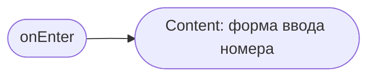
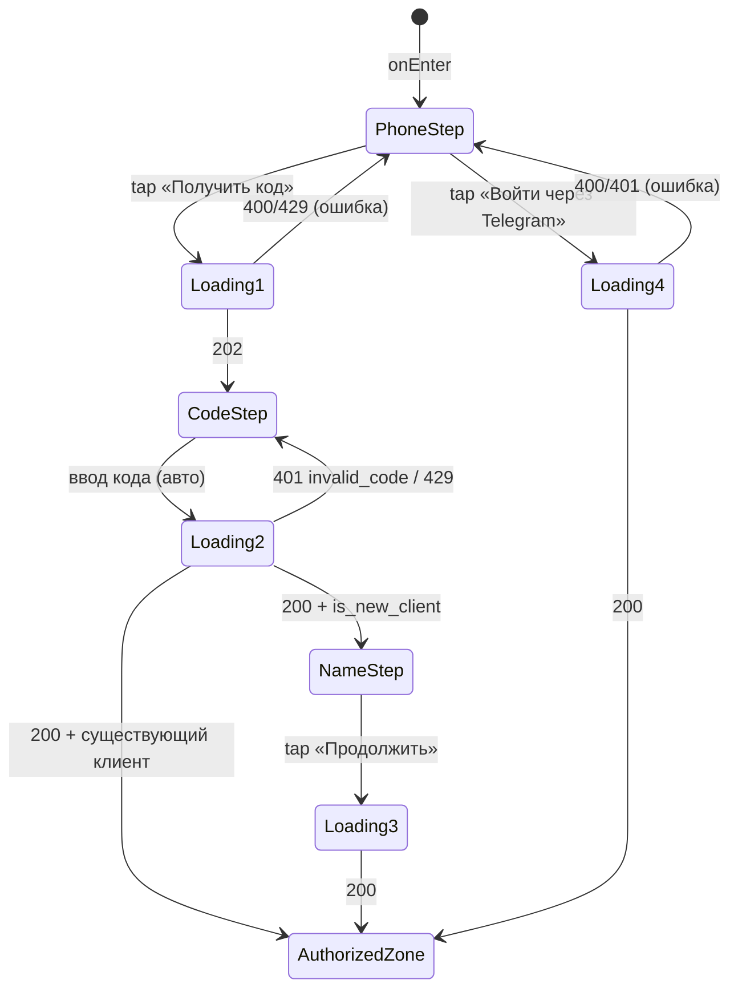

# Регистрация / Вход

**ID:** SCR-001
**Тип:** Экран
**Домен:** 01. Авторизация
**Приоритет:** Critical
**Статус:** Черновик
**Функциональные блоки:** FB-AUTH-001, FB-AUTH-002
**Зона авторизации:** НЗ
**Дизайн-макет:** Figma не заведён (бренд не зафиксирован) — текстовый wireframe: [../3-design-brief/SCR-001-registration.md](../3-design-brief/SCR-001-registration.md), версия 0.1

---

## Содержание

- [История изменений](#история-изменений)
- [Обзор](#обзор)
- [Навигация](#навигация)
- [Входные данные](#входные-данные)
- [Применяемые логики](#применяемые-логики)
- [Инициализация](#инициализация)
- [Используемые запросы](#используемые-запросы)
- [Макет экрана](#макет-экрана)
- [Элементы экрана](#элементы-экрана)
- [Состояния экрана](#состояния-экрана)
- [Действия пользователя](#действия-пользователя)
- [Связанные требования](#связанные-требования)
- [Критерии приёмки](#критерии-приёмки)

---

## История изменений

| Релиз | ТЗ | Описание изменений |
|-------|-----|-------------------|
| 0.1.0 | [SCR-001-registration.md](../3-design-brief/SCR-001-registration.md) | Первичная версия ТЗ на основе дизайн-брифа SCR-001 v0.1 |

---

## Обзор

Единственная точка входа в приложение для неавторизованного клиента. Вход — по номеру телефона
через одноразовый SMS-код или через Telegram, без пароля (минимальный порог входа, P3
foundations). Для нового клиента (первый вход по номеру) дополнительно запрашивается имя.

### User Story

> Как клиент, я хочу войти по номеру телефона (SMS-код) или через Telegram,
> чтобы быстро начать пользоваться приложением без сложных паролей.

### Бизнес-ценность

- Снимает основной барьер входа для клиента, торопящегося записаться прямо в зале (BR-2, NFR-3).
- Уменьшает отток на самом раннем шаге воронки записи (M-1: доля онлайн-записей ≥ 70%).
- Telegram как альтернативный канал входа сразу связывает клиента с основным каналом уведомлений (NFR-17, NFR-26).

---

## Навигация

### Входящая (откуда открывается)

| Источник | Триггер | Условие | Передаваемые параметры |
|----------|---------|---------|------------------------|
| Первый заход по ссылке приложения | Открытие URL | Нет активной сессии | — |
| Любой экран АЗ | Автоматический редирект | Истёкшая/отсутствующая сессия (401 → неуспешный refresh, см. LOGIC-004) | `returnTo` (опционально, для возврата после входа) |
| [SCR-007 Профиль](SCR-007-profile.md) | Тап «Выйти» + подтверждение | Всегда | — |

### Исходящая (куда ведёт)

| Назначение | Триггер | Передаваемые параметры |
|------------|---------|------------------------|
| [SCR-002 Список тренировок](SCR-002-slot-list.md) | Успешный вход/регистрация (шаг код/имя пройден, либо успешный Telegram-вход) | — |

---

## Входные данные

| Название | Тип | Возможные значения | Описание |
|----------|-----|-------------------|----------|
| `returnTo` | Состояние (query-параметр) | путь экрана АЗ | Куда вернуть клиента после успешного входа (если редирект был из-за истёкшей сессии) |

---

## Применяемые логики

| Логика | Элемент/Триггер | Описание |
|--------|-----------------|----------|
| [LOGIC-004 Сессия: access/refresh, 401-flow](09-logics/LOGIC-004-session-401-refresh.md) | Успешный вход | После `otp/verify` / `telegram` сохраняет `access_token` в памяти, `refresh` приходит в httpOnly-cookie |
| [LOGIC-006 Loading/Content/Empty/Error](09-logics/LOGIC-006-loading-content-empty-error.md) | Отправка кода / проверка кода | Loading — блокировка полей + спиннер на кнопке; Error — сообщение по коду ответа |

---

## Инициализация

Экран не делает загрузочных запросов при открытии — состояние стартует сразу в Content (форма
ввода номера). Запросы отправляются только по действиям пользователя (см. «Используемые запросы»).

### Диаграмма загрузки



---

## Используемые запросы

### otpRequest

**Тип:** REST
**Метод:** POST
**Спецификация:** [../api/openapi.yaml](../api/openapi.yaml) → `POST /auth/otp/request`

**Триггер:** Тап «Получить код» (номер валиден + согласие отмечено)

**Параметры/Body:**

| Параметр | Тип | Обязательность | Источник | Описание |
|----------|-----|----------------|----------|----------|
| `phone` | string | Да | Поле «Номер телефона» | Формат `+7XXXXXXXXXX` |

**Обработка ответа:**

| Результат | Условие | UI-реакция |
|-----------|---------|------------|
| Загрузка | — | Спиннер на кнопке «Получить код», поля блокированы |
| Успех (202) | — | Переход на шаг «Код из SMS»; таймер повторной отправки = `retry_after_seconds` из ответа |
| HTTP 400 | Невалидный номер | Подсветка поля, текст «Проверьте номер телефона» |
| HTTP 429 | Превышен лимит запросов (NFR-19) | «Слишком много попыток. Повторите через N сек.» (`details.retry_after`), кнопка неактивна до истечения |
| Сеть/5xx | — | Снек «Не удалось выполнить. Проверьте соединение и повторите» |

---

### otpVerify

**Тип:** REST
**Метод:** POST
**Спецификация:** [../api/openapi.yaml](../api/openapi.yaml) → `POST /auth/otp/verify`

**Триггер:** Автоотправка при вводе последнего знака кода

**Параметры/Body:**

| Параметр | Тип | Обязательность | Источник | Описание |
|----------|-----|----------------|----------|----------|
| `phone` | string | Да | Введённый номер (шаг 1) | — |
| `code` | string | Да | Поле «Код из SMS» | 4–6 знаков, формат — из ответа `otpRequest` (не хардкодится) |
| `name` | string | Нет | Поле «Имя» (шаг 3, только для нового клиента) | Передаётся, если UI уже собрал имя в этом же вызове |

**Обработка ответа:**

| Результат | Условие | UI-реакция |
|-----------|---------|------------|
| Загрузка | — | Спиннер, поле кода блокировано |
| Успех (200) | `is_new_client = true` и `name` не передавалось | Показать шаг «Как вас зовут?», после ввода — повторный вызов `otpVerify`/`PATCH /profile` с именем |
| Успех (200) | `is_new_client = false`, либо `name` уже передано | Сохранить `access_token` (LOGIC-004), переход на [SCR-002](SCR-002-slot-list.md) |
| HTTP 401 | `code: invalid_code` | «Неверный код. Попробуйте ещё раз», поле очищается, фокус остаётся |
| HTTP 429 | Превышен лимит попыток (NFR-19, ≤5) | «Слишком много попыток. Повторите через N сек.» |
| Сеть/5xx | — | Снек «Не удалось выполнить. Проверьте соединение и повторите» |

---

### telegramAuth

**Тип:** REST
**Метод:** POST
**Спецификация:** [../api/openapi.yaml](../api/openapi.yaml) → `POST /auth/telegram`

**Триггер:** Успешное подтверждение в Telegram Login Widget

**Параметры/Body:**

| Параметр | Тип | Обязательность | Источник | Описание |
|----------|-----|----------------|----------|----------|
| `telegram_init_data` | string | Да | Telegram Login Widget | Подписанные данные виджета |

**Обработка ответа:**

| Результат | Условие | UI-реакция |
|-----------|---------|------------|
| Загрузка | — | Спиннер на кнопке «Войти через Telegram» |
| Успех (200) | — | Сохранить `access_token`, переход на [SCR-002](SCR-002-slot-list.md) (шаг «Имя» пропускается, если Telegram передал имя) |
| HTTP 401/400 | — | Снек «Не удалось войти через Telegram. Попробуйте снова» |
| Сеть/5xx | — | Снек «Не удалось выполнить. Проверьте соединение и повторите» |

---

## Макет экрана

### Структура (шаг 1 — номер телефона)

```
┌─────────────────────────────────────┐
│              Вертикаль               │
│                                       │
│      Вход по номеру телефона          │
│  ┌─────────────────────────────────┐ │
│  │ +7 ___ ___ __ __                │ │
│  └─────────────────────────────────┘ │
│  ☐ Согласен с политикой конфиденц.    │
│  ┌─────────────────────────────────┐ │
│  │         Получить код            │ │  ← disabled до валидного номера + согласия
│  └─────────────────────────────────┘ │
│  ───────────── или ─────────────     │
│  ┌─────────────────────────────────┐ │
│  │      Войти через Telegram       │ │
│  └─────────────────────────────────┘ │
└─────────────────────────────────────┘
```

### Компоненты

| Компонент | Описание | Обязательность |
|-----------|----------|----------------|
| Переключатель/группа полей «Телефон» | Ввод номера с маской | Да |
| Чекбокс согласия с политикой | Обязателен перед `otpRequest` (NFR-20) | Да |
| Кнопка «Получить код» | Primary CTA, disabled-логика | Да |
| Кнопка «Войти через Telegram» | Secondary CTA, открывает Login Widget | Да |
| Шаг «Код из SMS» | Поле 4–6 знаков + таймер повторной отправки | Да |
| Шаг «Имя» | Поле ввода, только для нового клиента | Да (условно) |

---

## Элементы экрана

### 1. Шаг «Номер телефона»

| Элемент | Описание | Источник данных | Валидация | Действие |
|---------|----------|-----------------|-----------|----------|
| Поле «Номер телефона» | Ввод номера с маской `+7 ___ ___ __ __` | — | Российский формат номера. Ошибка: «Проверьте номер телефона» | — |
| Чекбокс согласия | Согласие с политикой конфиденциальности (NFR-20) | — | Обязателен | — |
| Кнопка «Получить код» | Primary CTA | — | — | Валидация → [otpRequest](#otprequest) |
| Кнопка «Войти через Telegram» | Secondary CTA | — | — | Открыть Telegram Login Widget → [telegramAuth](#telegramauth) |

**Условия доступности:**
- Кнопка «Получить код» активна, если: номер валиден И согласие отмечено.

### 2. Шаг «Код из SMS»

| Элемент | Описание | Источник данных | Валидация | Действие |
|---------|----------|-----------------|-----------|----------|
| Текст «Код отправлен на +7 \*\*\* \*\* 67» | Номер маскирован (NFR-20) | введённый номер | — | — |
| Поле «Код из SMS» | 4–6 знаков, автофокус, автоотправка на последнем знаке | — | Числовой код, длина — по ответу API | Автоотправка → [otpVerify](#otpverify) |
| Ссылка/кнопка «Отправить код повторно» | Таймер обратного отсчёта | `retry_after_seconds` из `otpRequest` | — | Повтор → [otpRequest](#otprequest) |

**Момент валидации:** При вводе последнего знака (автоотправка), без отдельной кнопки «Подтвердить».

### 3. Шаг «Как вас зовут?» (только новый клиент)

| Элемент | Описание | Источник данных | Валидация | Действие |
|---------|----------|-----------------|-----------|----------|
| Поле «Имя» | Имя клиента | — | Не пусто, 2–50 символов. Ошибка: «Введите имя» | — |
| Кнопка «Продолжить» | Primary CTA | — | — | → [otpVerify](#otpverify) (повторно, с `name`) либо `PATCH /profile` |

**Условия доступности:**
- Шаг показывается только если `is_new_client = true` в ответе `otpVerify`.

---

## Состояния экрана

### Таблица состояний

| Состояние | Условие | Отображение |
|-----------|---------|-------------|
| Content | Форма ввода — основной режим | Соответствующий шаг (телефон / код / имя) |
| Loading | Отправка `otpRequest`/`otpVerify`/`telegramAuth` | Блокировка полей + спиннер на активной кнопке |
| Error | `invalid_code`, `429`, сетевая ошибка | Инлайн-сообщение под полем/кнопкой, форма не сбрасывается |

Empty state не применим (экран не отображает список данных).

### Диаграмма переходов



---

## Действия пользователя

| Действие | Элемент | Триггер | Результат |
|----------|---------|---------|-----------|
| Запрос кода | Кнопка «Получить код» | Tap | Отправка `otpRequest`, переход на шаг «Код» |
| Ввод кода | Поле «Код из SMS» | Ввод 4–6 знаков | Автоотправка `otpVerify` |
| Повторная отправка кода | Ссылка «Отправить код повторно» | Tap (после истечения таймера) | Повтор `otpRequest` |
| Вход через Telegram | Кнопка «Войти через Telegram» | Tap | Открытие Login Widget → `telegramAuth` |
| Завершение регистрации | Кнопка «Продолжить» (шаг «Имя») | Tap | Завершение регистрации, переход на [SCR-002](SCR-002-slot-list.md) |

---

## Связанные требования

### Функциональные (FR-*)

| ID | Название | Приоритет |
|----|----------|-----------|
| FR-1 | Вход по номеру телефона через SMS OTP | Must |
| FR-2 | Вход/привязка через Telegram | Must |

### Нефункциональные (NFR-*)

| ID | Название | Приоритет |
|----|----------|-----------|
| NFR-3 | Лёгкий вход, без сложных паролей | Высокий |
| NFR-18 | Сессия: access в памяти, refresh в httpOnly-cookie | Высокий |
| NFR-19 | Антифрод OTP: rate-limit, лимит попыток, TTL кода | Высокий |
| NFR-20 | ПДн: согласие, маскирование номера, TLS | Высокий |
| NFR-25 | Доступность: клавиатурная навигация, ARIA-подписи | Средний |

### Use cases / User stories

| ID | Связь |
|----|-------|
| US-1 | «Как клиент, хочу войти по номеру телефона или через Telegram» |

---

## Критерии приёмки

### Позитивные сценарии

| ID | Критерий | Приоритет |
|----|----------|-----------|
| AC-001 | **Дано** клиент ввёл валидный номер и получил код, **Когда** вводит верный код и это первый вход, **Тогда** показывается шаг «Имя», и после его заполнения клиент попадает на SCR-002 | P0 |
| AC-002 | **Дано** клиент ввёл валидный номер и верный код, и клиент уже зарегистрирован, **Когда** код подтверждён, **Тогда** шаг «Имя» пропускается и клиент сразу попадает на SCR-002 | P0 |
| AC-003 | **Дано** клиент нажал «Войти через Telegram» и подтвердил в Telegram, **Когда** получен успешный ответ, **Тогда** клиент попадает на SCR-002 | P0 |

### Негативные сценарии

| ID | Критерий | Приоритет |
|----|----------|-----------|
| AC-N01 | **Дано** клиент ввёл неверный код, **Когда** отправлен запрос `otpVerify`, **Тогда** показывается «Неверный код. Попробуйте ещё раз», поле кода доступно для повторного ввода | P0 |
| AC-N02 | **Дано** согласие с политикой не отмечено, **Когда** клиент пытается получить код, **Тогда** кнопка «Получить код» неактивна | P1 |
| AC-N03 | **Дано** превышен лимит запросов кода, **Когда** клиент запрашивает код повторно, **Тогда** показывается сообщение с временем до повторной попытки (`retry_after`) | P1 |

### Граничные условия (Edge Cases)

| ID | Критерий | Приоритет |
|----|----------|-----------|
| AC-E01 | **Дано** сетевой сбой во время `otpVerify`, **Когда** ответа нет, **Тогда** показывается снек ошибки с возможностью повторить ввод/отправку | P2 |
| AC-E02 | **Дано** клиент был редиректнут на SCR-001 из-за истёкшей сессии (`returnTo` задан), **Когда** вход успешен, **Тогда** клиент возвращается на исходный экран, а не на SCR-002 по умолчанию | P2 |

---
