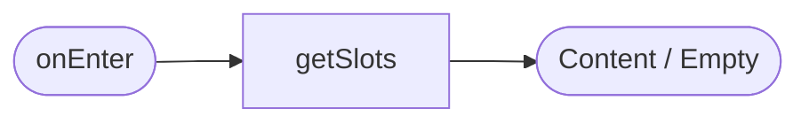
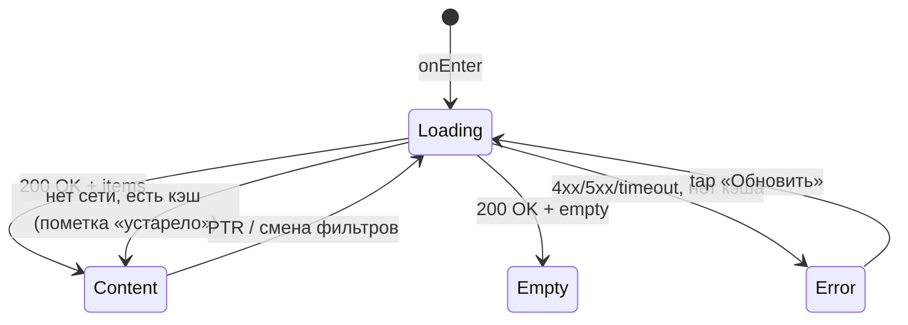

# Список тренировок

**ID:** SCR-002
**Тип:** Экран
**Домен:** 02. Просмотр тренировок
**Приоритет:** Critical
**Статус:** Черновик
**Функциональные блоки:** FB-SLOTS-001, FB-SLOTS-002
**Зона авторизации:** АЗ
**Дизайн-макет:** Figma не заведён — текстовый wireframe: [../3-design-brief/SCR-002-slot-list.md](../3-design-brief/SCR-002-slot-list.md), версия 0.1

---

## Содержание

- [История изменений](#история-изменений)
- [Обзор](#обзор)
- [Навигация](#навигация)
- [Входные данные](#входные-данные)
- [Применяемые логики](#применяемые-логики)
- [Инициализация](#инициализация)
- [Используемые запросы](#используемые-запросы)
- [Макет экрана](#макет-экрана)
- [Элементы экрана](#элементы-экрана)
- [Состояния экрана](#состояния-экрана)
- [Действия пользователя](#действия-пользователя)
- [Связанные требования](#связанные-требования)
- [Критерии приёмки](#критерии-приёмки)

---

## История изменений

| Релиз | ТЗ | Описание изменений |
|-------|-----|-------------------|
| 0.1.0 | [SCR-002-slot-list.md](../3-design-brief/SCR-002-slot-list.md) | Первичная версия ТЗ на основе дизайн-брифа SCR-002 v0.1 |

---

## Обзор

Стартовый экран авторизованной зоны и главная точка входа в основной сценарий записи (UC-1).
Клиент видит доступные тренировки на ближайшие 7 дней (дефолт), может отфильтровать список и
перейти в карточку слота.

### User Story

> Как клиент, я хочу видеть список тренировок на ближайшие 7 дней,
> чтобы выбрать подходящую тренировку.

### Бизнес-ценность

- Даёт клиенту полный и актуальный обзор расписания без обращения к владелице (BR-2).
- Устраняет путаницу «есть ли места» — счётчики свободных мест показываются прямо в списке (BR-1).
- Первый шаг воронки записи — минимизация трения здесь напрямую влияет на M-1 (доля онлайн-записей).

---

## Навигация

### Входящая (откуда открывается)

| Источник | Триггер | Условие | Передаваемые параметры |
|----------|---------|---------|------------------------|
| [SCR-001 Регистрация/Вход](SCR-001-registration.md) | Успешный вход | Всегда (если не задан `returnTo`) | — |
| Нижняя навигация (любой экран АЗ) | Тап «Тренировки» | Всегда | — |
| [BS-002 Подтверждение записи](BS-002-booking-success.md) | Тап «Готово» / закрытие | Всегда | — |

### Исходящая (куда ведёт)

| Назначение | Триггер | Передаваемые параметры |
|------------|---------|------------------------|
| [SCR-003 Карточка тренировки](SCR-003-slot-card.md) | Тап по карточке слота (кроме заблокированных состояний) | `slotId` |
| [BS-001 Фильтры](BS-001-filters.md) | Тап «Фильтры» | Текущие активные фильтры |
| [SCR-005 Мои бронирования](SCR-005-my-bookings.md) | Нижняя навигация | — |
| [SCR-007 Профиль](SCR-007-profile.md) | Нижняя навигация | — |

---

## Входные данные

| Название | Тип | Возможные значения | Описание |
|----------|-----|-------------------|----------|
| `activeFilters` | Состояние | `{dateFrom, dateTo, zoneFormat[], instructorId[]}` | Текущие фильтры, применённые через BS-001; по умолчанию пусты (окно 7 дней) |
| `slotsCache` | Кэш (Service Worker Cache API) | список слотов | Используется при офлайн-просмотре (NFR-24) с пометкой «Данные могут быть неактуальны» |

---

## Применяемые логики

| Логика | Элемент/Триггер | Описание |
|--------|-----------------|----------|
| [LOGIC-006 Loading/Content/Empty/Error](09-logics/LOGIC-006-loading-content-empty-error.md) | При открытии / pull-to-refresh | Единый паттерн состояний + офлайн-кэш |
| [LOGIC-007 Комбинирование фильтров](09-logics/LOGIC-007-filter-combination.md) | Применение фильтров из BS-001 | ИЛИ внутри группы, И между группами |

---

## Инициализация

### Диаграмма загрузки



### Запросы при открытии

| № | Запрос | Критичный | Зависит от | Условие |
|---|--------|-----------|------------|---------|
| 1 | [getSlots](#getslots) | Да | — | Всегда (с `activeFilters`, либо дефолт `date_from=now`, `date_to=now+7д`) |

> Полное описание запроса см. в секции [Используемые запросы](#используемые-запросы).

---

## Используемые запросы

### getSlots

**Тип:** REST
**Метод:** GET
**Спецификация:** [../api/openapi.yaml](../api/openapi.yaml) → `GET /slots`

**Триггер:** Инициализация; повторно — при применении/сбросе фильтров (BS-001), pull-to-refresh, возврате из SCR-003/BS-001

**Параметры:**

| Параметр | Тип | Обязательность | Источник | Описание |
|----------|-----|----------------|----------|----------|
| `date_from` | string (date) | Нет | `activeFilters.dateFrom` либо `now` | Включительно, локальная таймзона на входе |
| `date_to` | string (date) | Нет | `activeFilters.dateTo` либо `now + 7 дней` | Включительно |
| `zone_format` | array | Нет | `activeFilters.zoneFormat` | Повторяемый параметр, значения — ИЛИ |
| `instructor_id` | array | Нет | `activeFilters.instructorId` | Повторяемый параметр, значения — ИЛИ |
| `page`, `limit` | int | Нет | Пагинация (дефолт `limit=50`) | — |

**Обработка ответа:**

| Результат | Условие | UI-реакция |
|-----------|---------|------------|
| Загрузка | — | Скелетоны карточек (3–5 шт.) |
| Успех (200) | `items` не пуст | Список карточек, сортировка по `start_at` (возрастание) |
| Успех (200) | `items` пуст, фильтры не применены | Empty state «Пока нет доступных тренировок» |
| Успех (200) | `items` пуст, фильтры применены | Empty state «Ничего не найдено. Попробуйте изменить фильтры» + кнопка «Сбросить фильтры» |
| HTTP 401 | — | Сброс сессии (LOGIC-004), переход на [SCR-001](SCR-001-registration.md) |
| HTTP 4xx/5xx | — | Error state с кнопкой «Обновить» |
| Сеть | Нет соединения, есть кэш | Показ кэша с пометкой «Данные могут быть неактуальны» |
| Сеть | Нет соединения, кэша нет | Error state с кнопкой «Обновить» |

---

## Макет экрана

### Структура

```
┌─────────────────────────────────────┐
│ Тренировки                [Фильтры•]│  ← Header, • = индикатор активных фильтров
├─────────────────────────────────────┤
│  ┌───────────────────────────────┐  │
│  │ Пн, 7 июля · 18:00              │  │
│  │ Болдеринг · Для новичков        │  │
│  │ Инструктор: Анна ★4.8           │  │
│  │ Свободно: 3 из 8                │  │
│  └───────────────────────────────┘  │
│  ┌───────────────────────────────┐  │
│  │ Пн, 7 июля · 20:00              │  │
│  │ Трассы с верёвкой               │  │
│  │ Инструктор: Игорь ★4.5          │  │
│  │ Мест нет                        │  │  ← бейдж, карточка тускнее, но видна
│  └───────────────────────────────┘  │
│                ...                   │
├─────────────────────────────────────┤
│ [Тренировки] [Мои записи] [Профиль]  │  ← нижняя навигация
└─────────────────────────────────────┘
```
На `lg:` — карточки в сетке 2–3 колонки вместо одной ленты.

### Компоненты

| Компонент | Описание | Обязательность |
|-----------|----------|----------------|
| Заголовок + кнопка «Фильтры» | Header, счётчик активных фильтров | Да |
| Карточка слота (повторяющийся элемент) | Сводка одной тренировки | Да |
| Empty state | Заглушка + подсказка | Да (при пустом списке) |
| Нижняя навигация | Тренировки / Мои записи / Профиль | Да |

---

## Элементы экрана

### 1. Header

| Элемент | Описание | Источник данных | Валидация | Действие |
|---------|----------|-----------------|-----------|----------|
| Заголовок «Тренировки» | — | — | — | — |
| Кнопка «Фильтры» с индикатором | Счётчик активных фильтров | `activeFilters` | — | Открыть [BS-001](BS-001-filters.md) |

### 2. Карточка слота

| Элемент | Описание | Источник данных | Валидация | Действие |
|---------|----------|-----------------|-----------|----------|
| Дата и время старта | — | `slot.start_at` (отображение в локальной TZ) | — | — |
| Зона/формат + бейдж «Для новичков» | — | `slot.zone_format`, `slot.is_beginner_only` | — | — |
| Инструктор + средний рейтинг | «Нет оценок», если `avg_rating = null` | `slot.instructor.name`, `slot.instructor.avg_rating` | — | — |
| Свободно/всего мест | — | `slot.free_seats`, `slot.capacity_total` | — | — |
| Статус-бейдж «Мест нет» / «Отменена скалодромом» | Дублируется текстом, не только цветом | `slot.status` | — | — |
| Карточка (целиком) | — | — | — | Открыть [SCR-003](SCR-003-slot-card.md) с `slotId`, кроме заблокированных состояний |

**Логика:**
- Карточка со статусом `full` или `cancelled_by_gym`: тап открывает SCR-003 в режиме просмотра без активного CTA (не блокируется полностью, чтобы клиент мог увидеть причину отмены).

**Условия доступности:**
- Активный переход на SCR-003 доступен для всех статусов; CTA «Записаться» на SCR-003 зависит от `free_seats`/`status` (см. SCR-003).

### 3. Empty state

| Элемент | Описание | Источник данных | Валидация | Действие |
|---------|----------|-----------------|-----------|----------|
| Текст + иллюстрация | «Пока нет доступных тренировок» либо «Ничего не найдено. Попробуйте изменить фильтры» | `activeFilters` (пусты/заданы) | — | — |
| Кнопка «Сбросить фильтры» | Только если фильтры применены | — | — | Сброс `activeFilters` → повтор [getSlots](#getslots) |

---

## Состояния экрана

### Таблица состояний

| Состояние | Условие | Отображение |
|-----------|---------|-------------|
| Loading | Ожидание `getSlots` | Скелетоны карточек (3–5 шт.) |
| Content | 200 + `items` не пуст | Список карточек |
| Empty | 200 + `items` пуст | Заглушка (текст зависит от наличия фильтров) |
| Error | 4xx/5xx/таймаут, нет кэша | Заглушка + кнопка «Обновить» |
| Content (устаревший) | Нет сети, есть кэш | Список из кэша + пометка «Данные могут быть неактуальны» |

### Диаграмма переходов



---

## Действия пользователя

| Действие | Элемент | Триггер | Результат |
|----------|---------|---------|-----------|
| Открыть фильтры | Кнопка «Фильтры» | Tap | Открытие [BS-001](BS-001-filters.md) |
| Открыть карточку слота | Карточка слота | Tap | Переход на [SCR-003](SCR-003-slot-card.md) |
| Обновить список | Pull-to-refresh (моб.) / кнопка «Обновить» (десктоп) | Swipe/Tap | Повтор [getSlots](#getslots) |
| Сбросить фильтры из empty state | Кнопка «Сбросить фильтры» | Tap | Сброс фильтров, повтор [getSlots](#getslots) |

---

## Связанные требования

### Функциональные (FR-*)

| ID | Название | Приоритет |
|----|----------|-----------|
| FR-9 | Список слотов на 7 дней, статусы, empty state | Must |
| FR-41 | Средний рейтинг инструктора в карточке | Must |

### Нефункциональные (NFR-*)

| ID | Название | Приоритет |
|----|----------|-----------|
| NFR-6, NFR-21 | Отклик списка p95 < 2.5 c | Высокий |
| NFR-24 | Офлайн-просмотр кэша с пометкой устаревания | Средний |
| NFR-25 | Бейджи статуса дублируются текстом; фокусируемые карточки с доступным именем | Средний |

### Use cases / User stories

| ID | Связь |
|----|-------|
| UC-3 | Просмотр и фильтрация списка тренировок |
| US-2 | «Хочу видеть список тренировок на ближайшие 7 дней» |

---

## Критерии приёмки

### Позитивные сценарии

| ID | Критерий | Приоритет |
|----|----------|-----------|
| AC-001 | **Дано** клиент открывает SCR-002 без заданных фильтров, **Когда** список загружен, **Тогда** видны слоты на ближайшие 7 дней, отсортированные по времени старта | P0 |
| AC-002 | **Дано** у слота `free_seats = 0`, **Когда** карточка отображается, **Тогда** показан бейдж «Мест нет», тап открывает SCR-003 без активного CTA | P0 |
| AC-003 | **Дано** слот отменён скалодромом, **Когда** карточка отображается, **Тогда** показан бейдж «Отменена скалодромом», повторная запись недоступна | P0 |

### Негативные сценарии

| ID | Критерий | Приоритет |
|----|----------|-----------|
| AC-N01 | **Дано** ошибка сети и нет кэша, **Когда** открытие экрана, **Тогда** отображается error state с кнопкой «Обновить» | P0 |
| AC-N02 | **Дано** истёкшая сессия (401), **Когда** запрос `getSlots` выполняется, **Тогда** клиент переводится на SCR-001 | P0 |

### Граничные условия (Edge Cases)

| ID | Критерий | Приоритет |
|----|----------|-----------|
| AC-E01 | **Дано** на ближайшие 7 дней нет ни одной тренировки, **Когда** список загружен, **Тогда** показан empty state «Пока нет доступных тренировок» | P1 |
| AC-E02 | **Дано** нет сети, но есть валидный кэш, **Когда** открытие экрана, **Тогда** показывается список из кэша с пометкой «Данные могут быть неактуальны» | P1 |

---
