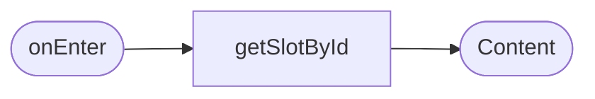
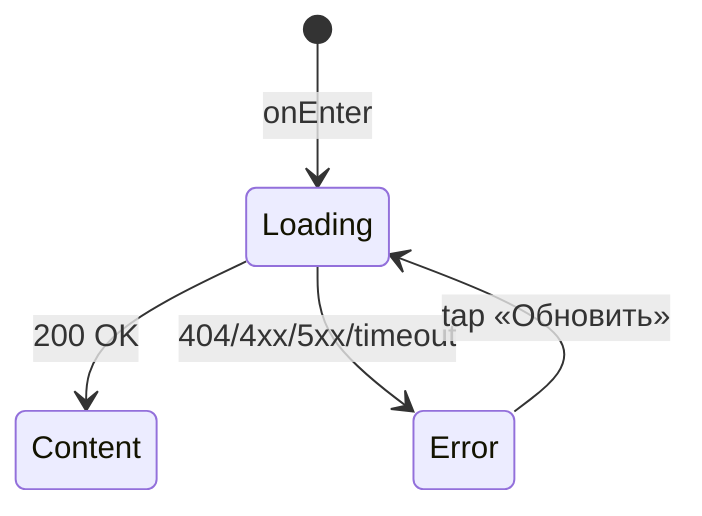

# Карточка тренировки

**ID:** SCR-003
**Тип:** Экран
**Домен:** 02. Просмотр тренировок
**Приоритет:** Critical
**Статус:** Черновик
**Функциональные блоки:** FB-SLOTS-003
**Зона авторизации:** АЗ
**Дизайн-макет:** Figma не заведён — текстовый wireframe: [../3-design-brief/SCR-003-slot-card.md](../3-design-brief/SCR-003-slot-card.md), версия 0.1

---

## Содержание

- [История изменений](#история-изменений)
- [Обзор](#обзор)
- [Навигация](#навигация)
- [Входные данные](#входные-данные)
- [Применяемые логики](#применяемые-логики)
- [Инициализация](#инициализация)
- [Используемые запросы](#используемые-запросы)
- [Макет экрана](#макет-экрана)
- [Элементы экрана](#элементы-экрана)
- [Состояния экрана](#состояния-экрана)
- [Действия пользователя](#действия-пользователя)
- [Связанные требования](#связанные-требования)
- [Критерии приёмки](#критерии-приёмки)

---

## История изменений

| Релиз | ТЗ | Описание изменений |
|-------|-----|-------------------|
| 0.1.0 | [SCR-003-slot-card.md](../3-design-brief/SCR-003-slot-card.md) | Первичная версия ТЗ на основе дизайн-брифа SCR-003 v0.1 |

---

## Обзор

Полная информация об одной тренировке перед принятием решения о записи — последний экран перед
оформлением брони (UC-1).

### User Story

> Как клиент, я хочу открыть карточку тренировки со всеми параметрами,
> чтобы понять детали перед записью.

### Бизнес-ценность

- Снимает неопределённость перед записью (вместимость, инструктор, снаряжение, адрес) — меньше отмен «не туда попал» (BR-5, косвенно).
- Показ рейтинга инструктора до записи помогает распределять клиентов, поддерживая мотивацию инструкторов (BR-10).

---

## Навигация

### Входящая (откуда открывается)

| Источник | Триггер | Условие | Передаваемые параметры |
|----------|---------|---------|------------------------|
| [SCR-002 Список тренировок](SCR-002-slot-list.md) | Тап по карточке слота | Всегда | `slotId` |

### Исходящая (куда ведёт)

| Назначение | Триггер | Передаваемые параметры |
|------------|---------|------------------------|
| [SCR-004 Оформление записи](SCR-004-booking.md) | Тап «Записаться» | `slotId` |
| [SCR-002 Список тренировок](SCR-002-slot-list.md) | «Назад» | — |

---

## Входные данные

| Название | Тип | Возможные значения | Описание |
|----------|-----|-------------------|----------|
| `slotId` | Параметр навигации | UUID | Идентификатор слота, полученный с SCR-002 |
| `client.is_beginner` | Состояние (из профиля) | `true`/`false` | Определяет, доступен ли CTA «Записаться» для новичковых слотов |

---

## Применяемые логики

| Логика | Элемент/Триггер | Описание |
|--------|-----------------|----------|
| [LOGIC-003 Раздельная доступность мест/проката](09-logics/LOGIC-003-seats-rental-separation.md) | Блок «Прокат снаряжения» | Наличие мест не гарантирует наличие проката, и наоборот |
| [LOGIC-006 Loading/Content/Empty/Error](09-logics/LOGIC-006-loading-content-empty-error.md) | При открытии | Скелетон / Error + «Обновить» |

---

## Инициализация

### Диаграмма загрузки



### Запросы при открытии

| № | Запрос | Критичный | Зависит от | Условие |
|---|--------|-----------|------------|---------|
| 1 | [getSlotById](#getslotbyid) | Да | — | Всегда |

---

## Используемые запросы

### getSlotById

**Тип:** REST
**Метод:** GET
**Спецификация:** [../api/openapi.yaml](../api/openapi.yaml) → `GET /slots/{slotId}`

**Триггер:** Инициализация

**Параметры:**

| Параметр | Тип | Обязательность | Источник | Описание |
|----------|-----|----------------|----------|----------|
| `slotId` | string (uuid, path) | Да | Параметр навигации | Идентификатор слота |

**Обработка ответа:**

| Результат | Условие | UI-реакция |
|-----------|---------|------------|
| Загрузка | — | Скелетон карточки |
| Успех (200) | — | Отобразить все параметры слота |
| HTTP 401 | — | Переход на [SCR-001](SCR-001-registration.md) (LOGIC-004) |
| HTTP 404 | Слот не найден/удалён | Error state «Тренировка не найдена» + «Обновить» / «Назад» |
| HTTP 4xx/5xx | — | Error state с кнопкой «Обновить» |
| Сеть | Нет соединения | Error state с кнопкой «Обновить» |

---

## Макет экрана

### Структура

```
┌─────────────────────────────────────┐
│ ← Назад                              │
│ Пн, 7 июля · 18:00–19:30              │
│ Болдеринг · Для новичков              │
│ Инструктор: Анна   ★ 4.8              │
│ Свободно: 3 из 8 мест                 │
│ ────────────────────────────────     │
│ Прокат снаряжения: доступен           │
│ Тариф: 300 ₽                          │
│ ────────────────────────────────     │
│ 📍 ул. Складская, 12                   │
│                                       │
│ ┌───────────────────────────────┐   │
│ │          Записаться            │   │  ← disabled при 0 мест / нет флага «новичок»
│ └───────────────────────────────┘   │
└─────────────────────────────────────┘
```

### Компоненты

| Компонент | Описание | Обязательность |
|-----------|----------|----------------|
| Блок «Когда/что» | Дата/время, длительность, зона/формат | Да |
| Блок «Инструктор» | Имя + рейтинг (или «Нет оценок») | Да |
| Блок «Места» | Свободно/всего | Да |
| Блок «Прокат» | Доступность + тариф | Да |
| Блок «Адрес» | Адрес скалодрома | Да |
| CTA «Записаться» / плашка-замена | Основное действие или объяснение недоступности | Да |

---

## Элементы экрана

### 1. Параметры слота

| Элемент | Описание | Источник данных | Валидация | Действие |
|---------|----------|-----------------|-----------|----------|
| Дата/время старта, длительность | — | `slot.start_at`, `slot.duration_min` | — | — |
| Зона/формат + бейдж «Для новичков» | — | `slot.zone_format`, `slot.is_beginner_only` | — | — |
| Инструктор + рейтинг | «Нет оценок», если `avg_rating = null` | `slot.instructor.name`, `slot.instructor.avg_rating` | — | — |
| Свободно/всего мест | — | `slot.free_seats`, `slot.capacity_total` | — | — |
| Прокат: доступность и тариф | Плашка о нехватке, если `rental.low_stock_warning = true` | `slot.rental.available`, `slot.rental.tariff`, `slot.rental.low_stock_warning` | — | — |
| Адрес скалодрома | — | `slot.gym_address` | — | — |

### 2. CTA-блок

| Элемент | Описание | Источник данных | Валидация | Действие |
|---------|----------|-----------------|-----------|----------|
| Кнопка «Записаться» | Активна при `free_seats > 0` и (не новичковый ИЛИ у клиента флаг «новичок») | `slot.free_seats`, `slot.is_beginner_only`, `client.is_beginner` | — | Переход на [SCR-004](SCR-004-booking.md) с `slotId` |
| Плашка «Мест нет» | Заменяет CTA при `free_seats = 0` | `slot.free_seats` | — | — |
| Плашка «Тренировка только для новичков» | Заменяет CTA, если `is_beginner_only = true` и `client.is_beginner = false` | `slot.is_beginner_only`, `client.is_beginner` | — | — |
| Блок причины отмены | Заменяет CTA, если `slot.status = cancelled_by_gym` | `slot.cancel_reason` | — | — |

**Условия доступности:**
- CTA «Записаться» активен, если: `free_seats > 0` И (`is_beginner_only = false` ИЛИ `client.is_beginner = true`) И `status != cancelled_by_gym`.

---

## Состояния экрана

### Таблица состояний

| Состояние | Условие | Отображение |
|-----------|---------|-------------|
| Loading | Ожидание `getSlotById` | Скелетон карточки |
| Content | 200 OK | Обычный показ параметров |
| Error | 404 / 4xx / 5xx / сеть | Заглушка + «Обновить» (слот не найден/удалён) |

Empty state не применим (карточка одного объекта, не список).

### Диаграмма переходов



---

## Действия пользователя

| Действие | Элемент | Триггер | Результат |
|----------|---------|---------|-----------|
| Записаться | Кнопка «Записаться» | Tap | Переход на [SCR-004](SCR-004-booking.md) |
| Вернуться к списку | «← Назад» | Tap | Переход на [SCR-002](SCR-002-slot-list.md) |

---

## Связанные требования

### Функциональные (FR-*)

| ID | Название | Приоритет |
|----|----------|-----------|
| FR-10 | Полная карточка слота (дата/время, зона, инструктор+рейтинг, места, прокат+тариф, адрес) | Must |
| FR-16 | Ограничение по флагу «новичок» | Must |
| FR-41 | Средний рейтинг инструктора, «Нет оценок» вместо 0 | Must |

### Use cases / User stories

| ID | Связь |
|----|-------|
| UC-1 | Запись на тренировку (шаг 3) |
| US-4 | Карточка слота |
| US-8 | Ограничение новичковых тренировок |

---

## Критерии приёмки

### Позитивные сценарии

| ID | Критерий | Приоритет |
|----|----------|-----------|
| AC-001 | **Дано** `free_seats > 0` и (слот не для новичков ИЛИ у клиента флаг «новичок»), **Когда** карточка отображается, **Тогда** кнопка «Записаться» активна и ведёт на SCR-004 | P0 |
| AC-002 | **Дано** `free_seats = 0`, **Когда** карточка отображается, **Тогда** вместо кнопки показана плашка «Мест нет» | P0 |
| AC-003 | **Дано** `is_beginner_only = true` и у клиента флаг «новичок» не установлен, **Когда** карточка отображается, **Тогда** вместо кнопки показано пояснение, что тренировка только для новичков | P0 |
| AC-004 | **Дано** у инструктора нет ни одной оценки, **Когда** карточка отображается, **Тогда** вместо числового рейтинга показано «Нет оценок» | P1 |

### Негативные сценарии

| ID | Критерий | Приоритет |
|----|----------|-----------|
| AC-N01 | **Дано** слот удалён/не найден (404), **Когда** открытие карточки, **Тогда** отображается error state с понятным сообщением | P1 |
| AC-N02 | **Дано** ошибка сети при открытии, **Тогда** отображается error state с кнопкой «Обновить» | P1 |

### Граничные условия (Edge Cases)

| ID | Критерий | Приоритет |
|----|----------|-----------|
| AC-E01 | **Дано** прокатного инвентаря может не хватить (`low_stock_warning = true`), **Когда** карточка отображается, **Тогда** видна постоянная информационная плашка независимо от наличия мест | P1 |
| AC-E02 | **Дано** слот отменён скалодромом, **Когда** карточка открывается через прямой переход с SCR-002, **Тогда** вместо CTA показан блок с причиной отмены | P1 |

---
