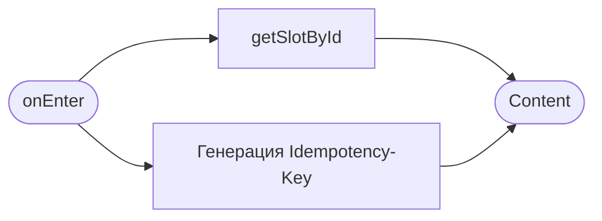
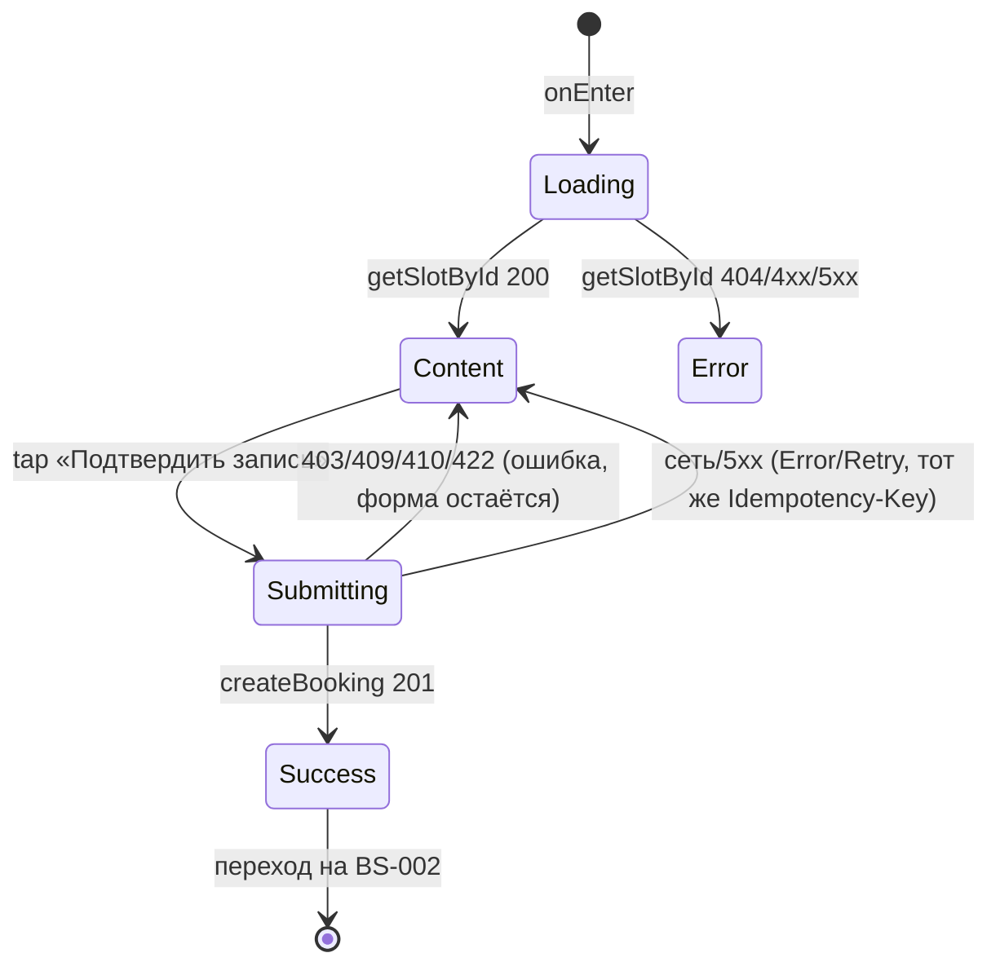

# Оформление записи

**ID:** SCR-004
**Тип:** Экран
**Домен:** 03. Запись на тренировку
**Приоритет:** Critical
**Статус:** Черновик
**Функциональные блоки:** FB-BOOK-001
**Зона авторизации:** АЗ
**Дизайн-макет:** Figma не заведён — текстовый wireframe: [../3-design-brief/SCR-004-booking.md](../3-design-brief/SCR-004-booking.md), версия 0.1

---

## Содержание

- [История изменений](#история-изменений)
- [Обзор](#обзор)
- [Навигация](#навигация)
- [Входные данные](#входные-данные)
- [Применяемые логики](#применяемые-логики)
- [Инициализация](#инициализация)
- [Используемые запросы](#используемые-запросы)
- [Макет экрана](#макет-экрана)
- [Элементы экрана](#элементы-экрана)
- [Состояния экрана](#состояния-экрана)
- [Действия пользователя](#действия-пользователя)
- [Связанные требования](#связанные-требования)
- [Критерии приёмки](#критерии-приёмки)

---

## История изменений

| Релиз | ТЗ | Описание изменений |
|-------|-----|-------------------|
| 0.1.0 | [SCR-004-booking.md](../3-design-brief/SCR-004-booking.md) | Первичная версия ТЗ на основе дизайн-брифа SCR-004 v0.1 |

---

## Обзор

Финальный шаг перед созданием брони: выбор снаряжения и подтверждение. Здесь обрабатываются
все ошибки записи (UC-1, E1–E6) — до [BS-002](BS-002-booking-success.md) ошибочный сценарий не доходит.

### User Story

> Как клиент, я хочу выбрать своё или прокатное снаряжение и подтвердить запись,
> чтобы забронировать место на тренировке.

### Бизнес-ценность

- Устраняет двойные брони и овербукинг за счёт атомарной проверки на сервере (BR-1, NFR-8).
- Прозрачность по прокату до оплаты снижает недовольство при получении инвентаря (BR-13).

---

## Навигация

### Входящая (откуда открывается)

| Источник | Триггер | Условие | Передаваемые параметры |
|----------|---------|---------|------------------------|
| [SCR-003 Карточка тренировки](SCR-003-slot-card.md) | Тап «Записаться» | `free_seats > 0` и доступ к слоту разрешён | `slotId` |

### Исходящая (куда ведёт)

| Назначение | Триггер | Передаваемые параметры |
|------------|---------|------------------------|
| [BS-002 Подтверждение записи](BS-002-booking-success.md) | Успешное создание брони (201) | `bookingId` |
| [SCR-003 Карточка тренировки](SCR-003-slot-card.md) | «Назад» | — |

---

## Входные данные

| Название | Тип | Возможные значения | Описание |
|----------|-----|-------------------|----------|
| `slotId` | Параметр навигации | UUID | Слот, на который оформляется бронь |
| `idempotencyKey` | Состояние (генерируется на экране) | UUID v4 | Генерируется один раз при входе на экран, переиспользуется при повторных попытках отправки той же операции (LOGIC-001) |
| `equipmentChoice` | Состояние (форма) | `own` \| `rental` | Дефолт — `own` (не выбрано автоматически «Прокат») |

---

## Применяемые логики

| Логика | Элемент/Триггер | Описание |
|--------|-----------------|----------|
| [LOGIC-001 Идемпотентность мутаций](09-logics/LOGIC-001-idempotency.md) | Кнопка «Подтвердить запись» | Генерация и переиспользование `Idempotency-Key` |
| [LOGIC-003 Раздельная доступность мест/проката](09-logics/LOGIC-003-seats-rental-separation.md) | Плашка о нехватке проката | Видна независимо от выбора снаряжения |

---

## Инициализация

### Диаграмма загрузки



### Запросы при открытии

| № | Запрос | Критичный | Зависит от | Условие |
|---|--------|-----------|------------|---------|
| 1 | [getSlotById](#getslotbyid) | Да | — | Всегда (актуализация сводки слота перед подтверждением) |

---

## Используемые запросы

### getSlotById

**Тип:** REST
**Метод:** GET
**Спецификация:** [../api/openapi.yaml](../api/openapi.yaml) → `GET /slots/{slotId}`

**Триггер:** Инициализация

**Параметры:**

| Параметр | Тип | Обязательность | Источник | Описание |
|----------|-----|----------------|----------|----------|
| `slotId` | string (uuid, path) | Да | Параметр навигации | — |

**Обработка ответа:**

| Результат | Условие | UI-реакция |
|-----------|---------|------------|
| Загрузка | — | Скелетон сводки слота |
| Успех | — | Отобразить сводку (дата/время, зона, инструктор, тариф проката) |
| HTTP 404 | Слот удалён/не найден | Error state, возврат к списку |
| HTTP 4xx/5xx / сеть | — | Error state с кнопкой «Обновить» |

---

### createBooking

**Тип:** REST
**Метод:** POST
**Спецификация:** [../api/openapi.yaml](../api/openapi.yaml) → `POST /bookings`

**Триггер:** Тап «Подтвердить запись»

**Заголовки:**

| Заголовок | Описание |
|-----------|----------|
| `Authorization` | Bearer access-токен |
| `Idempotency-Key` | UUID, сгенерированный при входе на экран (LOGIC-001) |

**Параметры/Body:**

| Параметр | Тип | Обязательность | Источник | Описание |
|----------|-----|----------------|----------|----------|
| `slot_id` | string (uuid) | Да | `slotId` | — |
| `equipment_choice` | string (`own`\|`rental`) | Да | Выбор радио-группы «Снаряжение» | На уровне брони, не сохраняется как настройка профиля |

**Обработка ответа:**

| Результат | Условие | UI-реакция |
|-----------|---------|------------|
| Загрузка | — | Спиннер на кнопке «Подтвердить запись», форма блокирована |
| Успех (201) | — | Переход на [BS-002](BS-002-booking-success.md) с `bookingId` |
| HTTP 403 | `beginner_flag_required` | «Тренировка только для новичков», подтверждение заблокировано |
| HTTP 409 | `slot_full` | «Мест не осталось», обновить карточку/актуальные `available_seats` |
| HTTP 409 | `rental_unavailable` | «Прокатного снаряжения не осталось», предложить выбрать «Своё» |
| HTTP 409 | `double_booking` | «Вы уже записаны на эту тренировку», ссылка на [SCR-005](SCR-005-my-bookings.md) |
| HTTP 410 | `slot_cancelled` | «Тренировка недоступна для записи», вернуться к списку |
| HTTP 422 | `slot_started` | «Тренировка недоступна для записи», вернуться к списку |
| Сеть/таймаут (~10 c) | — | Error/Retry с тем же `Idempotency-Key` — без дубля брони |
| HTTP 5xx | — | Снек «Что-то пошло не так. Попробуйте ещё раз позже» |

---

## Макет экрана

### Структура

```
┌─────────────────────────────────────┐
│ ← Назад                              │
│ Пн, 7 июля · 18:00                    │
│ Болдеринг · Инструктор: Анна          │
│ ────────────────────────────────     │
│ Снаряжение                           │
│ ( ) Своё        ( ) Прокат            │
│ ⓘ Проката может не хватить на всех    │  ← плашка, только если применимо
│   записавшихся                        │
│ Тариф проката: 300 ₽ (если выбран)    │
│ ────────────────────────────────     │
│ ⓘ Оплата на месте: наличные            │
│   или перевод на карту.                │
│ ┌───────────────────────────────┐   │
│ │       Подтвердить запись       │   │
│ └───────────────────────────────┘   │
└─────────────────────────────────────┘
```

### Компоненты

| Компонент | Описание | Обязательность |
|-----------|----------|----------------|
| Сводка слота | Дата/время, зона, инструктор | Да |
| Радио-выбор снаряжения | «Своё»/«Прокат», дефолт «Своё» | Да |
| Плашка о нехватке проката | Условная | Опционально |
| Тариф проката | Только при выборе «Прокат» | Опционально |
| Напоминание об офлайн-оплате | Статический текст | Да |
| CTA «Подтвердить запись» | Primary button | Да |

---

## Элементы экрана

### 1. Сводка и выбор снаряжения

| Элемент | Описание | Источник данных | Валидация | Действие |
|---------|----------|-----------------|-----------|----------|
| Сводка слота | Дата/время, зона, инструктор | `slot.*` | — | — |
| Радио «Своё» / «Прокат» | Дефолт «Своё» | — | Обязательный выбор (по дефолту предзаполнен) | — |
| Плашка нехватки проката | Видна независимо от выбора снаряжения | `slot.rental.low_stock_warning` | — | — |
| Тариф проката | Показывается, если выбран «Прокат» | `slot.rental.tariff` | — | — |
| Текст «Оплата на месте» | Статический (foundations §6) | — | — | — |
| Кнопка «Подтвердить запись» | Primary CTA, блокируется после первого тапа | — | — | → [createBooking](#createbooking) |

**Логика:**
- Кнопка «Подтвердить запись»: при тапе → блокировка формы → отправка `createBooking` с текущим `Idempotency-Key` (см. [LOGIC-001](09-logics/LOGIC-001-idempotency.md)).

**Момент валидации:** Перед отправкой (выбор снаряжения обязателен, но предзаполнен дефолтом «Своё», поэтому фактически всегда валиден).

**Условия доступности:**
- Кнопка «Подтвердить запись» неактивна во время выполнения запроса (защита от повторных тапов).

---

## Состояния экрана

### Таблица состояний

| Состояние | Условие | Отображение |
|-----------|---------|-------------|
| Loading (инициализация) | Ожидание `getSlotById` | Скелетон сводки |
| Content | Форма выбора снаряжения | Обычный показ |
| Loading (подтверждение) | Ожидание `createBooking` | Спиннер на кнопке, форма заблокирована |
| Error | Ошибка `createBooking` по коду ответа | Сообщение по матрице ошибок, форма остаётся заполненной |

### Диаграмма переходов



---

## Действия пользователя

| Действие | Элемент | Триггер | Результат |
|----------|---------|---------|-----------|
| Выбрать снаряжение | Радио «Своё»/«Прокат» | Tap | Обновление тарифа/плашки |
| Подтвердить запись | Кнопка «Подтвердить запись» | Tap | Отправка `createBooking`, переход на [BS-002](BS-002-booking-success.md) при успехе |
| Вернуться назад | «← Назад» | Tap | Переход на [SCR-003](SCR-003-slot-card.md) |

---

## Связанные требования

### Функциональные (FR-*)

| ID | Название | Приоритет |
|----|----------|-----------|
| FR-15 | Запись при наличии свободных мест | Must |
| FR-18 | Выбор снаряжения на уровне каждой брони | Must |
| FR-19 | Раздельная доступность мест и проката | Must |
| FR-20 | Постоянная плашка о нехватке проката | Must |
| FR-21 | Отображение тарифа проката и офлайн-оплаты | Must |
| FR-23 | Запрет превышения лимита мест, исключение двойной брони | Must |

### Нефункциональные (NFR-*)

| ID | Название | Приоритет |
|----|----------|-----------|
| NFR-8, NFR-9 | Атомарность, целостность при параллельных операциях | Высокий |
| NFR-21, NFR-22 | p95 < 1.5 c на createBooking, устойчивость к гонке бронирований | Высокий |
| NFR-24 | Мутации офлайн запрещены, таймаут ~10 с, Idempotency-Key при повторе | Средний |

### Use cases / User stories

| ID | Связь |
|----|-------|
| UC-1 | Запись на тренировку (шаги 4–7, альтернативы A1–A3, ошибки E1–E6) |
| US-5, US-6, US-7, US-10 | Запись, выбор снаряжения, предупреждение о прокате, защита от овербукинга |

---

## Критерии приёмки

### Позитивные сценарии

| ID | Критерий | Приоритет |
|----|----------|-----------|
| AC-001 | **Дано** клиент выбрал «Своё снаряжение» и нажал «Подтвердить запись», **Тогда** бронь создаётся и клиент переходит на BS-002 | P0 |
| AC-002 | **Дано** клиент выбрал «Прокат» и нажал «Подтвердить запись», **Тогда** бронь создаётся с учётом проката, прокатный фонд слота уменьшается, клиент переходит на BS-002 | P0 |
| AC-003 | **Дано** прокатного фонда может не хватить на всех, **Тогда** плашка-предупреждение видна независимо от выбора снаряжения | P1 |

### Негативные сценарии

| ID | Критерий | Приоритет |
|----|----------|-----------|
| AC-N01 | **Дано** пока клиент оформлял запись, места закончились, **Когда** нажимает «Подтвердить запись», **Тогда** показывается «Мест не осталось», бронь не создаётся | P0 |
| AC-N02 | **Дано** прокат закончился, **Когда** запрос отправлен, **Тогда** показывается предложение выбрать «Своё снаряжение», запись без проката остаётся доступной | P1 |
| AC-N03 | **Дано** бронь на этот слот у клиента уже есть, **Когда** запрос отправлен, **Тогда** показывается сообщение и ссылка на «Мои бронирования» | P1 |

### Граничные условия (Edge Cases)

| ID | Критерий | Приоритет |
|----|----------|-----------|
| AC-E01 | **Дано** сетевой сбой/таймаут при отправке `createBooking`, **Когда** результат неопределён, **Тогда** повтор выполняется с тем же `Idempotency-Key` и не создаёт вторую бронь | P1 |
| AC-E02 | **Дано** слот отменён скалодромом между открытием SCR-003 и подтверждением, **Когда** отправлен `createBooking`, **Тогда** показывается «Тренировка недоступна для записи» | P1 |

---
