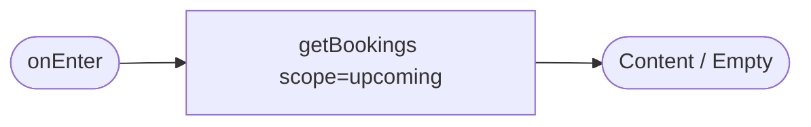
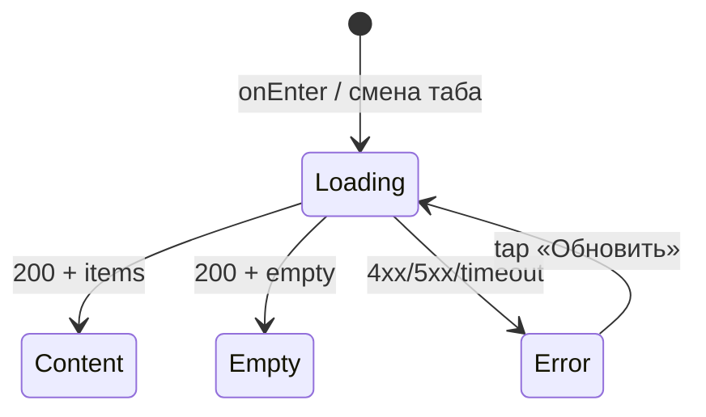

# Мои бронирования

**ID:** SCR-005
**Тип:** Экран
**Домен:** 04. Мои бронирования
**Приоритет:** Critical
**Статус:** Черновик
**Функциональные блоки:** FB-MYB-001
**Зона авторизации:** АЗ
**Дизайн-макет:** Figma не заведён — текстовый wireframe: [../3-design-brief/SCR-005-my-bookings.md](../3-design-brief/SCR-005-my-bookings.md), версия 0.1

---

## Содержание

- [История изменений](#история-изменений)
- [Обзор](#обзор)
- [Навигация](#навигация)
- [Входные данные](#входные-данные)
- [Применяемые логики](#применяемые-логики)
- [Инициализация](#инициализация)
- [Используемые запросы](#используемые-запросы)
- [Макет экрана](#макет-экрана)
- [Элементы экрана](#элементы-экрана)
- [Состояния экрана](#состояния-экрана)
- [Действия пользователя](#действия-пользователя)
- [Связанные требования](#связанные-требования)
- [Критерии приёмки](#критерии-приёмки)

---

## История изменений

| Релиз | ТЗ | Описание изменений |
|-------|-----|-------------------|
| 0.1.0 | [SCR-005-my-bookings.md](../3-design-brief/SCR-005-my-bookings.md) | Первичная версия ТЗ на основе дизайн-брифа SCR-005 v0.1 |

---

## Обзор

Обзор всех броней клиента — предстоящих и прошедших, с их статусами (FR-25). Один из трёх
корневых разделов авторизованной зоны.

### User Story

> Как клиент, я хочу видеть список своих бронирований,
> чтобы контролировать предстоящие и прошедшие тренировки.

### Бизнес-ценность

- Единая точка контроля своих записей — избавляет от необходимости помнить/переспрашивать в Telegram (BR-1, BR-2).
- Точка входа в отмену и оценку инструктора.

---

## Навигация

### Входящая (откуда открывается)

| Источник | Триггер | Условие | Передаваемые параметры |
|----------|---------|---------|------------------------|
| Нижняя навигация (любой экран АЗ) | Тап «Мои записи» | Всегда | — |
| [BS-002 Подтверждение записи](BS-002-booking-success.md) | Тап «Мои бронирования» | Всегда | — |

### Исходящая (куда ведёт)

| Назначение | Триггер | Передаваемые параметры |
|------------|---------|------------------------|
| [SCR-006 Детали брони](SCR-006-booking-details.md) | Тап по карточке брони | `bookingId` |
| [SCR-002 Список тренировок](SCR-002-slot-list.md) | Тап «Найти тренировку» (empty state «Предстоящие») | — |
| [BS-004 Оценка инструктора](BS-004-rate-instructor.md) | Тап «Оценить» на карточке завершённой неоценённой брони | `bookingId` |

---

## Входные данные

| Название | Тип | Возможные значения | Описание |
|----------|-----|-------------------|----------|
| `activeTab` | Состояние | `upcoming` \| `past` | Дефолт — `upcoming` |

---

## Применяемые логики

| Логика | Элемент/Триггер | Описание |
|--------|-----------------|----------|
| [LOGIC-006 Loading/Content/Empty/Error](09-logics/LOGIC-006-loading-content-empty-error.md) | При открытии / переключении вкладки | Единый паттерн состояний |

---

## Инициализация

### Диаграмма загрузки



### Запросы при открытии

| № | Запрос | Критичный | Зависит от | Условие |
|---|--------|-----------|------------|---------|
| 1 | [getBookings](#getbookings) | Да | — | Всегда, `scope = activeTab` (дефолт `upcoming`) |

---

## Используемые запросы

### getBookings

**Тип:** REST
**Метод:** GET
**Спецификация:** [../api/openapi.yaml](../api/openapi.yaml) → `GET /bookings`

**Триггер:** Инициализация; повторно — при переключении вкладки «Предстоящие»/«Прошедшие»

**Параметры:**

| Параметр | Тип | Обязательность | Источник | Описание |
|----------|-----|----------------|----------|----------|
| `scope` | string (`upcoming`\|`past`) | Нет (дефолт `upcoming`) | `activeTab` | Предстоящие или прошедшие (по времени старта слота) |
| `page`, `limit` | int | Нет | Пагинация | — |

**Обработка ответа:**

| Результат | Условие | UI-реакция |
|-----------|---------|------------|
| Загрузка | — | Скелетоны карточек броней |
| Успех (200) | `items` не пуст | Список карточек со статус-бейджами |
| Успех (200) | `items` пуст, вкладка «Предстоящие» | Empty state «У вас пока нет предстоящих записей» + CTA «Найти тренировку» |
| Успех (200) | `items` пуст, вкладка «Прошедшие» | Empty state «Прошедших записей пока нет» |
| HTTP 401 | — | Переход на [SCR-001](SCR-001-registration.md) |
| HTTP 4xx/5xx / сеть | — | Error state с кнопкой «Обновить» (либо кэш с пометкой устаревания, NFR-24) |

---

## Макет экрана

### Структура

```
┌─────────────────────────────────────┐
│ Мои бронирования                     │
│ [ Предстоящие ] [ Прошедшие ]        │
├─────────────────────────────────────┤
│  ┌───────────────────────────────┐  │
│  │ Пн, 7 июля · 18:00              │  │
│  │ Болдеринг · Анна                │  │
│  │ ● Активна                       │  │
│  └───────────────────────────────┘  │
│  ┌───────────────────────────────┐  │
│  │ Чт, 3 июля · 19:00              │  │
│  │ Трассы · Игорь                  │  │
│  │ ✓ Завершена   [ Оценить ]        │  │
│  └───────────────────────────────┘  │
├─────────────────────────────────────┤
│ [Тренировки] [●Мои записи] [Профиль] │
└─────────────────────────────────────┘
```

### Компоненты

| Компонент | Описание | Обязательность |
|-----------|----------|----------------|
| Переключатель «Предстоящие/Прошедшие» | Табы | Да |
| Карточка брони | Дата/время, зона, инструктор, статус-бейдж | Да |
| CTA «Оценить инструктора» | Только на завершённых неоценённых | Опционально |
| Empty state | Разный текст на вкладку | Да |

---

## Элементы экрана

### 1. Табы

| Элемент | Описание | Источник данных | Валидация | Действие |
|---------|----------|-----------------|-----------|----------|
| Таб «Предстоящие» | Дефолтная вкладка | `activeTab` | — | Переключение → повтор [getBookings](#getbookings) с `scope=upcoming` |
| Таб «Прошедшие» | — | `activeTab` | — | Переключение → повтор [getBookings](#getbookings) с `scope=past` |

### 2. Карточка брони

| Элемент | Описание | Источник данных | Валидация | Действие |
|---------|----------|-----------------|-----------|----------|
| Дата/время, зона, инструктор | — | `booking.slot.*` | — | — |
| Статус-бейдж | активна / поздняя отмена / отменена клиентом / отменена скалодромом / завершена; свой цвет+иконка+текст | `booking.status` | — | — |
| CTA «Оценить» | Только на завершённых, ещё не оценённых бронях | `booking.rating` (пусто) | — | Открыть [BS-004](BS-004-rate-instructor.md) с `bookingId` |
| Карточка (целиком) | — | — | — | Открыть [SCR-006](SCR-006-booking-details.md) с `bookingId` |

**Условия доступности:**
- CTA «Оценить» видна только если тренировка завершена (`slot.start_at` в прошлом, производный признак) И `booking.rating` отсутствует.

### 3. Empty state

| Элемент | Описание | Источник данных | Валидация | Действие |
|---------|----------|-----------------|-----------|----------|
| Текст + CTA «Найти тренировку» | Только на вкладке «Предстоящие» | `activeTab` | — | Переход на [SCR-002](SCR-002-slot-list.md) |
| Текст без CTA | Вкладка «Прошедшие» | `activeTab` | — | — |

---

## Состояния экрана

### Таблица состояний

| Состояние | Условие | Отображение |
|-----------|---------|-------------|
| Loading | Ожидание `getBookings` | Скелетоны карточек |
| Content | 200 + `items` не пуст | Список карточек |
| Empty (Предстоящие) | 200 + пусто | «У вас пока нет предстоящих записей» + CTA «Найти тренировку» |
| Empty (Прошедшие) | 200 + пусто | «Прошедших записей пока нет» |
| Error | 4xx/5xx/таймаут | Error state + «Обновить» |

### Диаграмма переходов



---

## Действия пользователя

| Действие | Элемент | Триггер | Результат |
|----------|---------|---------|-----------|
| Переключить вкладку | Табы «Предстоящие»/«Прошедшие» | Tap | Повтор `getBookings` с новым `scope` |
| Открыть детали брони | Карточка брони | Tap | Переход на [SCR-006](SCR-006-booking-details.md) |
| Оценить инструктора | CTA «Оценить» на карточке | Tap | Открытие [BS-004](BS-004-rate-instructor.md) |
| Перейти к поиску тренировки | CTA «Найти тренировку» (empty state) | Tap | Переход на [SCR-002](SCR-002-slot-list.md) |

---

## Связанные требования

### Функциональные (FR-*)

| ID | Название | Приоритет |
|----|----------|-----------|
| FR-25 | История бронирований (предстоящие/прошедшие) со статусом | Must |
| FR-40 | Точка входа к оценке инструктора | Must |

### Нефункциональные (NFR-*)

| ID | Название | Приоритет |
|----|----------|-----------|
| NFR-12 | Клиент видит только свои брони | Высокий |
| NFR-25 | Статус-бейджи не только цветом | Средний |

### Use cases / User stories

| ID | Связь |
|----|-------|
| US-11 | «Хочу видеть список своих бронирований» |

---

## Критерии приёмки

### Позитивные сценарии

| ID | Критерий | Приоритет |
|----|----------|-----------|
| AC-001 | **Дано** у клиента есть активные брони, **Когда** открыта вкладка «Предстоящие», **Тогда** видны эти брони со статусами | P0 |
| AC-002 | **Дано** тренировка завершена и ещё не оценена, **Когда** карточка отображается, **Тогда** видна кнопка «Оценить инструктора» | P1 |

### Негативные сценарии

| ID | Критерий | Приоритет |
|----|----------|-----------|
| AC-N01 | **Дано** ошибка сети без кэша, **Когда** открытие экрана, **Тогда** отображается error state с кнопкой «Обновить» | P0 |

### Граничные условия (Edge Cases)

| ID | Критерий | Приоритет |
|----|----------|-----------|
| AC-E01 | **Дано** у клиента нет активных броней, **Когда** открыта вкладка «Предстоящие», **Тогда** показан empty state с призывом найти тренировку | P1 |
| AC-E02 | **Дано** у клиента нет прошедших броней, **Когда** открыта вкладка «Прошедшие», **Тогда** показан текст «Прошедших записей пока нет» без CTA | P2 |

---
