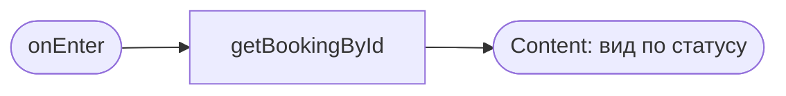
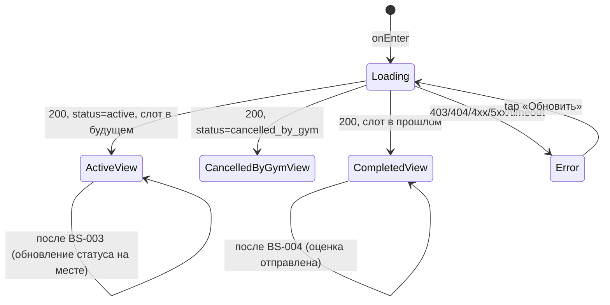

# Детали брони + отмена

**ID:** SCR-006
**Тип:** Экран
**Домен:** 04. Мои бронирования
**Приоритет:** Critical
**Статус:** Черновик
**Функциональные блоки:** FB-MYB-002, FB-MYB-003
**Зона авторизации:** АЗ
**Дизайн-макет:** Figma не заведён — текстовый wireframe: [../3-design-brief/SCR-006-booking-details.md](../3-design-brief/SCR-006-booking-details.md), версия 0.1

---

## Содержание

- [История изменений](#история-изменений)
- [Обзор](#обзор)
- [Навигация](#навигация)
- [Входные данные](#входные-данные)
- [Применяемые логики](#применяемые-логики)
- [Инициализация](#инициализация)
- [Используемые запросы](#используемые-запросы)
- [Макет экрана](#макет-экрана)
- [Элементы экрана](#элементы-экрана)
- [Состояния экрана](#состояния-экрана)
- [Действия пользователя](#действия-пользователя)
- [Связанные требования](#связанные-требования)
- [Критерии приёмки](#критерии-приёмки)

---

## История изменений

| Релиз | ТЗ | Описание изменений |
|-------|-----|-------------------|
| 0.1.0 | [SCR-006-booking-details.md](../3-design-brief/SCR-006-booking-details.md) | Первичная версия ТЗ на основе дизайн-брифа SCR-006 v0.1 |

---

## Обзор

Полная информация об одной брони + точка входа в отмену (UC-2) и в оценку инструктора (UC-4) для
завершённых тренировок. Три варианта вида в зависимости от статуса брони: активная, отменена
скалодромом, завершена.

### User Story

> Как клиент, я хочу открыть детали своей брони и при необходимости отменить её,
> чтобы управлять своими записями и освобождать место, если планы изменились.

### Бизнес-ценность

- Единая точка отмены с прозрачным объяснением правила 2 часов снижает недовольство при поздних отменах (BR-5).
- Явный статус «Отменена скалодромом» с причиной снимает нагрузку с владелицы по индивидуальным объяснениям (BR-11).

---

## Навигация

### Входящая (откуда открывается)

| Источник | Триггер | Условие | Передаваемые параметры |
|----------|---------|---------|------------------------|
| [SCR-005 Мои бронирования](SCR-005-my-bookings.md) | Тап по карточке брони | Всегда | `bookingId` |

### Исходящая (куда ведёт)

| Назначение | Триггер | Передаваемые параметры |
|------------|---------|------------------------|
| [BS-003 Подтверждение отмены](BS-003-cancel-confirm.md) | Тап «Отменить запись» | `bookingId` |
| [BS-004 Оценка инструктора](BS-004-rate-instructor.md) | Тап «Оценить инструктора» (для завершённых, ещё не оценённых) | `bookingId` |

---

## Входные данные

| Название | Тип | Возможные значения | Описание |
|----------|-----|-------------------|----------|
| `bookingId` | Параметр навигации | UUID | Идентификатор брони |

---

## Применяемые логики

| Логика | Элемент/Триггер | Описание |
|--------|-----------------|----------|
| [LOGIC-002 Правило ранней/поздней отмены](09-logics/LOGIC-002-cancellation-rule.md) | Блок «Правило отмены» + кнопка «Отменить запись» | Единый текст правила 2 часов (foundations §6), сервер — источник истины |

---

## Инициализация

### Диаграмма загрузки



### Запросы при открытии

| № | Запрос | Критичный | Зависит от | Условие |
|---|--------|-----------|------------|---------|
| 1 | [getBookingById](#getbookingbyid) | Да | — | Всегда |

---

## Используемые запросы

### getBookingById

**Тип:** REST
**Метод:** GET
**Спецификация:** [../api/openapi.yaml](../api/openapi.yaml) → `GET /bookings/{bookingId}`

**Триггер:** Инициализация; повторно — после закрытия BS-003 (обновление статуса) и после BS-004 (обновление оценки)

**Параметры:**

| Параметр | Тип | Обязательность | Источник | Описание |
|----------|-----|----------------|----------|----------|
| `bookingId` | string (uuid, path) | Да | Параметр навигации | — |

**Обработка ответа:**

| Результат | Условие | UI-реакция |
|-----------|---------|------------|
| Загрузка | — | Скелетон карточки |
| Успех (200) | `status = active`, слот в будущем | Вид «Активная» (см. Макет 4) с кнопкой «Отменить запись» |
| Успех (200) | `status = cancelled_by_gym` | Вид «Отменена скалодромом» (см. Макет 4a), без кнопки отмены |
| Успех (200) | Слот в прошлом (производный признак «Завершена») | Вид «Завершена» (см. Макет 4b) с блоком оценки |
| HTTP 401 | — | Переход на [SCR-001](SCR-001-registration.md) |
| HTTP 403/404 | Чужая/несуществующая бронь | Error state «Бронь недоступна» |
| HTTP 4xx/5xx / сеть | — | Error state с кнопкой «Обновить» |

---

## Макет экрана

### Структура (активная бронь)

```
┌─────────────────────────────────────┐
│ ← Назад                              │
│ ● Активна                             │
│ Пн, 7 июля · 18:00                     │
│ Болдеринг · Анна · Прокат (300 ₽)       │
│ ────────────────────────────────      │
│ ⓘ Отмена не позднее чем за 2 ч         │
│   до старта — место освобождается.     │
│   Позже — место остаётся за вами,      │
│   штрафов нет.                          │
│ ┌───────────────────────────────┐    │
│ │        Отменить запись         │    │
│ └───────────────────────────────┘    │
└─────────────────────────────────────┘
```

### Структура (отменена скалодромом)

```
┌─────────────────────────────────────┐
│ ⚠ Отменена скалодромом                │
│ Причина: профилактика зоны            │
│ Пн, 7 июля · 18:00                     │
│ (кнопка отмены отсутствует,            │
│  повторная запись на слот недоступна)  │
└─────────────────────────────────────┘
```

### Структура (завершена)

```
┌─────────────────────────────────────┐
│ ✓ Завершена                           │
│ Чт, 3 июля · 19:00                     │
│ Трассы · Игорь                        │
│ ────────────────────────────────      │
│ Ваша оценка: ★★★★☆ «Отличный           │
│ инструктор!»                           │
└─────────────────────────────────────┘
```
Если оценки ещё нет — вместо блока оценки показывается кнопка «Оценить инструктора» → BS-004.

### Компоненты

| Компонент | Описание | Обязательность |
|-----------|----------|----------------|
| Статус-бейдж | активна / отменена скалодромом / завершена / поздняя отмена / отменена клиентом | Да |
| Сводка слота | Дата/время, зона, инструктор, снаряжение | Да |
| Блок правила отмены | Только для активных | Условно |
| Кнопка «Отменить запись» | Только для активных, тренировка не началась | Условно |
| Блок причины отмены | Только для `cancelled_by_gym` | Условно |
| Блок оценки / CTA «Оценить» | Только для завершённых | Условно |

---

## Элементы экрана

### 1. Общий блок сводки

| Элемент | Описание | Источник данных | Валидация | Действие |
|---------|----------|-----------------|-----------|----------|
| Статус-бейдж + причина (если есть) | — | `booking.status`, `booking.cancel_reason` | — | — |
| Дата/время, зона/формат, инструктор | — | `booking.slot.*` | — | — |
| Снаряжение и тариф проката | — | `booking.equipment_choice`, `booking.rental_tariff_snapshot` | — | — |

### 2. Блок отмены (только активная бронь, тренировка не началась)

| Элемент | Описание | Источник данных | Валидация | Действие |
|---------|----------|-----------------|-----------|----------|
| Текст правила отмены | Единая формулировка (foundations §6), не переписывается | — | — | — |
| Кнопка «Отменить запись» | — | — | — | Открыть [BS-003](BS-003-cancel-confirm.md) с `bookingId` |

**Условия доступности:**
- Кнопка «Отменить запись» видна только если `status = active` И тренировка ещё не началась (`slot.start_at` в будущем).

### 3. Блок оценки (только завершённая бронь)

| Элемент | Описание | Источник данных | Валидация | Действие |
|---------|----------|-----------------|-----------|----------|
| Поставленная оценка (режим чтения) | Звёзды + комментарий | `booking.rating` | — | — |
| Кнопка «Оценить инструктора» | Если оценки ещё нет | `booking.rating` (пусто) | — | Открыть [BS-004](BS-004-rate-instructor.md) с `bookingId` |

---

## Состояния экрана

### Таблица состояний

| Состояние | Условие | Отображение |
|-----------|---------|-------------|
| Loading | Ожидание `getBookingById` | Скелетон карточки |
| Content (активна) | `status = active`, слот в будущем | Вид «Активная» |
| Content (отменена скалодромом) | `status = cancelled_by_gym` | Вид «Отменена скалодромом» |
| Content (завершена) | Слот в прошлом | Вид «Завершена» + блок оценки |
| Error | 403/404/4xx/5xx/сеть | Error state «Бронь недоступна» + «Обновить» |

### Диаграмма переходов



---

## Действия пользователя

| Действие | Элемент | Триггер | Результат |
|----------|---------|---------|-----------|
| Отменить запись | Кнопка «Отменить запись» | Tap | Открытие [BS-003](BS-003-cancel-confirm.md) |
| Оценить инструктора | Кнопка «Оценить инструктора» | Tap | Открытие [BS-004](BS-004-rate-instructor.md) |
| Вернуться назад | «← Назад» | Tap | Переход на [SCR-005](SCR-005-my-bookings.md) |

---

## Связанные требования

### Функциональные (FR-*)

| ID | Название | Приоритет |
|----|----------|-----------|
| FR-26, FR-27, FR-28 | Отмена, правило 2 часов | Must |
| FR-29, FR-30 | Отмена скалодромом, без альтернативы | Must |
| FR-40 | Точка входа к оценке инструктора | Must |

### Use cases / User stories

| ID | Связь |
|----|-------|
| UC-2 | Отмена записи |
| UC-4 | Оценка инструктора (точка входа) |
| US-12, US-13 | Отмена; отмена скалодромом |

---

## Критерии приёмки

### Позитивные сценарии

| ID | Критерий | Приоритет |
|----|----------|-----------|
| AC-001 | **Дано** бронь активна и тренировка не началась, **Тогда** видна кнопка «Отменить запись», ведущая на BS-003 | P0 |
| AC-002 | **Дано** бронь имеет статус «отменена скалодромом», **Тогда** видна причина отмены и кнопка «Отменить запись» отсутствует | P0 |
| AC-003 | **Дано** тренировка завершена и не оценена, **Тогда** видна кнопка «Оценить инструктора», ведущая на BS-004 | P1 |
| AC-004 | **Дано** клиент уже оценил инструктора, **Тогда** видна поставленная оценка в режиме «только чтение» | P1 |

### Негативные сценарии

| ID | Критерий | Приоритет |
|----|----------|-----------|
| AC-N01 | **Дано** бронь принадлежит другому клиенту (403) или не существует (404), **Тогда** отображается «Бронь недоступна» | P1 |

### Граничные условия (Edge Cases)

| ID | Критерий | Приоритет |
|----|----------|-----------|
| AC-E01 | **Дано** тренировка уже началась, **Тогда** кнопка «Отменить запись» отсутствует даже при `status = active` | P1 |

---
