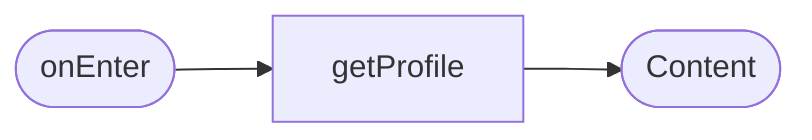
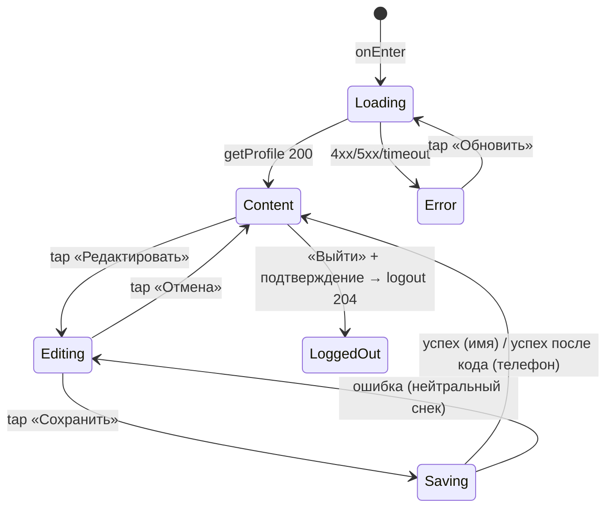

# Профиль клиента

**ID:** SCR-007
**Тип:** Экран
**Домен:** 06. Профиль
**Приоритет:** Medium
**Статус:** Черновик
**Функциональные блоки:** FB-PROFILE-001, FB-PROFILE-002, FB-PROFILE-003
**Зона авторизации:** АЗ
**Дизайн-макет:** Figma не заведён — текстовый wireframe: [../3-design-brief/SCR-007-profile.md](../3-design-brief/SCR-007-profile.md), версия 0.1

---

## Содержание

- [История изменений](#история-изменений)
- [Обзор](#обзор)
- [Навигация](#навигация)
- [Входные данные](#входные-данные)
- [Применяемые логики](#применяемые-логики)
- [Инициализация](#инициализация)
- [Используемые запросы](#используемые-запросы)
- [Макет экрана](#макет-экрана)
- [Элементы экрана](#элементы-экрана)
- [Состояния экрана](#состояния-экрана)
- [Действия пользователя](#действия-пользователя)
- [Связанные требования](#связанные-требования)
- [Критерии приёмки](#критерии-приёмки)

---

## История изменений

| Релиз | ТЗ | Описание изменений |
|-------|-----|-------------------|
| 0.1.0 | [SCR-007-profile.md](../3-design-brief/SCR-007-profile.md) | Первичная версия ТЗ на основе дизайн-брифа SCR-007 v0.1 |

---

## Обзор

Верхнеуровневый раздел авторизованной зоны: просмотр/редактирование имени и телефона, привязка
Telegram, выход из аккаунта, справочные пункты. Не управляет напоминаниями/Web Push (запрос
разрешения — на BS-002) и не содержит удаления аккаунта (не зафиксировано в FR-33/FR-34).

### User Story

> Как клиент, я хочу просматривать и редактировать данные своего профиля, привязывать Telegram
> и безопасно выходить из аккаунта,
> чтобы держать актуальными свои контакты и не пускать других под моим аккаунтом.

### Бизнес-ценность

- Актуальный телефон/имя — корректная доставка SMS-напоминаний и связь с клиентом (NFR-13).
- Привязка Telegram расширяет надёжность канала уведомлений сверх Web Push (NFR-17, NFR-26).

---

## Навигация

### Входящая (откуда открывается)

| Источник | Триггер | Условие | Передаваемые параметры |
|----------|---------|---------|------------------------|
| Нижняя навигация (любой экран АЗ) | Тап «Профиль» | Всегда | — |

### Исходящая (куда ведёт)

| Назначение | Триггер | Передаваемые параметры |
|------------|---------|------------------------|
| [SCR-001 Регистрация/Вход](SCR-001-registration.md) | «Выйти» + подтверждение | — |
| Telegram Login Widget (внешний) | «Привязать Telegram» | — |

---

## Входные данные

| Название | Тип | Возможные значения | Описание |
|----------|-----|-------------------|----------|
| `editMode` | Состояние | `false` \| `true` | Режим просмотра / редактирования |
| `phoneChangeStep` | Состояние | `none` \| `otp_pending` | Шаг подтверждения кодом при смене телефона |

---

## Применяемые логики

| Логика | Элемент/Триггер | Описание |
|--------|-----------------|----------|
| [LOGIC-004 Сессия: access/refresh, 401-flow](09-logics/LOGIC-004-session-401-refresh.md) | Кнопка «Выйти» | Инвалидация refresh-cookie, сброс access из памяти |

---

## Инициализация

### Диаграмма загрузки



### Запросы при открытии

| № | Запрос | Критичный | Зависит от | Условие |
|---|--------|-----------|------------|---------|
| 1 | [getProfile](#getprofile) | Да | — | Всегда |

---

## Используемые запросы

### getProfile

**Тип:** REST
**Метод:** GET
**Спецификация:** [../api/openapi.yaml](../api/openapi.yaml) → `GET /profile`

**Триггер:** Инициализация

**Обработка ответа:**

| Результат | Условие | UI-реакция |
|-----------|---------|------------|
| Загрузка | — | Скелетон блока данных; кнопка «Выйти» видна, но неактивна |
| Успех | — | Имя, телефон, статус Telegram (`telegram_linked`) |
| HTTP 401 | — | Переход на [SCR-001](SCR-001-registration.md) |
| HTTP 4xx/5xx / сеть | — | Error state «Обновить»; кнопка «Выйти» остаётся доступной |

---

### updateProfileName

**Тип:** REST
**Метод:** PATCH
**Спецификация:** [../api/openapi.yaml](../api/openapi.yaml) → `PATCH /profile`

**Триггер:** Тап «Сохранить» в режиме редактирования (изменено только имя)

**Параметры/Body:**

| Параметр | Тип | Обязательность | Источник | Описание |
|----------|-----|----------------|----------|----------|
| `name` | string | Да | Поле «Имя» | Не требует подтверждения кодом |

**Обработка ответа:**

| Результат | Условие | UI-реакция |
|-----------|---------|------------|
| Загрузка | — | Индикация сохранения, повторные клики блокируются |
| Успех (200) | — | Снек «Профиль обновлён», возврат в режим просмотра |
| HTTP 4xx/5xx / сеть | — | Нейтральная ошибка, данные в форме не теряются |

---

### requestPhoneChange

**Тип:** REST
**Метод:** POST
**Спецификация:** [../api/openapi.yaml](../api/openapi.yaml) → `POST /profile/phone/request-change`

**Триггер:** Тап «Сохранить» в режиме редактирования (изменён телефон)

**Параметры/Body:**

| Параметр | Тип | Обязательность | Источник | Описание |
|----------|-----|----------------|----------|----------|
| `new_phone` | string | Да | Поле «Телефон» | — |

**Обработка ответа:**

| Результат | Условие | UI-реакция |
|-----------|---------|------------|
| Успех (202) | — | Показать шаг подтверждения кодом «Подтвердите новый номер кодом из SMS» |
| HTTP 409 | Номер уже используется другим клиентом | Ошибка под полем «Телефон» |
| HTTP 429 | Лимит запросов (NFR-19) | «Слишком много попыток. Повторите через N сек.» |

---

### confirmPhoneChange

**Тип:** REST
**Метод:** POST
**Спецификация:** [../api/openapi.yaml](../api/openapi.yaml) → `POST /profile/phone/confirm-change`

**Триггер:** Ввод кода из SMS на шаге подтверждения смены телефона

**Параметры/Body:**

| Параметр | Тип | Обязательность | Источник | Описание |
|----------|-----|----------------|----------|----------|
| `new_phone` | string | Да | Введённый на предыдущем шаге номер | — |
| `code` | string | Да | Поле кода | — |

**Обработка ответа:**

| Результат | Условие | UI-реакция |
|-----------|---------|------------|
| Успех (200) | — | Снек «Профиль обновлён», телефон обновлён, возврат в режим просмотра |
| HTTP 401 | `invalid_code` | «Неверный код. Попробуйте ещё раз» |

---

### linkTelegram

**Тип:** REST
**Метод:** POST
**Спецификация:** [../api/openapi.yaml](../api/openapi.yaml) → `POST /profile/telegram`

**Триггер:** Успешное подтверждение в Telegram Login Widget (кнопка «Привязать Telegram»)

**Параметры/Body:**

| Параметр | Тип | Обязательность | Источник | Описание |
|----------|-----|----------------|----------|----------|
| `telegram_init_data` | string | Да | Telegram Login Widget | — |

**Обработка ответа:**

| Результат | Условие | UI-реакция |
|-----------|---------|------------|
| Успех (200) | — | Снек «Telegram привязан», статус меняется |
| HTTP 4xx/5xx / сеть | — | Снек «Не удалось привязать Telegram. Попробуйте снова» |

---

### unlinkTelegram

**Тип:** REST
**Метод:** DELETE
**Спецификация:** [../api/openapi.yaml](../api/openapi.yaml) → `DELETE /profile/telegram`

**Триггер:** Тап «Отвязать Telegram»

**Обработка ответа:**

| Результат | Условие | UI-реакция |
|-----------|---------|------------|
| Успех (204) | — | Снек «Telegram отвязан»; вход по телефону сохраняется всегда |
| HTTP 4xx/5xx / сеть | — | Снек ошибки |

---

### logout

**Тип:** REST
**Метод:** POST
**Спецификация:** [../api/openapi.yaml](../api/openapi.yaml) → `POST /auth/logout`

**Триггер:** Тап «Выйти» в модалке подтверждения выхода

**Обработка ответа:**

| Результат | Условие | UI-реакция |
|-----------|---------|------------|
| Успех (204) | — | Сброс `access_token` из памяти (LOGIC-004), переход на [SCR-001](SCR-001-registration.md); обратная связь — сам переход, снек не показывается |
| HTTP 4xx/5xx / сеть | — | «Не удалось выйти. Проверьте соединение и попробуйте снова»; локально всё равно сбросить access и перейти на SCR-001 (сессия небезопасна для продолжения) |

---

## Макет экрана

### Структура (режим просмотра)

```
┌─────────────────────────────────────┐
│  Профиль            Редактировать    │
├─────────────────────────────────────┤
│  Имя                                  │
│  Тори Иванова                         │
│  Телефон                              │
│  +7 999 123-45-67                     │
│  · · · · · · · · · · · · · · · ·      │
│  Telegram: не привязан                │
│  [ Привязать Telegram ]                │
│  · · · · · · · · · · · · · · · ·      │
│  Правила скалодрома                ›  │
│  Поддержка                          ›  │
│  Версия приложения           1.0.0    │
│                                       │
│           [   Выйти   ]               │
├─────────────────────────────────────┤
│ [Тренировки] [Мои записи] [●Профиль] │
└─────────────────────────────────────┘
```

### Компоненты

| Компонент | Описание | Обязательность |
|-----------|----------|----------------|
| Блок данных (имя/телефон) | Просмотр + режим редактирования | Да |
| Блок Telegram | Статус + действие привязки/отвязки | Да |
| Справочные пункты | Правила, поддержка, версия | Да |
| Кнопка «Выйти» | В безопасной зоне, с подтверждением | Да |

---

## Элементы экрана

### 1. Блок данных

| Элемент | Описание | Источник данных | Валидация | Действие |
|---------|----------|-----------------|-----------|----------|
| Поле «Имя» | Просмотр/редактирование | `client.name` | Не пусто, 2–50 символов | — |
| Поле «Телефон» | Просмотр/редактирование, смена — через код из SMS | `client.phone` | Российский формат номера | — |
| Кнопка «Редактировать» | Вход в режим редактирования | — | — | `editMode = true` |
| Кнопка «Сохранить» (в режиме редактирования) | Fixed CTA | — | — | Если изменено только имя → [updateProfileName](#updateprofilename); если телефон → [requestPhoneChange](#requestphonechange) |
| Кнопка «Отмена» (в режиме редактирования) | — | — | — | `editMode = false`, откат изменений |

**Условия доступности:**
- Кнопка «Сохранить» активна, если хотя бы одно поле изменено и валидно.

### 2. Блок Telegram

| Элемент | Описание | Источник данных | Валидация | Действие |
|---------|----------|-----------------|-----------|----------|
| Статус «Telegram: привязан / не привязан» | — | `client.telegram_linked` | — | — |
| Кнопка «Привязать Telegram» | Если не привязан | — | — | Открыть Telegram Login Widget → [linkTelegram](#linktelegram) |
| Кнопка «Отвязать» | Если привязан | — | — | → [unlinkTelegram](#unlinktelegram) |

**Условия доступности:**
- Отвязка не блокирует вход — вход по телефону сохраняется всегда.

### 3. Справочные пункты и выход

| Элемент | Описание | Источник данных | Валидация | Действие |
|---------|----------|-----------------|-----------|----------|
| «Правила скалодрома ›» | Переход на статический/внешний ресурс | конфиг | — | Открыть страницу правил |
| «Поддержка ›» | Переход на контакт поддержки | конфиг | — | Открыть контакт |
| «Версия приложения» | Нередактируемый текст | конфиг (build) | — | — |
| Кнопка «Выйти» | В безопасной зоне, тач-зона ≥44px | — | — | Открыть модалку подтверждения выхода |

**Логика:**
- Кнопка «Выйти»: тап → модалка подтверждения (заголовок «Выйти из аккаунта?», действия «Выйти»/«Отмена») → при подтверждении → [logout](#logout).

---

## Состояния экрана

### Таблица состояний

| Состояние | Условие | Отображение |
|-----------|---------|-------------|
| Loading | Ожидание `getProfile` | Скелетон блока данных; «Выйти» видна, но неактивна |
| Content (просмотр) | 200 OK | Имя, телефон, Telegram, справочные пункты |
| Редактирование | `editMode = true` | Поля ввода + «Сохранить»/«Отмена» |
| Сохранение (loading) | Ожидание `updateProfileName`/`confirmPhoneChange` | Индикация, повторные клики блокируются |
| Error (загрузка профиля) | 4xx/5xx/сеть | Заглушка + «Обновить»; «Выйти» доступна |

### Диаграмма переходов



---

## Действия пользователя

| Действие | Элемент | Триггер | Результат |
|----------|---------|---------|-----------|
| Редактировать профиль | Кнопка «Редактировать» | Tap | Переход в режим редактирования |
| Сохранить имя | Кнопка «Сохранить» (изменено имя) | Tap | `updateProfileName`, снек «Профиль обновлён» |
| Сохранить телефон | Кнопка «Сохранить» (изменён телефон) | Tap | `requestPhoneChange` → шаг кода → `confirmPhoneChange` |
| Привязать Telegram | Кнопка «Привязать Telegram» | Tap | Telegram Login Widget → `linkTelegram` |
| Отвязать Telegram | Кнопка «Отвязать» | Tap | `unlinkTelegram` |
| Выйти | Кнопка «Выйти» → подтверждение | Tap × 2 | `logout`, переход на [SCR-001](SCR-001-registration.md) |

---

## Связанные требования

### Функциональные (FR-*)

| ID | Название | Приоритет |
|----|----------|-----------|
| FR-33 | Просмотр и редактирование имени/телефона | Must |
| FR-34 | Выход из аккаунта | Must |
| FR-2 | Привязка Telegram (совместно с NFR-26) | Must |

### Нефункциональные (NFR-*)

| ID | Название | Приоритет |
|----|----------|-----------|
| NFR-11, NFR-12 | Только свои данные, безопасность ПДн | Высокий |
| NFR-18 | Завершение сессии при выходе | Высокий |
| NFR-19 | Антифрод при смене телефона (тот же механизм OTP) | Высокий |
| NFR-26 | Telegram-дублирование уведомлений | Средний |

### Use cases / User stories

| ID | Связь |
|----|-------|
| US-15 | «Хочу просматривать и редактировать данные своего профиля» |
| US-16 | «Хочу выйти из аккаунта» |

---

## Критерии приёмки

### Позитивные сценарии

| ID | Критерий | Приоритет |
|----|----------|-----------|
| AC-001 | **Дано** клиент авторизован, **Когда** открывает «Профиль», **Тогда** видит своё имя и телефон | P0 |
| AC-002 | **Дано** клиент на «Профиле», **Когда** нажимает «Выйти» и подтверждает, **Тогда** сессия завершается и клиент попадает на SCR-001 | P0 |
| AC-005 | **Дано** клиент меняет только имя, **Когда** нажимает «Сохранить», **Тогда** изменения сохраняются без подтверждения кодом | P1 |
| AC-006 | **Дано** клиент меняет телефон, **Когда** нажимает «Сохранить», **Тогда** показывается шаг подтверждения кодом, и после верного кода телефон обновляется | P1 |
| AC-007 | **Дано** клиент вошёл по телефону и Telegram не привязан, **Когда** нажимает «Привязать Telegram» и подтверждает, **Тогда** статус меняется на «привязан» | P1 |

### Негативные сценарии

| ID | Критерий | Приоритет |
|----|----------|-----------|
| AC-N01 | **Дано** согласие/подтверждение выхода не дано, **Когда** клиент выбирает «Отмена», **Тогда** он остаётся в аккаунте | P0 |
| AC-N02 | **Дано** новый номер уже используется другим клиентом, **Когда** отправлен `requestPhoneChange`, **Тогда** показывается ошибка под полем «Телефон» | P1 |

### Граничные условия (Edge Cases)

| ID | Критерий | Приоритет |
|----|----------|-----------|
| AC-E01 | **Дано** ошибка сети при `logout`, **Тогда** сессия всё равно сбрасывается локально и клиент переводится на SCR-001 (сессия не может считаться безопасной для продолжения) | P2 |
| AC-E02 | **Дано** на экране отсутствуют данные других клиентов и административные функции, **Тогда** это верно для любого состояния экрана | P1 |

---
